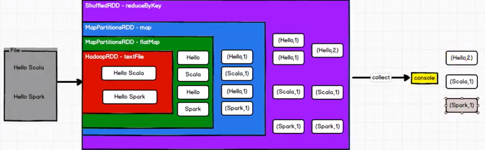

# Spark

## 定义

Spark 是一种基于内存的快速、通用、可扩展的大数据分析计算引擎

- Spark 是一种由 Scala 语言开发的快速、通用、可扩展的大数据分析引擎

- Spark Core 中提供了 Spark 最基础与最核心的功能

- Spark SQL 是Spark 用来操作结构化数据的组件。通过 Spark SQL，用户可以使用SQL 或者 Apache Hive 版本的 SQL 方言（HQL）来查询数据。

- Spark Streaming 是 Spark 平台上针对实时数据进行流式计算的组件，提供了丰富的处理数据流的API

## 核心模块


**Spark Core**

Spark Core 中提供了 Spark 最基础与最核心的功能，Spark 其他的功能如：Spark SQL， Spark Streaming，GraphX, MLlib 都是在 Spark Core 的基础上进行扩展的

**Spark SQL**

Spark SQL 是Spark 用来操作结构化数据的组件。通过 Spark SQL，用户可以使用 SQL或者Apache Hive 版本的 SQL 方言（HQL）来查询数据。

**Spark Streaming**

Spark Streaming 是 Spark 平台上针对实时数据进行流式计算的组件，提供了丰富的处理数据流的API。

**Spark MLlib**

MLlib 是 Spark 提供的一个机器学习算法库。MLlib 不仅提供了模型评估、数据导入等额外的功能，还提供了一些更底层的机器学习原语。

**Spark GraphX**

GraphX 是 Spark 面向图计算提供的框架与算法库。

## 上手实例

### 环境配置

**新建一个mavne工程**


**增加scala插件并添加框架支持**

见 Framework\Idea\04配置插件.md

**新建scala程序测试环境是否ok**


### WordCount实例

**有三种方式实现**

**目录结构**


在spark-core 的pom.xml文件里添加依赖

```xml
<dependencies>
        <dependency>
            <groupId>org.apache.spark</groupId>
            <!-- 注意这里spark使用的scala版本是2.12, 如果和配置的scala环境不一样会报错 -->
            <artifactId>spark-core_2.12</artifactId>
            <version>3.0.0</version>
        </dependency>
    </dependencies>

    <build>
        <plugins>
            <!-- 该插件用于将 Scala 代码编译成 class 文件 -->
            <plugin>
                <groupId>net.alchim31.maven</groupId>
                <artifactId>scala-maven-plugin</artifactId>
                <version>3.2.2</version>
                <executions>
                    <execution>
                        <!-- 声明绑定到 maven 的 compile 阶段 -->
                        <goals>
                            <goal>testCompile</goal>
                        </goals>
                    </execution>
                </executions>
            </plugin>
            <plugin>
                <groupId>org.apache.maven.plugins</groupId>
                <artifactId>maven-assembly-plugin</artifactId>
                <version>3.1.0</version>
                <configuration>
                    <descriptorRefs>
                        <descriptorRef>jar-with-dependencies</descriptorRef>
                    </descriptorRefs>
                </configuration>
                <executions>
                    <execution>
                        <id>make-assembly</id>
                        <phase>package</phase>
                        <goals>
                            <goal>single</goal>
                        </goals>
                    </execution>
                </executions>
            </plugin>
        </plugins>
    </build>
```

**Spark01_WordCount**

```scala
package com.stanlong.spark.core.wc

import org.apache.spark.{SparkConf, SparkContext}

object Spark01_WordCount {

    def main(args: Array[String]): Unit = {
        // 建立和Spark框架的连接
        val sparkConf = new SparkConf().setMaster("local").setAppName("WordCount")
        val sc = new SparkContext(sparkConf)

        // 执行业务操作
        val lines = sc.textFile("datas/*") // 读取文件
        val words = lines.flatMap(_.split(" ")) // 获取一行一行的数据,扁平化操作：将数据按空格隔开
        val wordGroup = words.groupBy(word => word) // 根据单词进行分组， 便于统计
        val wordToCount = wordGroup.map{ // 对分组后的数据进行转换
            case(word, list) =>{ // 这里用到了元组匹配，省略了 lambda 表达式， 参见Scala\13模式匹配.md
                (word, list.size)
            }
        }
        val array = wordToCount.collect()
        array.foreach(println) // 将转换结果采集到控制台打印出来

        // 关闭连接
        sc.stop()
    }
}
```

**Spark02_WordCount**

```scala
package com.stanlong.spark.core.wc

import org.apache.spark.{SparkConf, SparkContext}

object Spark02_WordCount {

    def main(args: Array[String]): Unit = {
        // 建立和Spark框架的连接
        val sparkConf = new SparkConf().setMaster("local").setAppName("WordCount")
        val sc = new SparkContext(sparkConf)

        // 执行业务操作
        val lines = sc.textFile("datas/*") // 读取文件
        val words = lines.flatMap(_.split(" ")) // 获取一行一行的数据,扁平化操作：将数据按空格隔开
        val wordToOne = words.map(
            word => (word , 1)
        )
        val wordGroup = wordToOne.groupBy(
            t => t._1
        )

        val wordToCount = wordGroup.map{ // 对分组后的数据进行转换
            case(word, list) =>{
                list.reduce(
                    (t1, t2) => {
                        (t1._1, t1._2 + t2._2)
                    }
                )
            }
        }
        val array = wordToCount.collect()
        array.foreach(println) // 将转换结果采集到控制台打印出来

        // 关闭连接
        sc.stop()
    }
}
```

**Spark03_WordCount**

```scala
package com.stanlong.spark.core.wc

import org.apache.spark.{SparkConf, SparkContext}

object Spark03_WordCount {

    def main(args: Array[String]): Unit = {
        // 建立和Spark框架的连接
        val sparkConf = new SparkConf().setMaster("local").setAppName("WordCount")
        val sc = new SparkContext(sparkConf)

        // 执行业务操作
        val lines = sc.textFile("datas/*") // 读取文件
        val words = lines.flatMap(_.split(" ")) // 获取一行一行的数据,扁平化操作：将数据按空格隔开
        val wordToOne = words.map(
            word => (word , 1)
        )

        // reduceByKey : 相同key的数据，可以对value进行reduce聚合
        val wordToCount = wordToOne.reduceByKey(_ + _)

        val array = wordToCount.collect()
        array.foreach(println) // 将转换结果采集到控制台打印出来

        // 关闭连接
        sc.stop()
    }
}
```

### case的特殊用法

```scala
package com.stanlong.spark.core

import org.apache.spark.{SparkConf, SparkContext}

object Test {
    def main(args: Array[String]): Unit = {
        // 建立和Spark框架的连接
        val sparkConf = new SparkConf().setMaster("local").setAppName("WordCount")
        val sc = new SparkContext(sparkConf)

        // 执行业务操作
        val lines = sc.textFile("datas/1.txt") // 读取文件

        val words = lines.flatMap(_.split(" ")) // 获取一行一行的数据,扁平化操作：将数据按空格隔开

        val wordGroup = words.groupBy(word => word) // 根据单词进行分组， 便于统计

        // 方法一
        // val wordToCount =  wordGroup.map( // 对分组后的数据进行转换
        //         word => {
        //         (word._1, word._2.size)
        //     }
        // )

        // 方法二 case替代map(word=>)的写法 不在使用._1 ._2  上一个父rdd的类型值可直接命名为变量使用
        val wordToCount = wordGroup.map{
            case(word, list) =>{
                (word, list.size)
            }
        }

        val array = wordToCount.collect()
        array.foreach(println) // 将转换结果采集到控制台打印出来

        // 关闭连接
        sc.stop()
    }
}
```


### 图解wordcount实例



## 配置日志格式


**log4j.properties**

```properties
log4j.rootCategory=ERROR, console
log4j.appender.console=org.apache.log4j.ConsoleAppender 
log4j.appender.console.target=System.err 
log4j.appender.console.layout=org.apache.log4j.PatternLayout 
log4j.appender.console.layout.ConversionPattern=%d{yy/MM/dd HH:mm:ss} %p %c{1}: %m%n

# Set the default spark-shell log level to ERROR. When running the spark-shell, the
# log level for this class is used to overwrite the root logger's log level, so that
# the user can have different defaults for the shell and regular Spark apps.
log4j.logger.org.apache.spark.repl.Main=ERROR

# Settings to quiet third party logs that are too verbose
log4j.logger.org.spark_project.jetty=ERROR 
log4j.logger.org.spark_project.jetty.util.component.AbstractLifeCycle=ERROR 
log4j.logger.org.apache.spark.repl.SparkIMain$exprTyper=ERROR 
log4j.logger.org.apache.spark.repl.SparkILoop$SparkILoopInterpreter=ERROR 
log4j.logger.org.apache.parquet=ERROR
log4j.logger.parquet=ERROR

# SPARK-9183: Settings to avoid annoying messages when looking up nonexistent UDFs in SparkSQL with Hive support
log4j.logger.org.apache.hadoop.hive.metastore.RetryingHMSHandler=FATAL 
log4j.logger.org.apache.hadoop.hive.ql.exec.FunctionRegistry=ERROR
```

## 异常处理

如果本机操作系统是 Windows，在程序中使用了 Hadoop 相关的东西，比如写入文件到HDFS，则会遇到如下异常。


出现这个问题的原因，并不是程序的错误，而是windows 系统用到了 hadoop 相关的服务，解决办法是通过配置关联到 windows 的系统依赖就可以了


在 IDEA 中配置Run Configuration，添加HADOOP_HOME 变量

配置步骤见 Framework\Idea\05配置环境变量.md