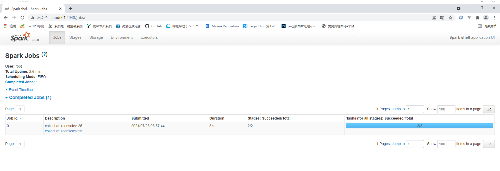

# Sprk运行环境

Spark 作为一个数据处理框架和计算引擎，被设计在所有常见的集群环境中运行, 在国内工作中主流的环境为

Yarn，不过逐渐容器式环境也慢慢流行起来。接下来，我们就分别看看不同环境下Spark 的运行


## Local 模式

所谓的Local 模式，就是不需要其他任何节点资源就可以在本地执行 Spark 代码的环境，一般用于教学，调试，演

示等

### spark 安装

```shell
[root@node01 ~]# tar -zxf spark-3.0.0-bin-hadoop2.7.tgz
[root@node01 ~]# mv spark-3.0.0-bin-hadoop2.7 /opt/stanlong/
[root@node01 ~]# cd /opt/stanlong/
[root@node01 stanlong]# mv spark-3.0.0-bin-hadoop2.7/ spark-local
[root@node01 stanlong]# ll
total 4
drwxr-xr-x  9 root root   210 Jun 20 11:12 flume
drwxr-xr-x 10 root root   161 Jun 11 10:27 hadoop-2.9.2
drwxr-xr-x 10 root root   161 Jun 11 10:13 hadoop-2.9.2-full
drwxr-xr-x  8 root root   172 Jun 14 11:28 hbase
drwxr-xr-x 10 root root   245 Jun 28 11:04 hive
drwxr-xr-x  7 root root   101 Jun 22 01:17 kafka
drwxr-xr-x  8 root root   119 Jun 29 03:44 kafka-manager
drwxr-xr-x 13 1000  1000  211 Jun  6 08:09 spark-local
drwxr-xr-x  5  502 games 4096 Mar 19  2019 tez-0.9.2
[root@node01 stanlong]# cd spark-local
[root@node01 spark-local]# bin/spark-shell

21/07/28 06:50:16 WARN NativeCodeLoader: Unable to load native-hadoop library for your platform... using builtin-java classes where applicable
Using Spark's default log4j profile: org/apache/spark/log4j-defaults.properties
Setting default log level to "WARN".
To adjust logging level use sc.setLogLevel(newLevel). For SparkR, use setLogLevel(newLevel).
Spark context Web UI available at http://node01:4040
Spark context available as 'sc' (master = local[*], app id = local-1627426249461).
Spark session available as 'spark'.
Welcome to
      ____              __
     / __/__  ___ _____/ /__
    _\ \/ _ \/ _ `/ __/  '_/
   /___/ .__/\_,_/_/ /_/\_\   version 3.0.0
      /_/
         
Using Scala version 2.12.10 (Java HotSpot(TM) 64-Bit Server VM, Java 1.8.0_221)
Type in expressions to have them evaluated.
Type :help for more information.

scala> 
scala> :quit
```

### 测试

**准备数据文件测试**

```shell
[root@node01 data]# pwd
/opt/stanlong/spark-local/data
[root@node01 data]# vi word.txt

Hello Spark
Hello Scala
Hello Spark
```

**命令行执行**

```shell
scala> sc.textFile("data/word.txt").flatMap(_.split(" ")).map((_, 1)).reduceByKey(_+_).collect
res0: Array[(String, Int)] = Array((Spark,2), (Hello,3), (Scala,1)) 
```

### 监控地址

http://node01:4040/jobs/



### 手动提交应用到spark

```pwd
[root@node01 spark-local]# pwd
/opt/stanlong/spark-local

[root@node01 spark-local]# bin/spark-submit \
> --class org.apache.spark.examples.SparkPi \
> --master local[2] \
> ./examples/jars/spark-examples_2.12-3.0.0.jar \
> 10
```

**执行结果**


**参数说明**

```
1)	--class 表示要执行程序的主类，此处可以更换为咱们自己写的应用程序

2)	--master local[2] 部署模式，默认为本地模式，数字表示分配的虚拟CPU 核数量

3)	spark-examples_2.12-3.0.0.jar 运行的应用类所在的 jar 包，实际使用时，可以设定为咱们自己打的 jar 包
4)	数字 10 表示程序的入口参数，用于设定当前应用的任务数量
```

**spark-submit语法说明**

```
（1）基本语法
bin/spark-submit \
--class <main-class>
--master <master-url> \
--deploy-mode <deploy-mode> \
--conf <key>=<value> \
... # other options
<application-jar> \
[application-arguments]

（2）参数说明：
--class: 你的应用的启动类 (如 org.apache.spark.examples.SparkPi)

--master 指定 Master 的地址，默认为 Local

--deploy-mode: 是否发布你的驱动到 worker 节点(cluster) 或者作为一个本地客户端(client) (default: client)

--conf: 任意的 Spark 配置属性， 格式 key=value. 如果值包含空格，可以加引号“key=value”

application-jar: 打包好的应用 jar,包含依赖. 

application-arguments: 传给 main()方法的参数

--executor-memory 1G 指定每个 executor 可用内存为 1G

--total-executor-cores 2 指定每个 executor 使用的 cup 核数为 2 个
```


