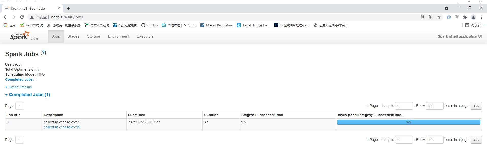
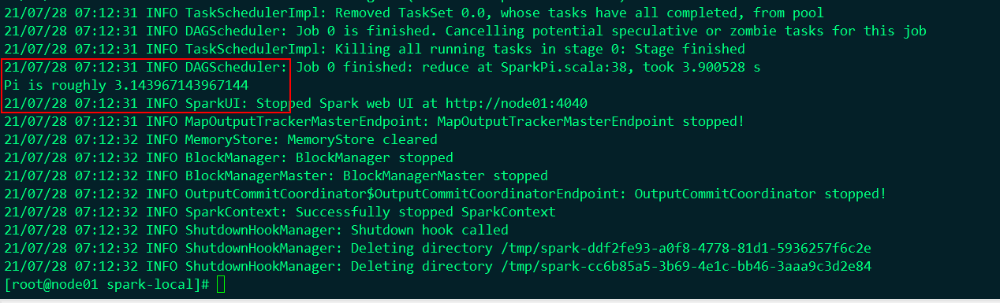
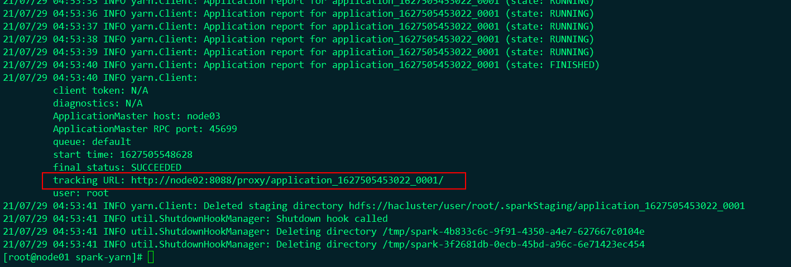
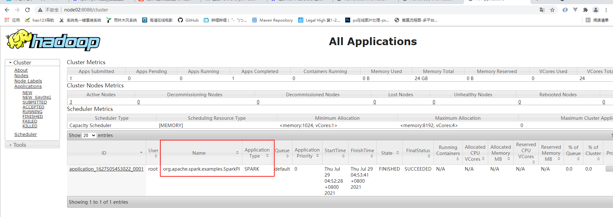
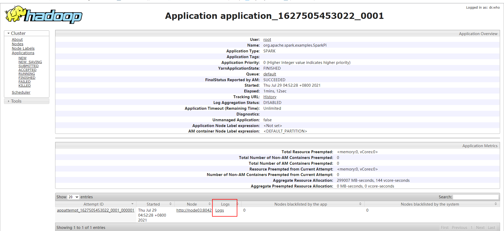
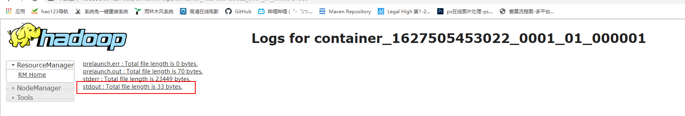
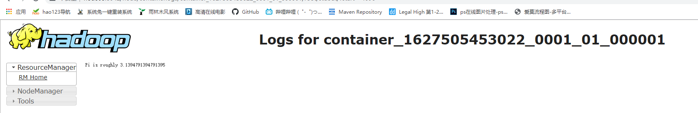

# Sprk部署模式

存盘地址 http://archive.apache.org/dist/spark/

Spark 作为一个数据处理框架和计算引擎，被设计在所有常见的集群环境中运行, 在国内工作中主流的环境为

Yarn，不过逐渐容器式环境也慢慢流行起来。接下来，我们就分别看看不同环境下Spark 的运行


## Local 模式

所谓的Local 模式，就是不需要其他任何节点资源就可以在本地执行 Spark 代码的环境，一般用于教学，调试，演

示等

### spark 安装

```shell
[root@node01 ~]# tar -zxf spark-2.0.0-bin-hadoop2.7.tgz
[root@node01 ~]# mv spark-2.0.0-bin-hadoop2.7 /opt/stanlong/
[root@node01 ~]# cd /opt/stanlong/
[root@node01 stanlong]# mv spark-2.0.0-bin-hadoop2.7/ spark-local
[root@node01 stanlong]# ll
total 4
drwxr-xr-x 13 1000  1000  211 Jun  6 08:09 spark-local
[root@node01 stanlong]# cd spark-local
[root@node01 spark-local]# bin/spark-shell

21/07/28 06:50:16 WARN NativeCodeLoader: Unable to load native-hadoop library for your platform... using builtin-java classes where applicable
Using Spark's default log4j profile: org/apache/spark/log4j-defaults.properties
Setting default log level to "WARN".
To adjust logging level use sc.setLogLevel(newLevel). For SparkR, use setLogLevel(newLevel).
Spark context Web UI available at http://node01:4040
Spark context available as 'sc' (master = local[*], app id = local-1627426249461).
Spark session available as 'spark'.
Welcome to
      ____              __
     / __/__  ___ _____/ /__
    _\ \/ _ \/ _ `/ __/  '_/
   /___/ .__/\_,_/_/ /_/\_\   version 2.0.0
      /_/
         
Using Scala version 2.12.10 (Java HotSpot(TM) 64-Bit Server VM, Java 1.8.0_221)
Type in expressions to have them evaluated.
Type :help for more information.

scala> 
scala> :quit
```

### 测试

**准备数据文件测试**

```shell
[root@node01 data]# pwd
/opt/stanlong/spark-local/data
[root@node01 data]# vi word.txt

Hello Spark
Hello Scala
Hello Spark
```

**命令行执行**

```shell
scala> sc.textFile("data/word.txt").flatMap(_.split(" ")).map((_, 1)).reduceByKey(_+_).collect
res0: Array[(String, Int)] = Array((Spark,2), (Hello,3), (Scala,1)) 
```

### 监控地址

http://node01:4040/jobs/



### 手动提交应用到spark

```pwd
[root@node01 spark-local]# pwd
/opt/stanlong/spark-local

[root@node01 spark-local]# bin/spark-submit \
> --class org.apache.spark.examples.SparkPi \
> --master local[2] \
> ./examples/jars/spark-examples_2.11-2.0.0.jar \
> 10
```

**执行结果**



**参数说明**

```
1)	--class 表示要执行程序的主类，此处可以更换为咱们自己写的应用程序

2)	--master local[2] 部署模式，默认为本地模式，数字表示分配的虚拟CPU 核数量

3)	spark-examples_2.12-2.0.0.jar 运行的应用类所在的 jar 包，实际使用时，可以设定为咱们自己打的 jar 包

4)	数字 10 表示程序的入口参数，用于设定当前应用的任务数量
```

**spark-submit语法说明**

```
（1）基本语法
bin/spark-submit \
--class <main-class>
--master <master-url> \
--deploy-mode <deploy-mode> \
--conf <key>=<value> \
... # other options
<application-jar> \
[application-arguments]

（2）参数说明：
--class: 你的应用的启动类 (如 org.apache.spark.examples.SparkPi)

--master 指定 Master 的地址，默认为 Local

--deploy-mode: 是否发布你的驱动到 worker 节点(cluster) 或者作为一个本地客户端(client) (default: client)

--conf: 任意的 Spark 配置属性， 格式 key=value. 如果值包含空格，可以加引号“key=value”

application-jar: 打包好的应用 jar,包含依赖. 

application-arguments: 传给 main()方法的参数

--executor-memory 1G 指定每个 executor 可用内存为 1G

--total-executor-cores 2 指定每个 executor 使用的 cup 核数为 2 个
```

## Yarn 模式

### spark安装

```shell
[root@node01 ~]# tar -zxf spark-2.0.0-bin-hadoop2.7.tgz
[root@node01 ~]# mv spark-2.0.0-bin-hadoop2.7 /opt/stanlong/
[root@node01 ~]# cd /opt/stanlong/
[root@node01 stanlong]# mv spark-2.0.0-bin-hadoop2.7 spark-yarn
[root@node01 stanlong]# ll
total 4
drwxr-xr-x 13 1000 1000  211 2020/06/06 20:09:17 spark-local
drwxr-xr-x 13 1000 1000  211 2020/06/06 20:09:17 spark-yarn
```

### 修改配置文件

1. 修改 hadoop 配置文件/opt/stanlong/hadoop-ha/hadoop-2.9.2/etc/hadoop/yarn-site.xml, 并分发

```shell
[root@node01 hadoop]# pwd
/opt/stanlong/hadoop-ha/hadoop-2.9.2/etc/hadoop
[root@node01 hadoop]# vi yarn-site.xml 
```

```xml
<!--是否启动一个线程检查每个任务正使用的物理内存量，如果任务超出分配值，则直接将其杀掉，默认是 true -->
<property>
    <name>yarn.nodemanager.pmem-check-enabled</name>
    <value>false</value>
</property>

<!--是否启动一个线程检查每个任务正使用的虚拟内存量，如果任务超出分配值，则直接将其杀掉，默认是 true -->
<property>
    <name>yarn.nodemanager.vmem-check-enabled</name>
    <value>false</value>
</property>
```

```shell
# 分发到其他节点
[root@node01 hadoop]# ~/myshell/rsyncd.sh yarn-site.xml 
```

2. 修改 conf/spark-env.sh，添加 JAVA_HOME 和YARN_CONF_DIR 配置

```shell
[root@node01 conf]# pwd
/opt/stanlong/spark-yarn/conf
[root@node01 conf]# cp spark-env.sh.template spark-env.sh
[root@node01 conf]# vi spark-env.sh
    
# 在文件末尾添加配置
export JAVA_HOME=/usr/java/jdk1.8.0_221-amd64
YARN_CONF_DIR=/opt/stanlong/hadoop-ha/hadoop-2.9.2/etc/hadoop
```

### 启动hadoop和yarn集群

参考 Hadoop\28自定义集群脚本\Hadoop-HA启停脚本.md

### 提交应用

```shell
[root@node01 spark-yarn]# pwd
/opt/stanlong/spark-yarn
[root@node01 spark-yarn]# bin/spark-submit \
> --class org.apache.spark.examples.SparkPi \
> --master yarn \
> --deploy-mode cluster \
> ./examples/jars/spark-examples_2.11-2.0.0.jar \
> 10
```



### 查看执行结果

http://node02:8088









### 配置历史服务器

1. 修改 spark-defaults.conf.template 文件名为 spark-defaults.conf

   ```shell
   [root@node01 conf]# pwd
   /opt/stanlong/spark-yarn/conf
   [root@node01 conf]# cp spark-defaults.conf.template spark-defaults.conf
   ```

2. 修改 spark-default.conf 文件，配置日志存储路径

   ```shell
   [root@node01 conf]# vi spark-defaults.conf
   # 在文件末尾追加
   spark.eventLog.enabled      true
   spark.eventLog.dir          hdfs://node01:8020/directory
   ```

   注意：需要启动 hadoop 集群，HDFS 上的目录需要提前存在

   ```shell
   [root@node02 ~]# hadoop fs -mkdir /directory
   ```

3. 修改 spark-env.sh 文件, 添加日志配置

   ```shell
   [root@node01 conf]# vi spark-env.sh
   
   # 在文件末尾追加
   export SPARK_HISTORY_OPTS="
   -Dspark.history.ui.port=18080
   -Dspark.history.fs.logDirectory=hdfs://node01:8020/directory
   -Dspark.history.retainedApplications=30"
   ```

   参数 1 含义：WEB UI 访问的端口号为 18080
   参数 2 含义：指定历史服务器日志存储路径
   参数 3 含义：指定保存Application 历史记录的个数，如果超过这个值，旧的应用程序信息将被删除，这个是内存中的应用数，而不是页面上显示的应用数。

4. 修改 spark-defaults.conf

   ```shell
   [root@node01 conf]# vi spark-defaults.conf
   
   # 在文件末尾添加
   spark.yarn.historyServer.address=linux1:18080 
   spark.history.ui.port=18080
   ```

5.  启动历史服务

   ```shell
   [root@node01 spark-yarn]# pwd
   /opt/stanlong/spark-yarn
   [root@node01 spark-yarn]# sbin/start-history-server.sh
   ```

## Standalone 模式

需要部署的时候再配置

## K8S & Mesos 模式

不做部署

## Windows 模式

解压即用

测试，在 bin 目录中创建 input 目录，并添加word.txt 文件, 在命令行中输入脚本代码

```shell
Using Spark's default log4j profile: org/apache/spark/log4j-defaults.properties
Setting default log level to "WARN".
To adjust logging level use sc.setLogLevel(newLevel). For SparkR, use setLogLevel(newLevel).
Spark context Web UI available at http://YLMF-2019YOXIZQ:4040
Spark context available as 'sc' (master = local[*], app id = local-1627479798469).
Spark session available as 'spark'.
Welcome to
      ____              __
     / __/__  ___ _____/ /__
    _\ \/ _ \/ _ `/ __/  '_/
   /___/ .__/\_,_/_/ /_/\_\   version 2.0.0
      /_/

Using Scala version 2.12.10 (Java HotSpot(TM) 64-Bit Server VM, Java 1.8.0_212)
Type in expressions to have them evaluated.
Type :help for more information.

scala> sc.textFile("input/word.txt").flatMap(_.split(" ")).map((_, 1)).reduceByKey(_+_).collect
res0: Array[(String, Int)] = Array((Hello,4), (World,1), (Scala,1), (Spark,2))
```

## 常用端口号

```
Spark 查看当前 Spark-shell 运行任务情况端口号：4040（计算）
Spark Master 内部通信服务端口号：7077
Standalone 模式下，Spark Master Web 端口号：8080（资源）
Spark 历史服务器端口号：18080
Hadoop YARN 任务运行情况查看端口号：8088
```


