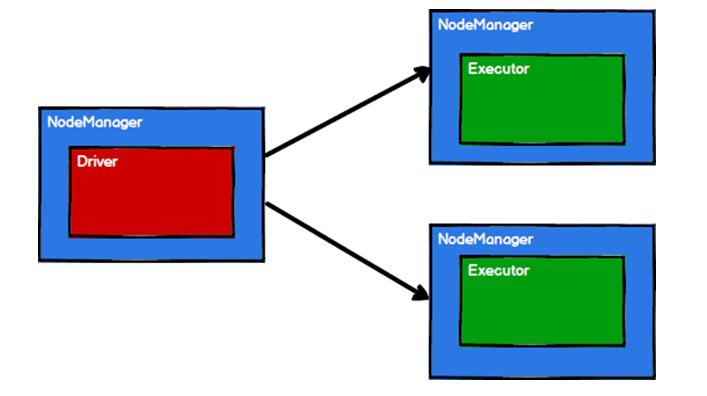
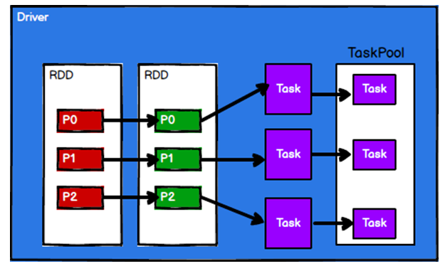
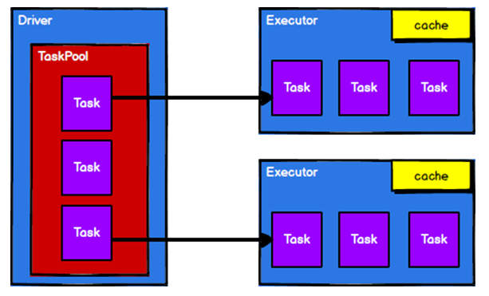
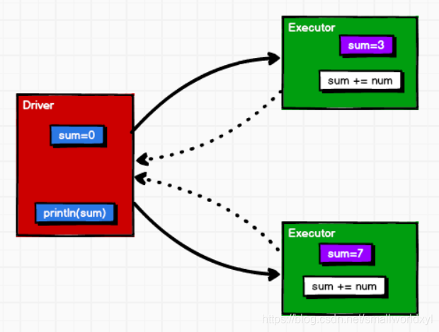
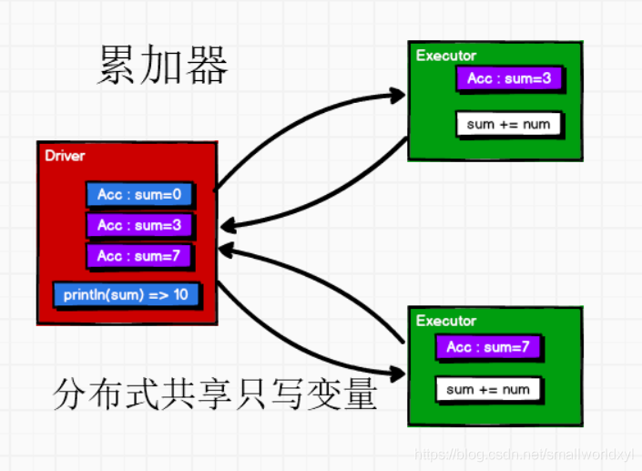
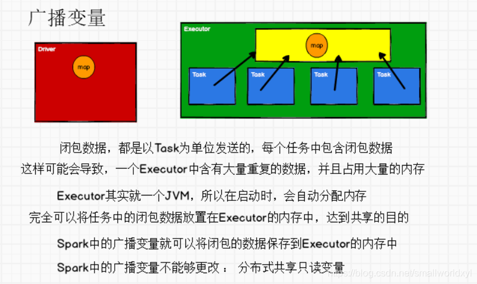

# Spark计算框架

Spark 计算框架为了能够进行高并发和高吞吐的数据处理，封装了三大数据结构，用于处理不同的应用场景。三大数据结构分别是：

- RDD : 弹性分布式数据集

- 累加器：分布式共享只写变量

- 广播变量：分布式共享只读变量

## RDD

### 什么是RDD

RDD（Resilient Distributed Dataset）叫做弹性分布式数据集，是 Spark 中最基本的数据处理模型。代码中是一个抽象类，它代表一个弹性的、不可变、可分区、里面的元素可并行计算的集合。

- 弹性
  - 存储的弹性：内存与磁盘的自动切换；
  - 容错的弹性：数据丢失可以自动恢复；
  - 计算的弹性：计算出错重试机制；
  - 分片的弹性：可根据需要重新分片。
- 分布式：数据存储在大数据集群不同节点上
- 数据集：RDD 封装了计算逻辑，并不保存数据
- 数据抽象：RDD 是一个抽象类，需要子类具体实现
- 不可变：RDD 封装了计算逻辑，是不可以改变的，想要改变，只能产生新的RDD，在新的RDD 里面封装计算逻辑
- 可分区、并行计算

### 核心属性

- 分区列表

RDD 数据结构中存在分区列表，用于执行任务时并行计算，是实现分布式计算的重要属性。

- 分区计算函数

Spark 在计算时，是使用分区函数对每一个分区进行计算

- RDD 之间的依赖关系

RDD 是计算模型的封装，当需求中需要将多个计算模型进行组合时，就需要将多个 RDD 建立依赖关系

- 分区器（可选）

当数据为 KV 类型数据时，可以通过设定分区器自定义数据的分区

- 首选位置（可选）

计算数据时，可以根据计算节点的状态选择不同的节点位置进行计算

### 执行原理

从计算的角度来讲，数据处理过程中需要计算资源（内存 & CPU）和计算模型（逻辑）。执行时，需要将计算资源和计算模型进行协调和整合。

Spark 框架在执行时，先申请资源，然后将应用程序的数据处理逻辑分解成一个一个的计算任务。然后将任务发到已经分配资源的计算节点上, 按照指定的计算模型进行数据计算。最后得到计算结果。

RDD 是 Spark 框架中用于数据处理的核心模型，接下来我们看看，在 Yarn 环境中，RDD 的工作原理:

1)    启动 Yarn 集群环境


2)    Spark 通过申请资源创建调度节点和计算节点



3)    Spark 框架根据需求将计算逻辑根据分区划分成不同的任务



4)    调度节点将任务根据计算节点状态发送到对应的计算节点进行计算



从以上流程可以看出 RDD 在整个流程中主要用于将逻辑进行封装，并生成 Task 发送给Executor 节点执行计算，接下来我们就一起看看 Spark 框架中RDD 是具体是如何进行数据处理的。

## 累加器

代码

```scala
package com.stanlong.spark.core.acc

import org.apache.spark.{SparkConf, SparkContext}

object Spark01_Acc {

    def main(args: Array[String]): Unit = {
        val sparkConf = new SparkConf().setMaster("local[*]").setAppName("ACC")
        val sc = new SparkContext(sparkConf)

        val rdd = sc.makeRDD(List(1, 2, 3, 4))

        // 分区内计算，分区间计算， 过于麻烦
        // val i = rdd.reduce(_+_)

        // 使用累加计算
        var sum = 0
        rdd.foreach(
            num =>{
                sum += num
            }
        )

        println("sum=" + sum)

        sc.stop()
    }
}
```

代码执行打印结果: 0

在Spark中声明SparkContext的类称为Driver，所以变量sum在Driver中；而任务Task（即分区数据的运算）的执行是在Executor中进行，即sum = sum + num在Executor节点执行；

问题的关键点在于：Executor只是做了运算，但并没有将sum运算后的值返回Driver中，也就是说Driver中的sum变量至始至终都保持初始值为0；如下图所示：



此时便可以考虑使用累加器解决上述问题

### 实现原理

累加器用来把Executor 端变量信息聚合到Driver 端。在Driver 程序中定义的变量，在Executor 端的每个Task 都会得到这个变量的一份新的副本，每个 task 更新这些副本的值后， 传回Driver 端进行 merge。



```scala
package com.stanlong.spark.core.acc

import org.apache.spark.{SparkConf, SparkContext}

object Spark01_Acc {

    def main(args: Array[String]): Unit = {
        val sparkConf = new SparkConf().setMaster("local[*]").setAppName("ACC")
        val sc = new SparkContext(sparkConf)

        val rdd = sc.makeRDD(List(1, 2, 3, 4))

        // 分区内计算，分区间计算， 过于麻烦
        // val i = rdd.reduce(_+_)

        // 使用累加器计算
        // 获取系统累加器
        val sumAcc = sc.longAccumulator("sum")

        rdd.foreach(
            num => {
                sumAcc.add(num)
            }
        )
        // 输出累加器的值
        println("sum=" + sumAcc.value)

        // 其他类型的累加器
        // sc.doubleAccumulator()
        // sc.collectionAccumulator()

        sc.stop()
    }
}
```

**使用累加器的一些问题**

- 少加：转换算子中调用累加器，如果没有行动算子的话，那么不会执行

  ```scala
  val rdd = sc.makeRDD(List(1,2,3,4))
  val mapRDD = rdd.map(  // 这里用的是 map， map是转换算子
              num => {
                  // 使用累加器
                  sumAcc.add(num)
                  num
              }
          )
   println(sumAcc.value)
  ```

  输出：0

- 多加：累加器为全局共享变量，多次调用行动算子就会多次执行

  ```scala
  val sumAcc = sc.longAccumulator("sum")
          val mapRDD = rdd.map(
              num => {
                  // 使用累加器
                  sumAcc.add(num)
                  num
              }
          )
          mapRDD.collect()
          mapRDD.collect()
          println(sumAcc.value)
  ```

  输出：20

一般情况下，累加器在行动算子中使用

### 自定义累加器

```scala
package com.stanlong.spark.core.acc

import org.apache.spark.util.AccumulatorV2
import org.apache.spark.{SparkConf, SparkContext}

import scala.collection.mutable

object Spark01_Acc {

    def main(args: Array[String]): Unit = {
        val sparkConf = new SparkConf().setMaster("local[*]").setAppName("ACC")
        val sc = new SparkContext(sparkConf)

        val rdd = sc.makeRDD(List("Hello", "Spark", "Hive", "Hello"))

        // 创建累加器对象
        val wcAcc = new MyAccumulator

        // 向Spark进行注册
        sc.register(wcAcc)

        // 使用自定义累加器
        rdd.foreach(
            word => {
                wcAcc.add(word)
            }
        )

        println(wcAcc.value)


        sc.stop()


    }

    /**
     *  自定义累加器
     *  1. 继承 AccumulatorV2, 定义泛型
     *      IN: 累加器输入的数据类型 String
     *      OUT: 累加器返回的数据类型 mutable.Map(String, Long)
     */
    class MyAccumulator extends AccumulatorV2[String, mutable.Map[String, Long]]{

        private var wcMap = mutable.Map[String, Long]()

        // 判断是否为初始状态
        override def isZero: Boolean = {
            wcMap.isEmpty
        }

        override def copy(): AccumulatorV2[String, mutable.Map[String, Long]] = {
            new MyAccumulator()
        }

        override def reset(): Unit = {
            wcMap.clear()
        }

        // 获取累加器需要计算的值
        override def add(word: String): Unit = {
            val newCnt = wcMap.getOrElse(word, 0L) + 1
            wcMap.update(word, newCnt)
        }

        // 合并累加器
        override def merge(other: AccumulatorV2[String, mutable.Map[String, Long]]): Unit = {
            val map1 = this.wcMap
            val map2 = other.value

            map2.foreach{
                case(word, count) =>{
                    val newCount = map1.getOrElse(word, 0L) + count
                    map1.update(word, newCount)
                }
            }
        }

        // 累加器结果
        override def value: mutable.Map[String, Long] = {
            wcMap
        }
    }

}
```

## 广播变量

### 问题引入

当在Executor端用到了Driver变量，比如使用map()函数，在每个Executor中有多少个task就有多少个Driver端变量副本。


广播变量可以让我们在每台计算机上保留一个只读变量，而不是为每个任务复制一份副本。

Spark会自动广播每个stage任务需要的通用数据。这些被广播的数据以序列化的形式缓存起来，然后在任务运行

前进行反序列化。也就是说，在以下两种情况下显示的创建广播变量才有用：

1）当任务跨多个stage并且需要同样的数据时；

2）当以反序列化的形式来缓存数据时。



### 基础代码

```scala
package com.stanlong.spark.core.acc

import org.apache.spark.{SparkConf, SparkContext}

import scala.collection.mutable

object Spark02_Bc{
    def main(args: Array[String]): Unit = {
        val sparkConf = new SparkConf().setMaster("local[*]").setAppName("ACC")
        val sc = new SparkContext(sparkConf)

        val rdd1 = sc.makeRDD(List(("a", 1),("b", 2),("c", 3)))
        // val rdd2 = sc.makeRDD(List(("a", 4),("b", 5),("c", 6)))

        // join 会导致数据几何增长，并且会影响shuffle的性能，不推荐使用
        // val joinRdd = rdd1.join(rdd2)
        // joinRdd.collect().foreach(println)

        val map = mutable.Map(("a", 4), ("b", 5), ("c", 6))

        // join 的替代方法
        // rdd1.map{
        //     case(w, c) => {
        //         val l = map.getOrElse(w, 0)
        //         (w, (l,1))
        //     }
        // }.collect().foreach(println)

        // 使用广播变量
        val bc = sc.broadcast(map)
        rdd1.map{
            case(w,c) => {
                // 访问广播变量
                bc.value.getOrElse(w, 0)
                (w, (c,1))
            }
        }.collect().foreach(println)
        
        sc.stop()
    }
}
```

