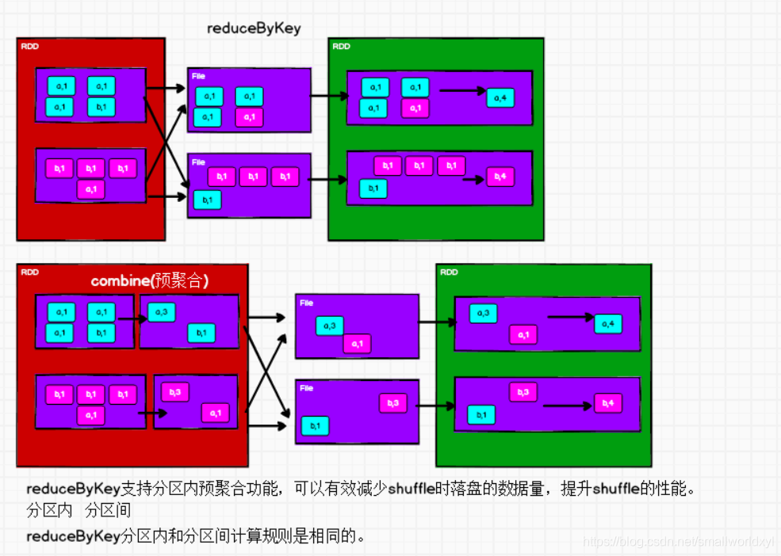
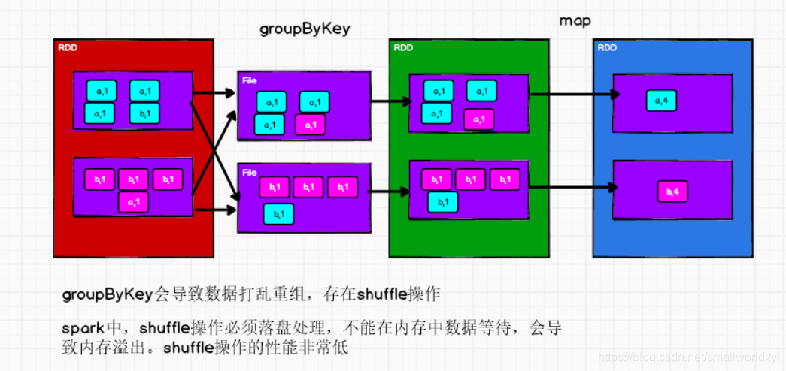
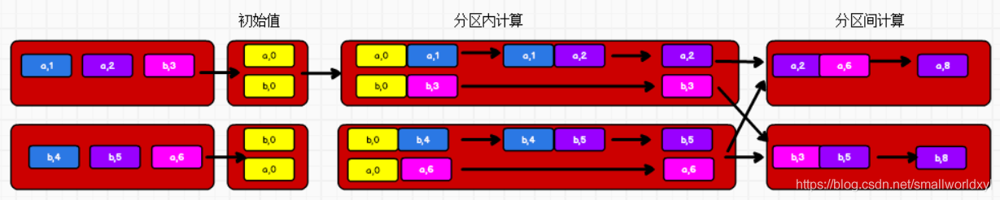
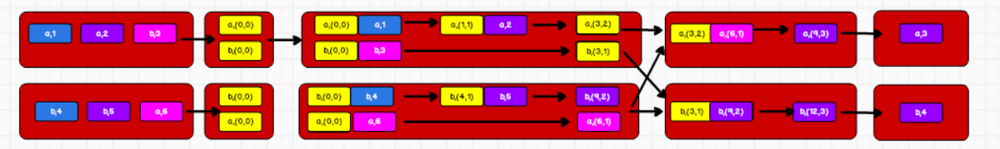
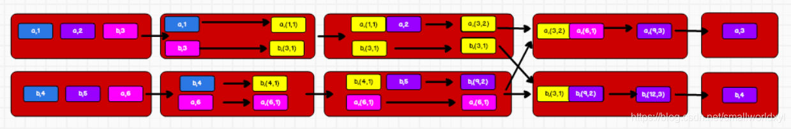

# RDD 转换算子

RDD 根据数据处理方式的不同将算子整体上分为Value 类型、双 Value 类型和Key-Value类型

## Value类型

### map

函数签名：` def map[U: ClassTag](f: T => U): RDD[U]`

函数说明：将处理的数据逐条进行映射转换，这里的转换可以是类型的转换，也可以是值的转换

实例：

```scala
package com.stanlong.spark.core.rdd.operator.transform

import org.apache.spark.{SparkConf, SparkContext}

object Spark01_RDD_Operator_Transform {

    def main(args: Array[String]): Unit = {
        val sparkConf = new SparkConf().setMaster("local[*]").setAppName("RDD")
        val sc = new SparkContext(sparkConf)

        // 算子 -》map
        val rdd = sc.makeRDD(List(1, 2, 3, 4))

        // 转换函数
        // def mapFunction(num:Int): Int ={
        //     num *2
        // }
        // val mapRdd = rdd.map(mapFunction)

        // 转换函数使用匿名函数的形式
        //val mapRdd = rdd.map((num: Int) => {
        //    num * 2
        //})

        //根据scala的至简原则， 匿名函数可以写成如下形式
        val mapRdd = rdd.map(_ * 2)

        mapRdd.collect().foreach(println)

        sc.stop()
        
        /**
         * 说明
         * 1. rdd的计算一个分区内的数据是一个一个执行逻辑
         *      只有前面一个数据全部的逻辑执行完毕后，才会执行下一个逻辑
         *      分区内数据的执行是有序的
         * 2. 不同分区数据计算是无序的
         */
    }
}
```

### mapPartitions

函数签名:

```scala
def mapPartitions[U: ClassTag]( 
    f: Iterator[T] => Iterator[U]
   ,preservesPartitioning: Boolean = false
): RDD[U]
```

函数说明: 将待处理的数据以分区为单位发送到计算节点进行处理，这里的处理是指可以进行任意的处理，哪怕是过滤数据

实例:

```scala
// 算子 -》mapPartitions
val rdd = sc.makeRDD(List(1, 2, 3, 4), 2)

// mapPartitions 
// 以分区为单位进行数据转换操作
// 但是会将整个分区的数据加载到内存进行引用
// 如果处理完的数据不被释放，在内存较小，数据较大的场合下，容易出现内存溢出
val mapRdd = rdd.mapPartitions(
    iter => { // 有几个分区 iter 就会迭代几次, mapPartitions 返回值是一个迭代器
        iter.map(_ * 2)
    }
)

// 获取每个分区内的最大值
// val mapRdd = rdd.mapPartitions( // mapPartitions返回一个迭代器
//     iter => {
//         List(iter.max).iterator
//     }
// )

mapRdd.collect().foreach(println)
```

> map 和 mapPartitions 的区别？

- 数据处理角度

  Map 算子是分区内一个数据一个数据的执行，类似于串行操作。而 mapPartitions 算子是以分区为单位进行批处理操作。

- 功能的角度

  Map 算子主要目的将数据源中的数据进行转换和改变。但是不会减少或增多数据。MapPartitions 算子需要传递一个迭代器，返回一个迭代器，没有要求的元素的个数保持不变， 所以可以增加或减少数据

- 性能的角度

  Map 算子因为类似于串行操作，所以性能比较低，而是 mapPartitions 算子类似于批处理，所以性能较高。但是mapPartitions 算子会长时间占用内存，那么这样会导致内存可能不够用，出现内存溢出的错误。所以在内存有限的情况下，不推荐使用。使用 map 操作。

### mapPartitionsWithIndex

函数签名：

```scala
def mapPartitionsWithIndex[U: ClassTag]( 
    f: (Int, Iterator[T]) => Iterator[U],preservesPartitioning: Boolean = false
): RDD[U]
```

函数说明: 将待处理的数据以分区为单位发送到计算节点进行处理，这里的处理是指可以进行任意的处理，哪怕是过滤数据，在处理时同时可以获取当前分区索引。

实例:

```scala
// 算子 -》mapPartitionsWithIndex
val rdd = sc.makeRDD(List(1, 2, 3, 4), 2)

// val mapRdd = rdd.mapPartitionsWithIndex( // 获取第二个分区的数据
//     (index, iter) => {
//         if (index == 1) {
//             iter
//         } else {
//             Nil.iterator
//         }
//     }
// )

val mapRdd = rdd.mapPartitionsWithIndex( // 打印数字和数字所在的分区
    (index, iter) => {
        iter.map(
            num => {
                (index, num)
            }
        )
    }
)

mapRdd.collect().foreach(println)
```

执行结果

```
(0,1)
(0,2)
(1,3)
(1,4)
```

### flatMap

函数签名:

```scala
def flatMap[U: ClassTag](
    f: T => TraversableOnce[U]
): RDD[U]
```

函数说明:将处理的数据进行扁平化后再进行映射处理，所以算子也称之为扁平映射

实例:

```scala
// 算子 -》flatMap
val rdd = sc.makeRDD(
    List(List(1, 2), List(3,4))
)

val flatRdd = rdd.flatMap(
    list => {
        list
    }
)

//  对 List(List(1,2), 3,  List(4,5)) 进行扁平化操作，结合模式匹配
//  val rdd = sc.makeRDD(List(List(1,2), 3,  List(4,5)) )
//  val flatRdd = rdd.flatMap {
//              case list: List[_] => list
//              case dat => List(dat)
//          }

flatRdd.collect().foreach(println)
```

### glom

函数签名: def glom(): RDD[Array[T]]

函数说明：将同一个分区的数据直接转换为相同类型的内存数组进行处理，分区不变

实例：

```scala
 // 算子 -》glom
val rdd = sc.makeRDD(List(1,2,3,4), 2) // rdd 类型为 RDD[Int]

// val glomRdd = rdd.glom() // 经 glom 转换之后， glomRdd 的类型为 RDD[Array[Int]]

// 计算所有分区最大值求和（分区内取最大值，分区间最大值求和）
val glomRdd = rdd.glom()

val maxRdd = glomRdd.map(
    array => {
        array.max
    }
)
println(maxRdd.collect().sum)
```

### groupBy

函数签名 : ` def groupBy[K](f: T => K)(implicit kt: ClassTag[K]): RDD[(K, Iterable[T])]`

函数说明 : 将数据根据指定的规则进行分组, 分区默认不变，但是数据会被打乱重新组合，我们将这样的操作称之为shuffle。极限情况下，数据可能被分在同一个分区中，一个组的数据在一个分区中，但是并不是说一个分区中只有一个组。

实例:

```scala
// 算子 -》groupBy
//val rdd = sc.makeRDD(List(1,2,3,4), 2)

//// groupBy 会将数据源中的每一个数据进行分组判断，根据返回的分组key进行分组
//// 相同key值的数据会放置在一个组中， 分组和分区没有必然的关系
//def groupFunction(num:Int): Int ={ // 该函数实现的分组是，奇数放一个组，偶数放一个组
//    num % 2
//}
//val groupRdd = rdd.groupBy(groupFunction)

val rdd = sc.makeRDD(List("Hello", "Spark", "Scala", "Hadoop"), 2)
val groupRdd = rdd.groupBy(_.charAt(0)) // 根据首字母进行分组

groupRdd.collect().foreach(println)
```

### filter

函数签名:  def filter(f: T => Boolean): RDD[T]

函数说明: 将数据根据指定的规则进行筛选过滤，符合规则的数据保留，不符合规则的数据丢弃。当数据进行筛选过滤后，分区不变，但是分区内的数据可能不均衡，生产环境下，可能会出现数据倾斜

实例:

```java
// 算子 -》filter
val rdd = sc.makeRDD(List(1,2,3,4))

val filterRdd = rdd.filter(num => num % 2 != 0) // 过滤出奇数

filterRdd.collect().foreach(println)
```

### sample

函数签名：

```scala
def sample(
    withReplacement: Boolean
   ,fraction: Double
   ,seed: Long = Utils.random.nextLong
): RDD[T]
```

函数说明: 根据指定的规则从数据集中抽取数据

实例: 

```scala
// 算子 -》sample
val rdd = sc.makeRDD(List(1,2,3,4,5,6,7,8,9,10))

// 第一个参数表示: 抽取数据后是否将数据返回 true(放回)， false(丢弃)
// 第二个参数表示: 数据源中每条数据被抽取的概率
// 第三个参数表示: 抽取数据式随机算法的种子, 如果参数为空，那么使用当前系统时间
println(rdd.sample(
    false,
    0.4,
    1
).collect().mkString(","))
```

执行结果

```
1,4,8,9
```

### distinct

函数签名：

```scala
def distinct()(implicit ord: Ordering[T] = null): RDD[T]

def distinct(numPartitions: Int)(implicit ord: Ordering[T] = null): RDD[T]
```

函数说明: 将数据集中重复的数据去重

```scala
// 算子 -》distinct
val rdd = sc.makeRDD(List(1, 2, 3, 4, 1,2,3,4)) // 去重

rdd.distinct().collect().foreach(println)
```

### coalesce

函数签名: 

```scala
def coalesce(
    numPartitions: Int
   ,shuffle: Boolean = false
   ,partitionCoalescer: Option[PartitionCoalescer] = Option.empty)
(implicit ord: Ordering[T] = null): RDD[T]
```

函数说明: 根据数据量缩减分区，用于大数据集过滤后，提高小数据集的执行效率，当 spark 程序中，存在过多的小任务的时候，可以通过 coalesce 方法，收缩合并分区，减少分区的个数，减小任务调度成本

实例：

```scala
// 算子 -》coalesce 合并分区
val rdd = sc.makeRDD(List(1, 2, 3, 4), 4)
// val newRdd = rdd.coalesce(2) // 将四个分区合并成两个， 默认不会将分区数据打乱重新组合， 这种情况下可能会导致数据不均衡，出现数据倾斜
//  第一个参数2表示合并后的分区数量
//  第二个参数表示：shuffle = true 可以让数据均衡分配到分区里，避免数据倾斜， 默认是 false
val newRdd = rdd.coalesce(2, true) 
newRdd.saveAsTextFile("output")

// coalesce 也可以扩大分区，但是需要进行shuffle操作， Spark提供了repartition操作
```

### repartition

函数签名: ` def repartition(numPartitions: Int)(implicit ord: Ordering[T] = null): RDD[T]`

函数说明: 该操作内部其实执行的是 coalesce 操作，参数 shuffle 的默认值为 true。无论是将分区数多的RDD 转换为分区数少的RDD，还是将分区数少的 RDD 转换为分区数多的RDD，repartition 操作都可以完成，因为无论如何都会经 shuffle 过程。

实例：

```scala
// 算子 -》repartition 扩大分区
val rdd = sc.makeRDD(List(1, 2, 3, 4), 2)

// repartition 底层代码调用的就是 coalesce， 而且肯定采用shuffle
val newRdd = rdd.repartition(3)
newRdd.saveAsTextFile("output")
```

### sortBy

函数签名: 

```scala
def sortBy[K]( 
    f: (T) => K
   ,ascending: Boolean =  true
   ,numPartitions: Int = this.partitions.length)
(implicit ord: Ordering[K], ctag: ClassTag[K]): RDD[T]
```

函数说明: 该操作用于排序数据。在排序之前，可以将数据通过 f 函数进行处理，之后按照 f 函数处理的结果进行排序，默认为升序排列。排序后新产生的 RDD 的分区数与原RDD 的分区数一致。中间存在 shuffle 的过程

实例：

```scala
// 算子 -》sortBy 排序， 默认升序，默认情况下不会改变分区
// val rdd = sc.makeRDD(List(1, 3, 2, 5, 4), 2)
// val sortRdd = rdd.sortBy(num=>num)
// sortRdd.saveAsTextFile("output")

val rdd = sc.makeRDD(List(("1",1),("11",2),("2",3)))
// sortBy 可以根据指定的方法对数据源中的数据进行排序，第二个参数式设置排序式升序还是降序
val sortRdd = rdd.sortBy(t=>t._1.toInt, false)
sortRdd.collect().foreach(println)
```

## 双 Value 类型

交集，并集和差集要求两个数据源数据类型保持一致

### intersection

函数签名: `def intersection(other: RDD[T]): RDD[T]`

函数说明: 对源RDD 和参数RDD 求交集后返回一个新的RDD

实例：

```scala
val rdd1 = sc.makeRDD(List(1,2,3,4))
val rdd2 = sc.makeRDD(List(3,4,5,6))

// 交集, 要求数据源类型保持一致
val rdd3 = rdd1.intersection(rdd2)
println(rdd3.collect().mkString(","))
```

执行结果

```
3,4
```

### union

函数签名: ` def union(other: RDD[T]): RDD[T]`

函数说明:  对源RDD 和参数RDD 求并集后返回一个新的RDD

实例：

```scala
// 并集, 要求数据源类型保持一致
val rdd4 = rdd1.union(rdd2)
println(rdd4.collect().mkString(","))
```

执行结果

```
1,2,3,4,3,4,5,6
```

### subtract

函数签名:  ` def subtract(other: RDD[T]): RDD[T]`

函数说明:  以一个 RDD 元素为主，去除两个 RDD 中重复元素，将其他元素保留下来。求差集

实例：

```scala
// 差集, 要求数据源类型保持一致
val rdd5 = rdd1.subtract(rdd2)
println(rdd5.collect().mkString(","))
```

执行结果

```
1,2
```

### zip

函数签名: ` def zip[U: ClassTag](other: RDD[U]): RDD[(T, U)]`

函数说明: 将两个 RDD 中的元素，以键值对的形式进行合并。其中，键值对中的Key 为第 1 个 RDD中的元素，Value 为第 2 个 RDD 中的相同位置的元素。

实例：

```scala
// 拉链, 数据源的类型可以不一致， 但是数据源的分区要保持一致， 数据源的元素个数要保持一致
val rdd6 = rdd1.zip(rdd2)
println(rdd6.collect().mkString(","))
```

执行结果

```
(1,3),(2,4),(3,5),(4,6)
```

## Key-Value类型

### partitionBy

函数签名:  ` def partitionBy(partitioner: Partitioner): RDD[(K, V)]`

函数说明: 将数据按照指定Partitioner 重新进行分区。Spark 默认的分区器是HashPartitioner

实例：

```scala
// partitionBy 根据分区的规则对数据进行重新分区
val rdd = sc.makeRDD(List(1,2,3,4))
val mapRdd = rdd.map((_, 1))
mapRdd.partitionBy(new HashPartitioner(2)).saveAsTextFile("output")
```

### reduceByKey

函数签名: 

```scala
def reduceByKey(func: (V, V) => V): RDD[(K, V)]

def reduceByKey(func: (V, V) => V, numPartitions: Int): RDD[(K, V)]
```

函数说明: 可以将数据按照相同的Key 对Value 进行聚合

实例：

```scala
// reduceByKey 对相同key的value进行聚合的操作, 如果key只有一个则不参与运算
val rdd = sc.makeRDD(List(("a", 1),("a", 2),("a", 3),("b",4)))
val reduceRdd = rdd.reduceByKey(_ + _)
reduceRdd.collect().foreach(println)
```

执行结果:

```
(a,6)
(b,4)
```



### groupByKey

函数签名: 

```scala
def groupByKey(): RDD[(K, Iterable[V])]

def groupByKey(numPartitions: Int): RDD[(K, Iterable[V])]

def groupByKey(partitioner: Partitioner): RDD[(K, Iterable[V])]
```

函数说明:  将数据源的数据根据 key 对 value 进行分组

实例：

```scala
// groupByKey 将相同key的数据分组一个组中，形成一个对偶元组，
// 元组中的第一个元素是key， 第二个元素是相同key的value集合
val rdd = sc.makeRDD(List(("a", 1),("a", 2),("a", 3),("b",4)))
val groupRdd = rdd.groupByKey()
groupRdd.collect().foreach(println) 
```

执行结果:

```
(a,CompactBuffer(1, 2, 3))
(b,CompactBuffer(4))
```



> reduceByKey和groupByKey的区别

**从** **shuffle 的角度**：reduceByKey 和 groupByKey 都存在 shuffle 的操作，但是reduceByKey 可以在 shuffle 前对分区内相同 key 的数据进行预聚合（combine）功能，这样会减少落盘的数据量，而groupByKey 只是进行分组，不存在数据量减少的问题，reduceByKey 性能比较高。

**从功能的角度**：reduceByKey 其实包含分组和聚合的功能。GroupByKey 只能分组，不能聚合，所以在分组聚合的场合下，推荐使用 reduceByKey，如果仅仅是分组而不需要聚合。那么还是只能使用groupByKey

### aggregateByKey

函数签名: 

```scala
def aggregateByKey[U: ClassTag](zeroValue: U)(
    seqOp: (U, V) => U
   ,combOp: (U, U) => U
): RDD[(K, U)]
```

函数说明: 将数据根据不同的规则进行分区内计算和分区间计算

实例：

```scala
// aggregateByKey 有两个参数列表
// 第一个参数列表 需要传递一个参数， 表示初始值，主要用于第一个key出现时和value进行分区内计算
// 第二个参数列表 需要传递两个参数， 第一个表示分区内的计算规则，第二个表示分区间的计算规则
// 最终的返回结果应该和初始值的类型保持一致
// val rdd = sc.makeRDD(List(("a", 1),("a", 2),("a", 3),("a",4)), 2)
// rdd.aggregateByKey(0 )(
//     (x, y) => math.max(x,y), // 分区内求最大值
//     (x, y) => x+y            // 分区间求和
// ).collect().foreach(println)

// 获取相同key的数据的平均值
val rdd = sc.makeRDD(List(("a", 1),("a", 2),("b", 3),("b",4),("b",5),("a",6)), 2)
val newRdd = rdd.aggregateByKey((0,0))( // (0,0) 第一个0表示初始值，用于计算数据的总和，第二个0表示相同的key出现的次数
    (t, v) =>{
        (t._1 +v , t._2 + 1) // (数据相加，次数相加)
    }, // 分区内计算
    (t1, t2) =>{
        (t1._1 + t2._1, t1._2 + t2._2)
    } // 分区间计算
)

val resultRdd = newRdd.mapValues { // mapValues， key不变，只对value进行计算
    case (num, cnt) => {
        num / cnt
    }
}

resultRdd.collect().foreach(println)
```





### foldByKey

函数签名: ` def foldByKey(zeroValue: V)(func: (V, V) => V): RDD[(K, V)]`

函数说明: 当分区内计算规则和分区间计算规则相同时，aggregateByKey 就可以简化为foldByKey

实例:

```scala
// 如果聚合计算时，分区内和分区间的计算规则相同
// 使用 aggregateByKey
// rdd.aggregateByKey(0)(_ + _, _ + _).collect().foreach(println)
// 而使用 foldByKey 可以简化操作 
val rdd = sc.makeRDD(List(("a", 1),("a", 2),("a", 3),("a",4)), 2)
rdd.foldByKey(0)(_ + _).collect().foreach(println)
```

执行结果:

```scala
(a,10)
```

### combineByKey

函数签名: 

```scala
def combineByKey[C]( 
    createCombiner: V => C
   ,mergeValue: (C, V) => C
   ,mergeCombiners: (C, C) => C
): RDD[(K, C)]
```

函数说明: 最通用的对key-value 型 rdd 进行聚集操作的聚集函数（aggregation function）。类似于aggregate()，combineByKey()允许用户返回值的类型与输入不一致

实例:

```scala
// combineByKey
// 第一个参数 将相同key的第一个数据进行结构转换，实现操作
// 第二个参数 分区内的计算规则
// 第三个参数 分区间的计算规则
val rdd = sc.makeRDD(List(("a", 1),("a", 2),("a", 3),("b",4), ("b",5), ("b",6)), 2)
rdd.combineByKey(
    v =>(v, 1),
    (t:(Int, Int), v) => {
        (t._1 + v, t._2 +1)
    },
    (t1:(Int, Int), t2:(Int, Int)) =>{
        (t1._1 + t2._1, t1._2 + t2._2)
    }
).collect().foreach(println)
```

执行结果:

```
(b,(15,3))
(a,(6,3))
```



>  reduceByKey: 

相同 key 的第一个数据不进行任何计算，分区内和分区间计算规则相同

> FoldByKey: 

相同 key 的第一个数据和初始值进行分区内计算，分区内和分区间计算规则相同

> AggregateByKey：

相同 key 的第一个数据和初始值进行分区内计算，分区内和分区间计算规则可以不相同

>  CombineByKey:

当计算时，发现数据结构不满足要求时，可以让第一个数据转换结构。分区内和分区间计算规则不相同。

### sortByKey

函数签名: 

```scala
def sortByKey(
    ascending: Boolean = true
   , numPartitions: Int = self.partitions.length
): RDD[(K, V)]
```

函数说明: 在一个(K,V)的 RDD 上调用，K 必须实现 Ordered 接口(特质)，返回一个按照 key 进行排序的

实例：

```scala
// 按key排序
val rdd = sc.makeRDD(List(("a", 1),("a", 2),("b", 3),("b",4),("b",5),("a",6)), 2)
val resultRdd = rdd.sortByKey(true, 2)
resultRdd.collect().foreach(println)
```

执行结果:

```
(a,1)
(a,2)
(a,6)
(b,3)
(b,4)
(b,5)
```

### join

函数签名: ` def join[W](other: RDD[(K, W)]): RDD[(K, (V, W))]`

函数说明: 在类型为(K,V)和(K,W)的RDD 上调用，返回一个相同 key 对应的所有元素连接在一起的(K,(V,W))的RDD

实例:

```scala
// join 两个不同数据源的数据，相同key的value会连接在一起，形成元组
// 如果数据源中key没有匹配上，那么数据不会出现在结果中
// 如果两个数据源中key有多个相同的，会依次匹配，可能会出现笛卡儿积，导致性能降低
val rdd1 = sc.makeRDD(List(("a", 1), ("b", 2), ("c", 3)))
val rdd2 = sc.makeRDD(List(("a", 4), ("b", 5), ("c", 6), ("d", 6)))
val joinRdd = rdd1.join(rdd2)
joinRdd.collect().foreach(println)
```

执行结果:

```
(a,(1,4))
(b,(2,5))
(c,(3,6))
```

### leftOuterJoin

函数签名: ` def leftOuterJoin[W](other: RDD[(K, W)]): RDD[(K, (V, Option[W]))]`

函数说明: 类似于 SQL 语句的左外连接

实例:

```scala
// 左连接，右连接
val rdd1 = sc.makeRDD(List(("a", 1), ("b", 2), ("c", 3)))
val rdd2 = sc.makeRDD(List(("a", 4), ("b", 5), ("c", 6), ("d", 6)))
val joinRdd = rdd1.leftOuterJoin(rdd2)
val joinRdd2 = rdd1.rightOuterJoin(rdd2)
joinRdd.collect().foreach(println)
joinRdd2.collect().foreach(println)
```

执行结果:

```scala
(a,(1,Some(4)))
(b,(2,Some(5)))
(c,(3,Some(6)))
(a,(Some(1),4))
(b,(Some(2),5))
(c,(Some(3),6))
(d,(None,6))
```

### cogroup

函数签名:  ` def cogroup[W](other: RDD[(K, W)]): RDD[(K, (Iterable[V], Iterable[W]))]`

函数说明:  在类型为(K,V)和(K,W)的RDD 上调用，返回一个(K,(Iterable\<V>,Iterable\<W>))类型的RDD

实例:

```scala
// cogroup = connect + group // 相同的key放到一个组里然后进行连接
val rdd1 = sc.makeRDD(List(("a", 1), ("b", 2), ("c", 3), ("c", 7)))
val rdd2 = sc.makeRDD(List(("a", 4), ("b", 5), ("c", 6), ("d", 6)))
val coRdd = rdd1.cogroup(rdd2)
coRdd.collect().foreach(println)
```

执行结果:

```
(a,(CompactBuffer(1),CompactBuffer(4)))
(b,(CompactBuffer(2),CompactBuffer(5)))
(c,(CompactBuffer(3, 7),CompactBuffer(6)))
(d,(CompactBuffer(),CompactBuffer(6)))
```
