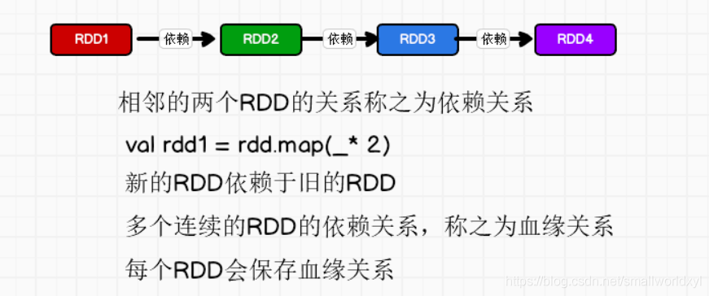
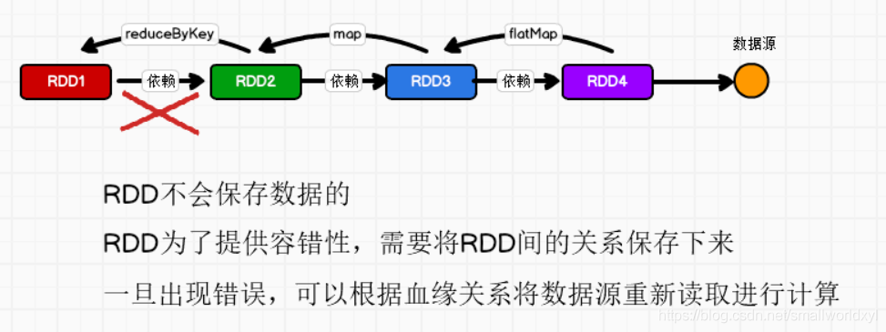
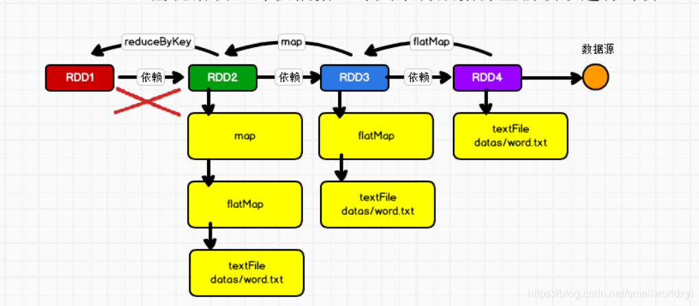
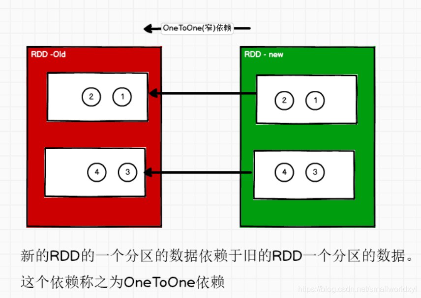
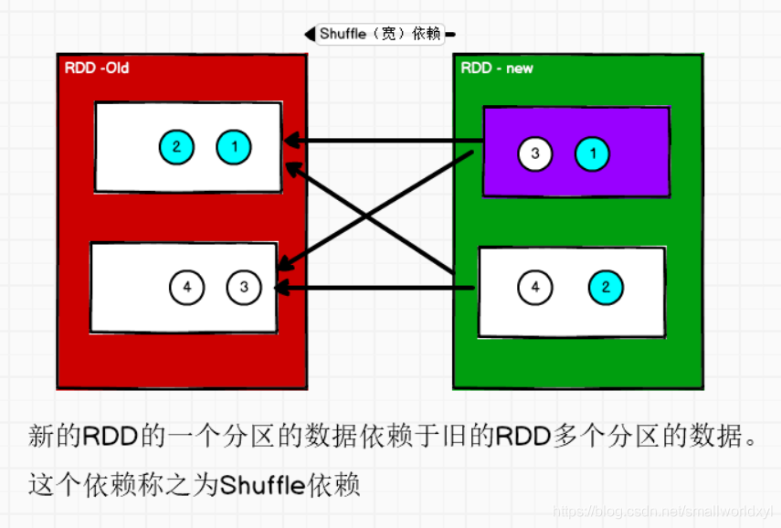
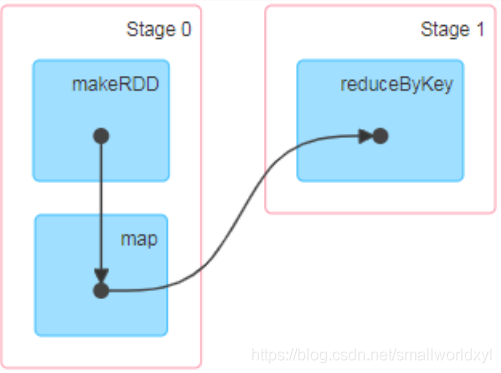
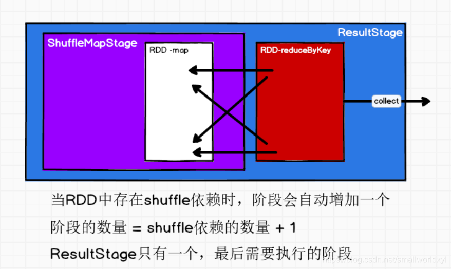
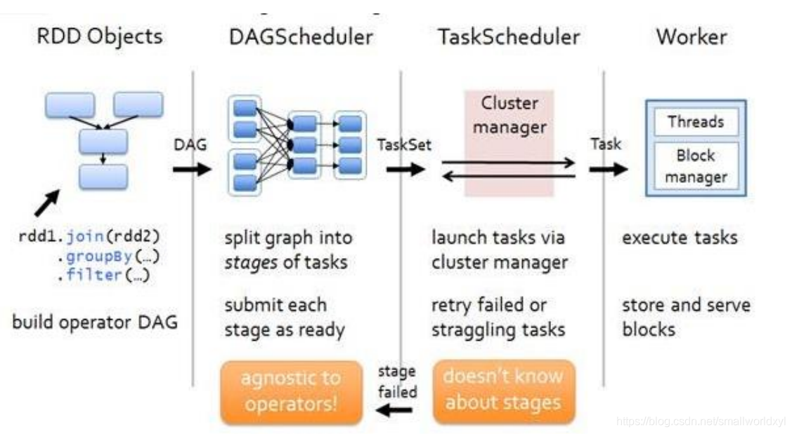
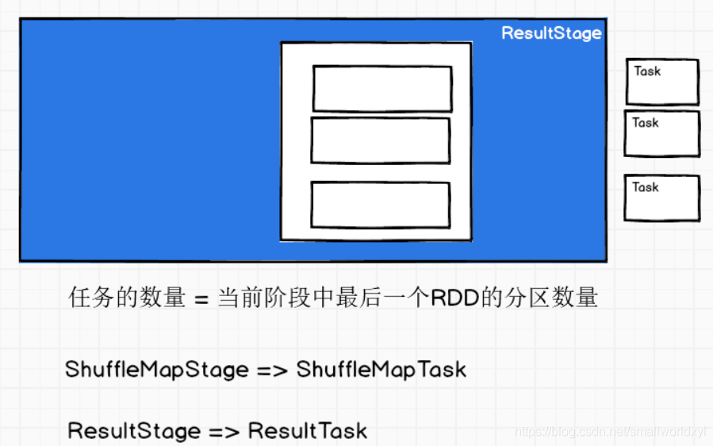

# RDD依赖关系

## 血缘关系

RDD 只支持粗粒度转换，即在大量记录上执行的单个操作。将创建 RDD 的一系列 Lineage（血统）记录下来，以便恢复丢失的分区。RDD 的 Lineage 会记录 RDD 的元数据信息和转换行为，当该 RDD 的部分分区数据丢失时，它可以根据这些信息来重新运算和恢复丢失的数据分区





wordCount血缘关系如图



血缘关系演示

```scala
package com.stanlong.spark.core.rdd.dep

import org.apache.spark.rdd.RDD
import org.apache.spark.{SparkConf, SparkContext}

object Spark01_Rdd_dep {

    def main(args: Array[String]): Unit = {

        val sparkConf = new SparkConf().setMaster("local").setAppName("WordCount")
        val sc = new SparkContext(sparkConf)

        val lines: RDD[String] = sc.textFile("datas/1.txt")
        println(lines.toDebugString) // toDebugString 打印血缘关系
        println("/*************************")

        val words: RDD[String] = lines.flatMap(_.split(" "))
        println(words.toDebugString)
        println("/*************************")

        val wordToOne = words.map(word=>(word,1))
        println(wordToOne.toDebugString)
        println("/*************************")

        val wordToSum: RDD[(String, Int)] = wordToOne.reduceByKey(_+_)
        println(wordToSum.toDebugString)
        println("/*************************")

        val array: Array[(String, Int)] = wordToSum.collect()
        array.foreach(println)

        sc.stop()
    }
}
```

输出

```
(1) datas/1.txt MapPartitionsRDD[1] at textFile at Spark01_Rdd_dep.scala:13 []
 |  datas/1.txt HadoopRDD[0] at textFile at Spark01_Rdd_dep.scala:13 []
/*************************
(1) MapPartitionsRDD[2] at flatMap at Spark01_Rdd_dep.scala:17 []
 |  datas/1.txt MapPartitionsRDD[1] at textFile at Spark01_Rdd_dep.scala:13 []
 |  datas/1.txt HadoopRDD[0] at textFile at Spark01_Rdd_dep.scala:13 []
/*************************
(1) MapPartitionsRDD[3] at map at Spark01_Rdd_dep.scala:21 []
 |  MapPartitionsRDD[2] at flatMap at Spark01_Rdd_dep.scala:17 []
 |  datas/1.txt MapPartitionsRDD[1] at textFile at Spark01_Rdd_dep.scala:13 []
 |  datas/1.txt HadoopRDD[0] at textFile at Spark01_Rdd_dep.scala:13 []
/*************************
(1) ShuffledRDD[4] at reduceByKey at Spark01_Rdd_dep.scala:25 []
 +-(1) MapPartitionsRDD[3] at map at Spark01_Rdd_dep.scala:21 [] // +-(1) 表示有shuffled操作， (1)表示一个分区
    |  MapPartitionsRDD[2] at flatMap at Spark01_Rdd_dep.scala:17 []
    |  datas/1.txt MapPartitionsRDD[1] at textFile at Spark01_Rdd_dep.scala:13 []
    |  datas/1.txt HadoopRDD[0] at textFile at Spark01_Rdd_dep.scala:13 []
/*************************
(Hello,2)
(World,1)
(Scala,1)
```

## 依赖关系

依赖关系其实就是两个相邻 RDD 之间的关系

代码如下

```scala
package com.stanlong.spark.core.rdd.dep

import org.apache.spark.rdd.RDD
import org.apache.spark.{SparkConf, SparkContext}

object Spark02_Rdd_dep {

    def main(args: Array[String]): Unit = {

        val sparkConf = new SparkConf().setMaster("local").setAppName("WordCount")
        val sc = new SparkContext(sparkConf)

        val lines: RDD[String] = sc.textFile("datas/1.txt")
        println(lines.dependencies) // dependencies 打印依赖关系
        println("/*************************")

        val words: RDD[String] = lines.flatMap(_.split(" "))
        println(words.dependencies)
        println("/*************************")

        val wordToOne = words.map(word=>(word,1))
        println(wordToOne.dependencies)
        println("/*************************")

        val wordToSum: RDD[(String, Int)] = wordToOne.reduceByKey(_+_)
        println(wordToSum.dependencies)
        println("/*************************")

        val array: Array[(String, Int)] = wordToSum.collect()
        array.foreach(println)
        
        sc.stop()
    }
}
```

输出结果

```scala
List(org.apache.spark.OneToOneDependency@43045f9f)  -- OneToOneDependency 窄依赖
/*************************
List(org.apache.spark.OneToOneDependency@21bd20ee)
/*************************
List(org.apache.spark.OneToOneDependency@54e3658c)
/*************************
List(org.apache.spark.ShuffleDependency@4b31a708) -- ShuffleDependency Shuffle依赖又称宽依赖
/*************************
(Hello,2)
(World,1)
(Scala,1)
```

## 窄依赖

窄依赖表示每一个父(上游)RDD 的 Partition 最多被子（下游）RDD 的一个 Partition 使用，窄依赖我们形象的比喻为独生子女。



## 宽依赖

宽依赖表示同一个父（上游）RDD 的 Partition 被多个子（下游）RDD 的 Partition 依赖，会引起 Shuffle。宽依赖形象的比喻为多生



## 阶段划分

一个Job会被拆分为多组Task，每组任务被称为一个Stage就像Map Stage， Reduce Stage。

DAG（Directed Acyclic Graph）有向无环图是由点和线组成的拓扑图形，该图形具有方向，不会闭环。例如，DAG 记录了RDD 的转换过程和任务的阶段



RDD之间的依赖关系将DAG图划分为不同的阶段，对于窄依赖，由于partition依赖关系的确定性，partition的转换处理就可以在同一个线程里完成，窄依赖就被spark划分到同一个stage中，而对于宽依赖，只能等父RDD shuffle处理完成后，下一个stage才能开始接下来的计算。即：遇到宽依赖就断开，划分为一个stage；遇到窄依赖就将这个RDD加入该stage中。一个宽依赖就分一个stage，每个shuffle之前都是一个stage。



## 任务划分

RDD 任务切分中间分为：Application、Job、Stage 和 Task

Application：初始化一个 SparkContext 即生成一个 Application；

Job：一个 Action 算子就会生成一个 Job；

Stage：Stage 等于宽依赖(ShuffleDependency)的个数加 1；

Task：一个 Stage 阶段中，最后一个 RDD 的分区个数就是 Task 的个数

$\color{#FF0000}{注意：Application->Job->Stage->Task 每一层都是 1 对 n 的关系}$.



在spark中Task的类型分为2种：ShuffleMapTask和ResultTask；
DAG的最后一个阶段会为每个结果的partition生成一个ResultTask，即每个Stage里面的Task的数量是由该Stage中最后一个RDD的Partition的数量所决定的！而其余所有阶段都会生成ShuffleMapTask；之所以称之为ShuffleMapTask是因为它需要将自己的计算结果通过shuffle到下一个stage中。



