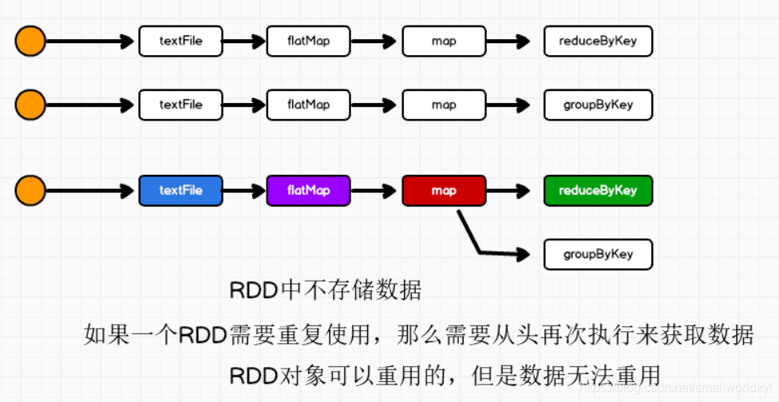
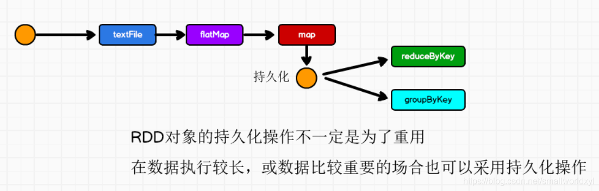
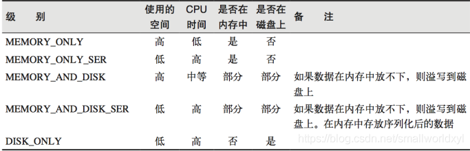

# RDD持久化

当需要对RDD连续使用时，重复调用是否就可以避免从头再来呢？



```scala
package com.stanlong.spark.core.rdd.persist

import org.apache.spark.{SparkConf, SparkContext}

object Spark01_RDD_Persist {

    def main(args: Array[String]): Unit = {
        val sparkConf = new SparkConf().setMaster("local").setAppName("WordCount")
        val sc = new SparkContext(sparkConf)

        val list = List("Hello Scala", "Hello World")
        val rdd = sc.makeRDD(list)
        val flatRdd = rdd.flatMap(_.split(" "))
        val mapRdd = flatRdd.map(word =>{
            println("@@@@@@@@@@@")
            (word, 1)
        })

        val reduceRdd = mapRdd.reduceByKey(_ + _)
        reduceRdd.collect().foreach(println)
        
        println("******************")

        val groupRdd = mapRdd.groupByKey() // mapRdd 重用
        groupRdd.collect().foreach(println)
    }
}
```

输出结果

```
@@@@@@@@@@@
@@@@@@@@@@@
@@@@@@@@@@@
@@@@@@@@@@@
(Hello,2)
(World,1)
(Scala,1)
******************
@@@@@@@@@@@
@@@@@@@@@@@
@@@@@@@@@@@
@@@@@@@@@@@
(Hello,CompactBuffer(1, 1))
(World,CompactBuffer(1))
(Scala,CompactBuffer(1))
```

由输出可见，@@@@@@@@@@@打印了两次， mapRDD从开始又执行了一次，所以效率很低，那能否有什么办法让rdd暂时保存数据呢？

答案是使用持久化



## 持久化原理

Spark中非常重要的一个功能特性就是可以将RDD持久化在内存中，当对RDD执行持久化操作时，每个节点都会将自己操作的RDD的partition持久化到内存中，并且在之后对该RDD的反复使用中，直接使用内存缓存的partition。这样的话，对于针对一个RDD反复执行多个操作的场景，就只要针对RDD计算一次即可，后面直接使用该RDD，而不用反复计算该RDD。

## 持久化使用原理

（1）第一次加载大量的数据到RDD中
（2）频繁的动态更新RDD Cache数据，不适合使用Spark Cache、Spark lineage

## 持久化方法

### RDD Cache 缓存 和 persist

RDD 通过 Cache 或者 Persist 方法将前面的计算结果缓存，默认情况下会把数据以缓存在 JVM 的堆内存中。但是并不是这两个方法被调用时立即缓存，而是触发后面的 action 算子时，该 RDD 将会被缓存在计算节点的内存中，并供后面重用。

缓存有可能丢失，或者存储于内存的数据由于内存不足而被删除，RDD 的缓存容错机制保证了即使缓存丢失也能保证计算的正确执行。通过基于 RDD 的一系列转换，丢失的数据会被重算，由于 RDD 的各个 Partition 是相对独立的，因此只需要计算丢失的部分即可，并不需要重算全部Partition。

Spark 会自动对一些 Shuffle 操作的中间数据做持久化操作(比如：reduceByKey)。这样做的目的是为了当一个节点 Shuffle 失败了避免重新计算整个输入。但是，在实际使用的时候，如果想重用数据，仍然建议调用 persist 或 cache。

**存储级别**



```scala
package com.stanlong.spark.core.rdd.persist

import org.apache.spark.{SparkConf, SparkContext}

object Spark01_RDD_Persist {

    def main(args: Array[String]): Unit = {
        val sparkConf = new SparkConf().setMaster("local").setAppName("WordCount")
        val sc = new SparkContext(sparkConf)

        val list = List("Hello Scala", "Hello World")
        val rdd = sc.makeRDD(list)
        val flatRdd = rdd.flatMap(_.split(" "))
        val mapRdd = flatRdd.map(word =>{
            println("@@@@@@@@@@@")
            (word, 1)
        })

        // cache 默认持久化的操作，只能将数据保存到内存中，如果想要保存到磁盘文件，需要调用 persist 更改存储级别， 持久化操作必须在行动算子执行时完成的
        mapRdd.cache()
        // mapRdd.persist(StorageLevel.DISK_ONLY)
        
        val reduceRdd = mapRdd.reduceByKey(_ + _)
        reduceRdd.collect().foreach(println)

        println("******************")

        val groupRdd = mapRdd.groupByKey()
        groupRdd.collect().foreach(println)
    }
}
```

输出: 可见 @@@@@@@@@@@ 并没有打印第二次

```
@@@@@@@@@@@
@@@@@@@@@@@
@@@@@@@@@@@
@@@@@@@@@@@
(Hello,2)
(World,1)
(Scala,1)
******************
(Hello,CompactBuffer(1, 1))
(World,CompactBuffer(1))
(Scala,CompactBuffer(1))
```

### RDD CheckPoint 检查点

所谓的检查点其实就是通过将 RDD 中间结果写入磁盘。

由于血缘依赖过长会造成容错成本过高，这样就不如在中间阶段做检查点容错，如果检查点之后有节点出现问题，可以从检查点开始重做血缘，减少了开销。

对 RDD 进行 checkpoint 操作并不会马上被执行，必须执行 Action 操作才能触发。
Checkpoint 的数据通常存储在 HDFS 等容错、高可用的文件系统，可靠性高。

```scala
package com.stanlong.spark.core.rdd.persist

import org.apache.spark.storage.StorageLevel
import org.apache.spark.{SparkConf, SparkContext}

object Spark01_RDD_Persist {

    def main(args: Array[String]): Unit = {
        val sparkConf = new SparkConf().setMaster("local").setAppName("WordCount")
        val sc = new SparkContext(sparkConf)
        val list = List("Hello Scala", "Hello World")
        val rdd = sc.makeRDD(list)
        val flatRdd = rdd.flatMap(_.split(" "))

        val mapRdd = flatRdd.map(word =>{
            println("@@@@@@@@@@@")
            (word, 1)
        })

        // checkpoint 需要落盘，需要指定检查点保存路径
        // 检查点路径保存的文件，当作业执行完毕后，不会被删除
        sc.setCheckpointDir("cp") // 一般保存路径都是在分布式存储系统中
        mapRdd.checkpoint()

        val reduceRdd = mapRdd.reduceByKey(_ + _)
        reduceRdd.collect().foreach(println)

        println("******************")

        val groupRdd = mapRdd.groupByKey()
        groupRdd.collect().foreach(println)
    }
}
```

### 缓存和检查点区别

- cache 
  1. 将数据临时存储在内存中进行数据重用
  2. 会在血缘关系中添加新的依赖。一旦，出现问题，可以重头读取数据

- persist :
  1. 将数据临时存储在磁盘文件中进行数据重用
  2. 涉及到磁盘IO，性能较低，但是数据安全
  3. 如果作业执行完毕，临时保存的数据文件就会丢失

- checkpoint :
  1. 将数据长久地保存在磁盘文件中进行数据重用
  2. 涉及到磁盘IO，性能较低，但是数据安全
  3. 为了保证数据安全，所以一般情况下，会独立执行作业
  4. 为了能够提高效率，一般情况下，是需要和cache联合使用
  5. 执行过程中，会切断血缘关系。重新建立新的血缘关系，checkpoint等同于改变数据源

