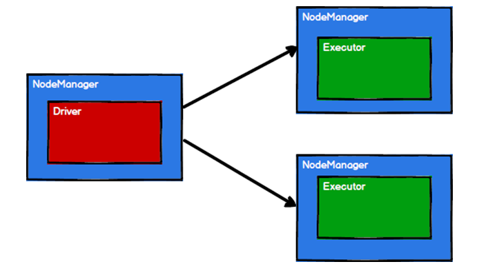
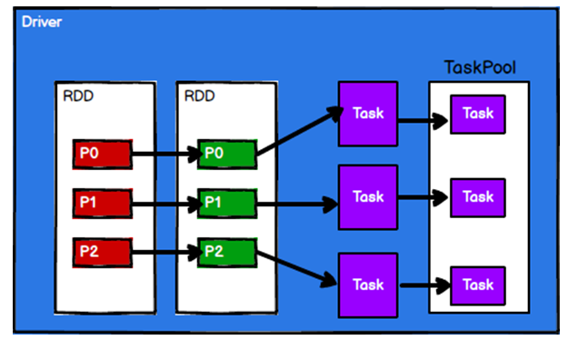
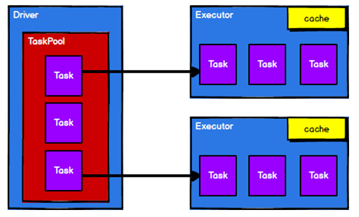

# Spark核心编程

Spark 计算框架为了能够进行高并发和高吞吐的数据处理，封装了三大数据结构，用于处理不同的应用场景。三大数据结构分别是：

- RDD : 弹性分布式数据集

- 累加器：分布式共享只写变量

- 广播变量：分布式共享只读变量

## RDD

### 什么是RDD

RDD（Resilient Distributed Dataset）叫做弹性分布式数据集，是 Spark 中最基本的数据处理模型。代码中是一个抽象类，它代表一个弹性的、不可变、可分区、里面的元素可并行计算的集合。

- 弹性
  - 存储的弹性：内存与磁盘的自动切换；
  - 容错的弹性：数据丢失可以自动恢复；
  - 计算的弹性：计算出错重试机制；
  - 分片的弹性：可根据需要重新分片。
- 分布式：数据存储在大数据集群不同节点上
- 数据集：RDD 封装了计算逻辑，并不保存数据
- 数据抽象：RDD 是一个抽象类，需要子类具体实现
- 不可变：RDD 封装了计算逻辑，是不可以改变的，想要改变，只能产生新的RDD，在新的RDD 里面封装计算逻辑
- 可分区、并行计算

### 核心属性

- 分区列表

RDD 数据结构中存在分区列表，用于执行任务时并行计算，是实现分布式计算的重要属性。

- 分区计算函数

Spark 在计算时，是使用分区函数对每一个分区进行计算

- RDD 之间的依赖关系

RDD 是计算模型的封装，当需求中需要将多个计算模型进行组合时，就需要将多个 RDD 建立依赖关系

- 分区器（可选）

当数据为 KV 类型数据时，可以通过设定分区器自定义数据的分区

- 首选位置（可选）

计算数据时，可以根据计算节点的状态选择不同的节点位置进行计算

### 执行原理

从计算的角度来讲，数据处理过程中需要计算资源（内存 & CPU）和计算模型（逻辑）。执行时，需要将计算资源和计算模型进行协调和整合。

Spark 框架在执行时，先申请资源，然后将应用程序的数据处理逻辑分解成一个一个的计算任务。然后将任务发到已经分配资源的计算节点上, 按照指定的计算模型进行数据计算。最后得到计算结果。

RDD 是 Spark 框架中用于数据处理的核心模型，接下来我们看看，在 Yarn 环境中，RDD 的工作原理:

1)    启动 Yarn 集群环境


2)    Spark 通过申请资源创建调度节点和计算节点



3)    Spark 框架根据需求将计算逻辑根据分区划分成不同的任务



4)    调度节点将任务根据计算节点状态发送到对应的计算节点进行计算



从以上流程可以看出 RDD 在整个流程中主要用于将逻辑进行封装，并生成 Task 发送给Executor 节点执行计算，接下来我们就一起看看 Spark 框架中RDD 是具体是如何进行数据处理的。

### 基础编程

在 Spark 中创建RDD 的创建方式可以分为四种

从集合中创建RDD，Spark 主要提供了两个方法：parallelize 和 makeRDD

#### 从集合（内存）中创建 RDD

```scala
package com.stanlong.spark.core.rdd.builder

import org.apache.spark.{SparkConf, SparkContext}

object Spark01_RDD_Memory {

    def main(args: Array[String]): Unit = {
        // 准备环境
        val spakConf = new SparkConf().setMaster("local[*]").setAppName("RDD") // [*] 表示当前系统最大可用核数，如果省略则表示用单线程模拟单核
        val sc = new SparkContext(spakConf)

        // 创建RDD
        //从内存中创建RDD 将内存中集合的数据作为处理的数据源
        val seq = Seq[Int](1,2,3,4)
        // val rdd = sc.parallelize(seq) // parallelize 并行, 等同于下面一行
        val rdd = sc.makeRDD(seq) // makeRDD 的底层实现也是调用了 rdd对象的parallelize方法

        rdd.collect().foreach(println)

        // 关闭环境
        sc.stop()
    }
}
```

#### 从外部存储（文件）创建RDD

由外部存储系统的数据集创建RDD 包括：本地的文件系统，所有Hadoop 支持的数据集， 比如HDFS、HBase 等

```scala
package com.stanlong.spark.core.rdd.builder

import org.apache.spark.{SparkConf, SparkContext}

object Spark02_RDD_File {

    def main(args: Array[String]): Unit = {
        // 准备环境
        val spakConf = new SparkConf().setMaster("local[*]").setAppName("RDD") // [*] 表示当前系统最大可用核数，如果省略则表示用单线程模拟单核
        val sc = new SparkContext(spakConf)

        // 创建RDD
        //从文件中创建RDD 将文件中的数据作为处理的数据源
        // textFile 以行为单位读取数据，读取到的都是字符串
        val rdd = sc.textFile("datas/1.txt") // 路径默认以当前环境的根路径为基准，也可用写绝对路径。如果文件后缀名相同，也可以使用通配符

        // wholeTextFiles 以文件为单位读取数据，读取的结果是个元组，第一个元素表示路径，第二个元素表示文件内容
        // val rdd = sc.wholeTextFiles("datas")

        rdd.collect().foreach(println)

        // 关闭环境
        sc.stop()
    }
}
```

#### 从其他 RDD 创建

主要是通过一个RDD 运算完后，再产生新的RDD。详情请参考后续章节

#### 直接创建 RDD（new）

使用 new 的方式直接构造RDD，一般由Spark 框架自身使用。

### RDD 并行度与分区

默认情况下，Spark 可以将一个作业切分多个任务后，发送给 Executor 节点并行计算，而能够并行计算的任务数量我们称之为并行度。这个数量可以在构建RDD 时指定。记住，这里的并行执行的任务数量，并不是指的切分任务的数量，不要混淆了。

```scala
package com.stanlong.spark.core.rdd.builder

import org.apache.spark.{SparkConf, SparkContext}
/*
 * 从集合中读取数据并分区
 */
object Spark03_RDD_Memory_Par {

    def main(args: Array[String]): Unit = {
        // 准备环境
        val spakConf = new SparkConf().setMaster("local[*]").setAppName("RDD") // [*] 表示当前系统最大可用核数，如果省略则表示用单线程模拟单核

        // spakConf.set("spark.default.parallelism", "5") // 配置默认并行度

        val sc = new SparkContext(spakConf)

        // 创建RDD
        // RDD 的并行度&分区
        // makeRDD 参数一表示序列，参数二表示分区的数量，不传表示使用默认值，默认值和CPU核数相同。
        val rdd = sc.makeRDD(
            List(1,2,3,4), 2
        )

        // 将处理的数据保存成分区文件
        rdd.saveAsTextFile("output")

        // 关闭环境
        sc.stop()

    }
}
```

**output 目录内容**


```scala
package com.stanlong.spark.core.rdd.builder

import org.apache.spark.{SparkConf, SparkContext}

/*
 * 从文件中读取数据并分区
 */
object Spark03_RDD_File_Par {

    def main(args: Array[String]): Unit = {
        // 准备环境
        val spakConf = new SparkConf().setMaster("local[*]").setAppName("RDD") // [*] 表示当前系统最大可用核数，如果省略则表示用单线程模拟单核

        val sc = new SparkContext(spakConf)

        // textFile 默认两个分区
        val rdd = sc.textFile("datas/1.txt")
        // val rdd = sc.textFile("datas/1.txt", 3) 也可以手动指定分区数，比如指定三个分区

        // 将处理的数据保存成分区文件
        rdd.saveAsTextFile("output")

        // 关闭环境
        sc.stop()
    }
}
```

### RDD 转换算子

RDD 根据数据处理方式的不同将算子整体上分为Value 类型、双 Value 类型和Key-Value类型

**Value类型**

1. **map**

   函数签名：` def map[U: ClassTag](f: T => U): RDD[U]`

   函数说明：将处理的数据逐条进行映射转换，这里的转换可以是类型的转换，也可以是值的转换

   实例：

   ```scala
   package com.stanlong.spark.core.rdd.operator.transform
   
   import org.apache.spark.{SparkConf, SparkContext}
   
   object Spark01_RDD_Operator_Transform {
   
       def main(args: Array[String]): Unit = {
           val sparkConf = new SparkConf().setMaster("local[*]").setAppName("RDD")
           val sc = new SparkContext(sparkConf)
   
           // 算子 -》map
           val rdd = sc.makeRDD(List(1, 2, 3, 4))
   
           // 转换函数
           // def mapFunction(num:Int): Int ={
           //     num *2
           // }
           // val mapRdd = rdd.map(mapFunction)
   
           // 转换函数使用匿名函数的形式
           //val mapRdd = rdd.map((num: Int) => {
           //    num * 2
           //})
   
           //根据scala的自简原则， 匿名函数可以写成如下形式
           val mapRdd = rdd.map(_ * 2)
   
           mapRdd.collect().foreach(println)
   
           sc.stop()
           
           /**
            * 说明
            * 1. rdd的计算一个分区内的数据是一个一个执行逻辑
            *      只有前面一个数据全部的逻辑执行完毕后，才会执行下一个逻辑
            *      分区内数据的执行是有序的
            * 2. 不同分区数据计算是无序的
            */
       }
   }
   ```

2. **mapPartitions**

   函数签名:

   ```scala
   def mapPartitions[U: ClassTag]( 
       f: Iterator[T] => Iterator[U],preservesPartitioning: Boolean = false
   ): RDD[U]
   ```

   函数说明: 将待处理的数据以分区为单位发送到计算节点进行处理，这里的处理是指可以进行任意的处理，哪怕是过滤数据

   实例:

   ```scala
   package com.stanlong.spark.core.rdd.operator.transform
   
   import org.apache.spark.{SparkConf, SparkContext}
   
   object Spark002_RDD_Operator_Transform {
   
       def main(args: Array[String]): Unit = {
           val sparkConf = new SparkConf().setMaster("local[*]").setAppName("RDD")
           val sc = new SparkContext(sparkConf)
   
           // 算子 -》mapPartitions
           val rdd = sc.makeRDD(List(1, 2, 3, 4), 2)
   
           // mapPartitions
           // 以分区为单位进行数据转换操作
           // 但是会将整个分区的数据加载到内存进行引用
           // 如果处理完的数据不被释放，在内存较小，数据较大的场合下，容易出现内存溢出
           val mapRdd = rdd.mapPartitions(
               iter => { // 有几个分区 iter 就会迭代几次
                   iter.map(_ * 2)
               }
           )
   
           mapRdd.collect().foreach(println)
   
           sc.stop()
       }
   }
   ```
> map 和 mapPartitions 的区别？

- 数据处理角度

  Map 算子是分区内一个数据一个数据的执行，类似于串行操作。而 mapPartitions 算子是以分区为单位进行批处理操作。

- 功能的角度

  Map 算子主要目的将数据源中的数据进行转换和改变。但是不会减少或增多数据。MapPartitions 算子需要传递一个迭代器，返回一个迭代器，没有要求的元素的个数保持不变， 所以可以增加或减少数据

- 性能的角度

  Map 算子因为类似于串行操作，所以性能比较低，而是 mapPartitions 算子类似于批处理，所以性能较高。但是mapPartitions 算子会长时间占用内存，那么这样会导致内存可能不够用，出现内存溢出的错误。所以在内存有限的情况下，不推荐使用。使用 map 操作。

3. **mapPartitionsWithIndex**

   函数签名：

   ```scala
   def mapPartitionsWithIndex[U: ClassTag]( 
       f: (Int, Iterator[T]) => Iterator[U],preservesPartitioning: Boolean = false
   ): RDD[U]
   ```

   函数说明: 将待处理的数据以分区为单位发送到计算节点进行处理，这里的处理是指可以进行任意的处理，哪怕是过滤数据，在处理时同时可以获取当前分区索引。

   实例:

   ```scala
   package com.stanlong.spark.core.rdd.operator.transform
   
   import org.apache.spark.{SparkConf, SparkContext}
   
   object Spark03_RDD_Operator_Transform {
   
       def main(args: Array[String]): Unit = {
           val sparkConf = new SparkConf().setMaster("local[*]").setAppName("RDD")
           val sc = new SparkContext(sparkConf)
   
           // 算子 -》mapPartitionsWithIndex
           val rdd = sc.makeRDD(List(1, 2, 3, 4), 2)
   
           // val mapRdd = rdd.mapPartitionsWithIndex( // 获取第二个分区的数据
           //     (index, iter) => {
           //         if (index == 1) {
           //             iter
           //         } else {
           //             Nil.iterator
           //         }
           //     }
           // )
   
           val mapRdd = rdd.mapPartitionsWithIndex( // 打印数字和数字所在的分区
               (index, iter) => {
                   iter.map(
                       num => {
                           (index, num)
                       }
                   )
               }
           )
   
           mapRdd.collect().foreach(println)
   
           sc.stop()
       }
   }
   ```

4. #### flatMap

   函数签名:

   ```scala
   def flatMap[U: ClassTag](
       f: T => TraversableOnce[U]
   ): RDD[U]
   ```

   函数说明:将处理的数据进行扁平化后再进行映射处理，所以算子也称之为扁平映射

   实例:

   ```scala
   package com.stanlong.spark.core.rdd.operator.transform
   
   import org.apache.spark.{SparkConf, SparkContext}
   
   object Spark04_RDD_Operator_Transform {
   
       def main(args: Array[String]): Unit = {
           val sparkConf = new SparkConf().setMaster("local[*]").setAppName("RDD")
           val sc = new SparkContext(sparkConf)
   
           // 算子 -》flatMap
           val rdd = sc.makeRDD(
               List(List(1, 2), List(3,4))
           )
   
           val flatRdd = rdd.flatMap(
               list => {
                   list
               }
           )
   
           flatRdd.collect().foreach(println)
   
           sc.stop()
       }
   }
   ```

5.  **glom**

   函数签名: def glom(): RDD[Array[T]]

   函数说明：将同一个分区的数据直接转换为相同类型的内存数组进行处理，分区不变

   实例：

   ```scala
   package com.stanlong.spark.core.rdd.operator.transform
   
   import org.apache.spark.{SparkConf, SparkContext}
   
   object Spark05_RDD_Operator_Transform {
   
       def main(args: Array[String]): Unit = {
           val sparkConf = new SparkConf().setMaster("local[*]").setAppName("RDD")
           val sc = new SparkContext(sparkConf)
   
           // 算子 -》glom
           val rdd = sc.makeRDD(List(1,2,3,4), 2)
   
           // val glomRdd = rdd.glom()
   
           // 计算所有分区最大值求和（分区内取最大值，分区间最大值求和）
           val glomRdd = rdd.glom()
   
           val maxRdd = glomRdd.map(
               array => {
                   array.max
               }
           )
           println(maxRdd.collect().sum)
   
           sc.stop()
       }
   }
   ```

6. **groupBy**

   函数签名 : ` def groupBy[K](f: T => K)(implicit kt: ClassTag[K]): RDD[(K, Iterable[T])]`

   函数说明 : 将数据根据指定的规则进行分组, 分区默认不变，但是数据会被打乱重新组合，我们将这样的操作称之为shuffle。极限情况下，数据可能被分在同一个分区中，一个组的数据在一个分区中，但是并不是说一个分区中只有一个组。

   实例:

   ```scala
   package com.stanlong.spark.core.rdd.operator.transform
   
   import org.apache.spark.{SparkConf, SparkContext}
   
   object Spark06_RDD_Operator_Transform {
   
       def main(args: Array[String]): Unit = {
           val sparkConf = new SparkConf().setMaster("local[*]").setAppName("RDD")
           val sc = new SparkContext(sparkConf)
   
           // 算子 -》groupBy
           //val rdd = sc.makeRDD(List(1,2,3,4), 2)
   
           //// groupBy 会将数据源中的每一个数据进行分组判断，根据返回的分组key进行分组
           //// 相同key值的数据会放置在一个组中， 分组和分区没有必然的关系
           //def groupFunction(num:Int): Int ={ // 该函数实现的分组是，奇数放一个组，偶数放一个组
           //    num % 2
           //}
           //val groupRdd = rdd.groupBy(groupFunction)
   
           val rdd = sc.makeRDD(List("Hello", "Spark", "Scala", "Hadoop"), 2)
           val groupRdd = rdd.groupBy(_.charAt(0)) // 根据首字母进行分组
   
           groupRdd.collect().foreach(println)
   
           sc.stop()
       }
   }
   ```

7. #### filter

   函数签名:  def filter(f: T => Boolean): RDD[T]

   函数说明: 将数据根据指定的规则进行筛选过滤，符合规则的数据保留，不符合规则的数据丢弃。当数据进行筛选过滤后，分区不变，但是分区内的数据可能不均衡，生产环境下，可能会出现数据倾斜

   实例:

   ```java
   
   ```

   

8. 


