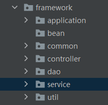

# 工程化代码架构

DAO -》 SERVICE -》 CONTROLLER

以wordcount代码为例演示

## 目录结构



- application

  ```scala
  package com.stanlong.spark.core.framework.application
  
  import com.stanlong.spark.core.framework.common.TApplication
  import com.stanlong.spark.core.framework.controller.WordCountController
  
  object WordCountApplication extends App  with TApplication{
  
      start(){
          val controller = new WordCountController
          controller.dispatch()
      }
  }
  ```

- common

  ```scala
  package com.stanlong.spark.core.framework.common
  
  import com.stanlong.spark.core.framework.util.EnvUtil
  import org.apache.spark.{SparkConf, SparkContext}
  
  trait TApplication {
  
      // 控制抽象
      def start(master:String = "local[*]", app:String="Application")(op : => Unit): Unit ={
          // 建立和Spark框架的连接
          val sparkConf = new SparkConf().setMaster(master).setAppName(app)
          val sc = new SparkContext(sparkConf)
  
          // sc 优化， 存储到ThreadLocal里
          EnvUtil.put(sc)
  
          try{
              op
          }catch {
              case ex => println(ex.getMessage)
          }
  
          sc.stop()
          EnvUtil.clear()
      }
  }
  ```

  ```scala
  package com.stanlong.spark.core.framework.common
  
  trait TController {
  
      def dispatch(): Unit
  
  }
  ```

  ```scala
  package com.stanlong.spark.core.framework.common
  
  import com.stanlong.spark.core.framework.util.EnvUtil
  import org.apache.spark.rdd.RDD
  
  trait TDao {
      def readFile(path:String): RDD[String] ={
          EnvUtil.take().textFile(path)
      }
  }
  ```

  ```scala
  package com.stanlong.spark.core.framework.common
  
  trait TService {
  
      def dataAnalysis(): Array[(String, Int)]
  
  }
  ```

- controller

  ```scala
  package com.stanlong.spark.core.framework.controller
  
  import com.stanlong.spark.core.framework.common.TController
  import com.stanlong.spark.core.framework.service.WordCountService
  
  class WordCountController extends TController{
  
      private val wordCountService = new WordCountService
  
      def dispatch(): Unit ={
          val array = wordCountService.dataAnalysis()
          array.foreach(println)
      }
  
  }
  ```

- dao

  ```scala
  package com.stanlong.spark.core.framework.dao
  
  import com.stanlong.spark.core.framework.common.TDao
  
  class WordCountDao extends TDao{
  
  }
  ```

- service

  ```scala
  package com.stanlong.spark.core.framework.service
  
  import com.stanlong.spark.core.framework.common.TService
  import com.stanlong.spark.core.framework.dao.WordCountDao
  
  class WordCountService extends TService{
  
      private val wordCountDao = new WordCountDao
  
      def dataAnalysis(): Array[(String, Int)] ={
          val lines = wordCountDao.readFile("datas/1.txt")
          val words = lines.flatMap(_.split(" "))
          val wordToOne = words.map(word => (word, 1))
          val wordToSum = wordToOne.reduceByKey(_ + _)
          val array = wordToSum.collect()
          array
      }
  }
  ```

- util

  ```scala
  package com.stanlong.spark.core.framework.util
  
  import org.apache.spark.SparkContext
  
  object EnvUtil {
  
      // ThreadLocal 可以对线程的内存进行控制，存储数据，共享数据
      private val scLocal = new ThreadLocal[SparkContext]
  
      def put(sc:SparkContext): Unit ={
          scLocal.set(sc)
      }
  
      def take(): SparkContext ={
          scLocal.get()
      }
  
      def clear(): Unit ={
          scLocal.remove()
      }
  }
  ```

  

  