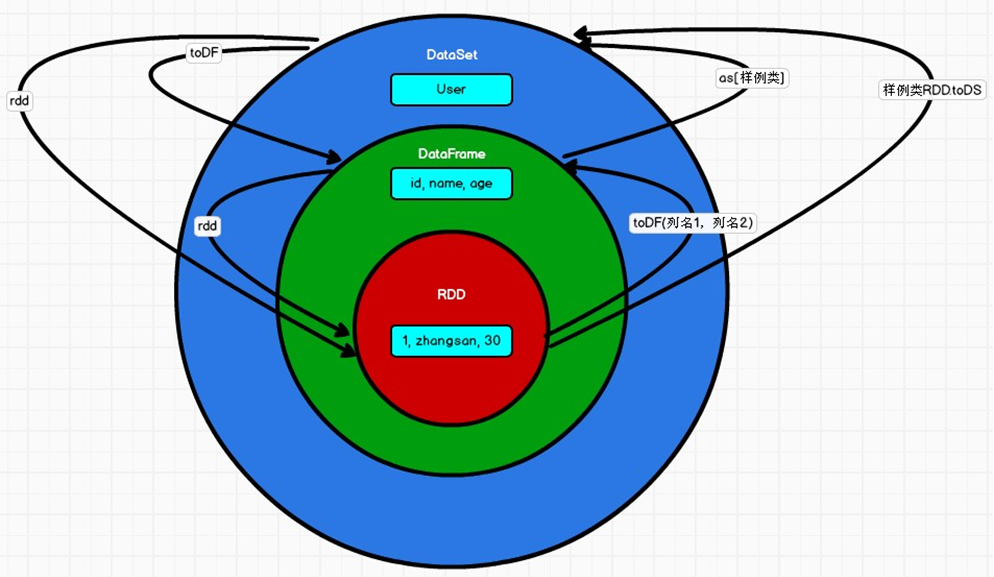

# SparkSql

## 简介

对于开发人员来讲，SparkSQL 可以简化RDD 的开发，提高开发效率，且执行效率非常快，所以实际工作中，基本上采用的就是 SparkSQL。Spark SQL 提供了 2 个编程抽象，类似Spark Core 中的RDD: DataFrame、DataSet

**DataFrame**

在 Spark 中，DataFrame 是一种以 RDD 为基础的分布式数据集，类似于传统数据库中的二维表格。DataFrame 与 RDD 的主要区别在于，前者带有 schema 元信息，即 DataFrame 所表示的二维表数据集的每一列都带有名称和类型。这使得 Spark SQL 得以洞察更多的结构信息，从而对藏于 DataFrame 背后的数据源以及作用于 DataFrame 之上的变换进行了针对性的优化，最终达到大幅提升运行时效率的目标。反观 RDD，由于无从得知所存数据元素的具体内部结构，Spark Core 只能在 stage 层面进行简单、通用的流水线优化。

同时，与Hive 类似，DataFrame 也支持嵌套数据类型（struct、array 和 map）。从 API 易用性的角度上看，DataFrame API 提供的是一套高层的关系操作，比函数式的 RDD API 要更加友好，门槛更低。

DataFrame 是为数据提供了 Schema 的视图。可以把它当做数据库中的一张表来对待。

DataFrame 也是懒执行的，但性能上比 RDD 要高，主要原因：优化的执行计划，即查询计划通过 Spark catalyst optimiser 进行优化

**DataSet**

DataSet 是分布式数据集合。DataSet 是Spark 1.6 中添加的一个新抽象，是DataFrame的一个扩展。它提供了RDD 的优势（强类型，使用强大的 lambda 函数的能力）以及SparkSQL 优化执行引擎的优点。DataSet 也可以使用功能性的转换（操作 map，flatMap，filter等等）。

- DataSet 是DataFrame API 的一个扩展，是SparkSQL 最新的数据抽象

- 用户友好的 API 风格，既具有类型安全检查也具有DataFrame 的查询优化特性；

- 用样例类来定义DataSet 中数据的结构信息，样例类中每个属性的名称直接映射到DataSet 中的字段名称；

- DataSet 是强类型的。比如可以有 DataSet[Car]，DataSet[Person]。

- DataFrame 是DataSet 的特列，DataFrame=DataSet[Row] ，所以可以通过 as 方法将

  DataFrame 转换为DataSet。Row 是一个类型，跟 Car、Person 这些的类型一样，所有的表结构信息都用 Row 来表示。获取数据时需要指定顺序

## 核心编程

Spark Core 中，如果想要执行应用程序，需要首先构建上下文环境对象 SparkContext， Spark SQL 其实可以理解为对 Spark Core 的一种封装，不仅仅在模型上进行了封装，上下文环境对象也进行了封装。

在老的版本中，SparkSQL 提供两种 SQL 查询起始点：一个叫 SQLContext，用于 Spark自己提供的SQL 查询；一个叫HiveContext，用于连接 Hive 的查询。

SparkSession 是 Spark 最新的 SQL 查询起始点，实质上是 SQLContext 和HiveContext 的组合，所以在 SQLContex 和HiveContext 上可用的API 在 SparkSession 上同样是可以使用的。SparkSession 内部封装了 SparkContext，所以计算实际上是由 sparkContext 完成的。当我们使用 spark-shell 的时候, spark 框架会自动的创建一个名称叫做 spark 的SparkSession 对象, 就像我们以前可以自动获取到一个 sc 来表示 SparkContext 对象一样。

### DataFrame

#### 创建

- 从 Spark 数据源进行创建
- 从 RDD 进行转换
- 从 Hive Table 进行查询返回

**从 Spark 数据源进行创建**

1. 查看 Spark 支持创建文件的数据源格式

   ```powershell
   scala> spark.read.[tab键补全]
   csv   format   jdbc   json   load   option   options   orc   parquet   schema   table   text   textFile
   ```

2. 在 spark 的 bin/input 目录中创建 user.json 文件

   ```json
   {"username":"zhangsan","age":20}
   {"username":"lisi","age":21}
   {"username":"wangyu","age":22}
   ```

3. 读取 json 文件创建DataFrame

   ```powershell
   scala> val df = spark.read.json("input/user.json")
   df: org.apache.spark.sql.DataFrame = [age: bigint, username: string]
   ```

   注意：如果从内存中获取数据，spark 可以知道数据类型具体是什么。如果是数字，默认作为 Int 处理；但是从文件中读取的数字，不能确定是什么类型，所以用 bigint 接收，可以和Long 类型转换，但是和 Int 不能进行转换

4. 展示结果

   ```powershell
   scala> df.show
   +---+--------+
   |age|username|
   +---+--------+
   | 20|zhangsan|
   | 21|    lisi|
   | 22|  wangyu|
   +---+--------+
   ```

**从 RDD 进行转换**

在后续章节中讨论

**从 Hive Table 进行查询返回**

在后续章节中讨论

#### SQL语法

1)  读取 JSON 文件创建DataFrame

```powershell
scala> val df = spark.read.json("input/user.json")
df: org.apache.spark.sql.DataFrame = [age: bigint, username: string]
```

2)  对 DataFrame 创建一个临时表

```powershell
# scala> df.createTempView("user") // 创建一个临时视图
scala> df.createOrReplaceTempView("user") // 创建或者替换一个临时视图
```

3)  写sql语句

```powershell
scala> val sqlDF = spark.sql("SELECT * FROM user")
sqlDF: org.apache.spark.sql.DataFrame = [age: bigint, username: string]
```

4)  结果展示

```powershell
scala> sqlDF.show
+---+--------+
|age|username|
+---+--------+
| 20|zhangsan|
| 21|    lisi|
| 22|  wangyu|
+---+--------+
```

5)  直接读 json 文件数据

```powershell
scala> spark.sql("select * from json.`input/user.json`").show
21/08/23 22:54:23 WARN HiveConf: HiveConf of name hive.stats.jdbc.timeout does not exist
21/08/23 22:54:23 WARN HiveConf: HiveConf of name hive.stats.retries.wait does not exist
21/08/23 22:54:24 WARN General: Plugin (Bundle) "org.datanucleus.api.jdo" is already registered. Ensure you dont have multiple JAR versions of the same plugin in the classpath. The URL "file:/D:/StanLong/ProgramFiles/spark-3.0.0-bin-hadoop2.7/jars/datanucleus-api-jdo-4.2.4.jar" is already registered, and you are trying to register an identical plugin located at URL "file:/D:/StanLong/ProgramFiles/spark-3.0.0-bin-hadoop2.7/bin/../jars/datanucleus-api-jdo-4.2.4.jar."
21/08/23 22:54:24 WARN General: Plugin (Bundle) "org.datanucleus" is already registered. Ensure you dont have multiple JAR versions of the same plugin in the classpath. The URL "file:/D:/StanLong/ProgramFiles/spark-3.0.0-bin-hadoop2.7/jars/datanucleus-core-4.1.17.jar" is already registered, and you are trying to register an identical plugin located at URL "file:/D:/StanLong/ProgramFiles/spark-3.0.0-bin-hadoop2.7/bin/../jars/datanucleus-core-4.1.17.jar."
21/08/23 22:54:24 WARN General: Plugin (Bundle) "org.datanucleus.store.rdbms" is already registered. Ensure you dont have multiple JAR versions of the same plugin in the classpath. The URL "file:/D:/StanLong/ProgramFiles/spark-3.0.0-bin-hadoop2.7/jars/datanucleus-rdbms-4.1.19.jar" is already registered, and you are trying to register an identical plugin located at URL "file:/D:/StanLong/ProgramFiles/spark-3.0.0-bin-hadoop2.7/bin/../jars/datanucleus-rdbms-4.1.19.jar."
21/08/23 22:54:37 WARN ObjectStore: Version information not found in metastore. hive.metastore.schema.verification is not enabled so recording the schema version 2.3.0
21/08/23 22:54:37 WARN ObjectStore: setMetaStoreSchemaVersion called but recording version is disabled: version = 2.3.0, comment = Set by MetaStore UNKNOWN@192.168.2.102
21/08/23 22:54:38 WARN ObjectStore: Failed to get database global_temp, returning NoSuchObjectException
21/08/23 22:54:38 WARN ObjectStore: Failed to get database json, returning NoSuchObjectException
+---+--------+
|age|username|
+---+--------+
| 20|zhangsan|
| 21|    lisi|
| 22|  wangyu|
+---+--------+
```

注意：普通临时表是 Session 范围内的，如果想应用范围内有效，可以使用全局临时表。使用全局临时表时需要全路径访问，如：global_temp.people

4)    对于DataFrame 创建一个全局表

```powershell
scala> df.createGlobalTempView("user")

21/08/21 17:50:43 WARN HiveConf: HiveConf of name hive.stats.jdbc.timeout does not exist
21/08/21 17:50:43 WARN HiveConf: HiveConf of name hive.stats.retries.wait does not exist
21/08/21 17:50:44 WARN General: Plugin (Bundle) "org.datanucleus.api.jdo" is already registered. Ensure you dont have multiple JAR versions of the same plugin in the classpath. The URL "file:/D:/StanLong/ProgramFiles/spark-3.0.0-bin-hadoop2.7/jars/datanucleus-api-jdo-4.2.4.jar" is already registered, and you are trying to register an identical plugin located at URL "file:/D:/StanLong/ProgramFiles/spark-3.0.0-bin-hadoop2.7/bin/../jars/datanucleus-api-jdo-4.2.4.jar."
21/08/21 17:50:44 WARN General: Plugin (Bundle) "org.datanucleus" is already registered. Ensure you dont have multiple JAR versions of the same plugin in the classpath. The URL "file:/D:/StanLong/ProgramFiles/spark-3.0.0-bin-hadoop2.7/jars/datanucleus-core-4.1.17.jar" is already registered, and you are trying to register an identical plugin located at URL "file:/D:/StanLong/ProgramFiles/spark-3.0.0-bin-hadoop2.7/bin/../jars/datanucleus-core-4.1.17.jar."
21/08/21 17:50:44 WARN General: Plugin (Bundle) "org.datanucleus.store.rdbms" is already registered. Ensure you dont have multiple JAR versions of the same plugin in the classpath. The URL "file:/D:/StanLong/ProgramFiles/spark-3.0.0-bin-hadoop2.7/jars/datanucleus-rdbms-4.1.19.jar" is already registered, and you are trying to register an identical plugin located at URL "file:/D:/StanLong/ProgramFiles/spark-3.0.0-bin-hadoop2.7/bin/../jars/datanucleus-rdbms-4.1.19.jar."
21/08/21 17:51:02 WARN ObjectStore: Version information not found in metastore. hive.metastore.schema.verification is not enabled so recording the schema version 2.3.0
21/08/21 17:51:02 WARN ObjectStore: setMetaStoreSchemaVersion called but recording version is disabled: version = 2.3.0, comment = Set by MetaStore UNKNOWN@192.168.2.102
21/08/21 17:51:02 WARN ObjectStore: Failed to get database default, returning NoSuchObjectException
21/08/21 17:51:05 WARN ObjectStore: Failed to get database global_temp, returning NoSuchObjectException
```

5)    通过 SQL 语句实现查询全表

```powershell
scala> spark.sql("SELECT * FROM global_temp.user").show()
+---+--------+
|age|username|
+---+--------+
| 20|zhangsan|
| 21|    lisi|
| 22|  wangyu|
+---+--------+

#  或者执行 spark.newSession().sql("SELECT * FROM global_temp.user").show()
#  newSession 只有在配置了全局临时表时才能用
```

#### DSL 语法

DataFrame 提供一个特定领域语言(domain-specific language, DSL)去管理结构化的数据。可以在 Scala, Java, Python 和 R 中使用 DSL，使用 DSL 语法风格不必去创建临时视图了。

1. 创建一个DataFrame

   ```powershell
   scala> val df = spark.read.json("input/user.json")
   df: org.apache.spark.sql.DataFrame = [age: bigint, username: string]
   ```

2. 查看DataFrame 的 Schema 信息

   ```powershell
   scala> df.printSchema
   root
    |-- age: long (nullable = true)
    |-- username: string (nullable = true)
   ```

3. 只查看"username"列数据

   ```powershell
   scala> df.select("username").show()
   +--------+
   |username|
   +--------+
   |zhangsan|
   |    lisi|
   |  wangyu|
   +--------+
   ```

4. 查看"username"列数据以及"age+1"数据

    注意:涉及到运算的时候, 每列都必须使用$, 或者采用引号表达式：单引号+字段名

   ```powershell
   scala> df.select($"username",$"age" + 1).show
   +--------+---------+
   |username|(age + 1)|
   +--------+---------+
   |zhangsan|       21|
   |    lisi|       22|
   |  wangyu|       23|
   +--------+---------+
   
   
   scala> df.select('username, 'age + 1).show()
   +--------+---------+
   |username|(age + 1)|
   +--------+---------+
   |zhangsan|       21|
   |    lisi|       22|
   |  wangyu|       23|
   +--------+---------+
   ```

5. 查看"age"大于"21"的数据

   ```powershell
   scala> df.filter($"age">21).show
   +---+--------+
   |age|username|
   +---+--------+
   | 22|  wangyu|
   +---+--------+
   ```

6. 按照"age"分组，查看数据条数

   ```powershell
   scala> df.groupBy("age").count.show
   +---+-----+
   |age|count|
   +---+-----+
   | 22|    1|
   | 21|    1|
   | 20|    1|
   +---+-----+
   ```

#### RDD 转换为 DataFrame

在 IDEA 中开发程序时，如果需要RDD 与DF 或者DS 之间互相操作，那么需要引入 import spark.implicits._

这里的 spark 不是Scala 中的包名，而是创建的 sparkSession 对象的变量名称，所以必须先创建 SparkSession 对象再导入。这里的 spark 对象不能使用var 声明，因为 Scala 只支持 val 修饰的对象的引入。spark-shell 中无需导入，自动完成此操作

```powershell
scala> val rdd = sc.makeRDD(List(1,2,3,4))
rdd: org.apache.spark.rdd.RDD[Int] = ParallelCollectionRDD[50] at makeRDD at <console>:24

scala> rdd.toDF("id").show
+---+
| id|
+---+
|  1|
|  2|
|  3|
|  4|
+---+
```

#### DataFrame转换为RDD

```powershell
scala> df.rdd
res14: org.apache.spark.rdd.RDD[org.apache.spark.sql.Row] = MapPartitionsRDD[58] at rdd at <console>:26
```

### DataSet

DataSet 是具有强类型的数据集合，需要提供对应的类型信息。

#### 创建

1）使用样例类序列创建 DataSet

```powershell
scala> case class Person(name: String, age: Long)
defined class Person

scala> val list = List(Person("zhangsan", 30), Person("lisi", 40))
list: List[Person] = List(Person(zhangsan,30), Person(lisi,40))

scala> val ds = list.toDS
ds: org.apache.spark.sql.Dataset[Person] = [name: string, age: bigint]

scala> ds.show
+--------+---+
|    name|age|
+--------+---+
|zhangsan| 30|
|    lisi| 40|
+--------+---+
```

2）使用基本类型的序列创建DataSet

```powershell
scala> val ds = Seq(1,2,3,4,5).toDS
ds: org.apache.spark.sql.Dataset[Int] = [value: int]

scala> ds.show
+-----+
|value|
+-----+
|    1|
|    2|
|    3|
|    4|
|    5|
+-----+
```


注意：在实际使用的时候，很少用到把序列转换成DataSet，更多的是通过RDD 来得到DataSet

### 转换关系

**DataFrame 和 DataSet转换**

```powershell
scala> val df = spark.read.json("input/user.json")
df: org.apache.spark.sql.DataFrame = [age: bigint, username: string]

scala> df.show
+---+--------+
|age|username|
+---+--------+
| 20|zhangsan|
| 21|    lisi|
| 22|  wangyu|
+---+--------+


scala> case class Emp(age:Long, username:String)
defined class Emp

scala> val ds = df.as[Emp]
ds: org.apache.spark.sql.Dataset[Emp] = [age: bigint, username: string]

scala> ds.show
+---+--------+
|age|username|
+---+--------+
| 20|zhangsan|
| 21|    lisi|
| 22|  wangyu|
+---+--------+
```

**DataSet 和 DataFrame 转换**

```powershell
scala> ds.toDF
res7: org.apache.spark.sql.DataFrame = [age: bigint, username: string]
```

**RDD转换为DataSet**

```powershell
scala> val rdd = sc.makeRDD(List(Emp(30, "zhangsan"), Emp(40,"lisi")))
rdd: org.apache.spark.rdd.RDD[Emp] = ParallelCollectionRDD[12] at makeRDD at <console>:26

scala> rdd.toDS
res8: org.apache.spark.sql.Dataset[Emp] = [age: bigint, username: string]
```

**DataSet 转换为RDD**

```powershell
scala> val rdd = sc.makeRDD(List(Emp(30, "zhangsan"), Emp(40,"lisi")))
rdd: org.apache.spark.rdd.RDD[Emp] = ParallelCollectionRDD[12] at makeRDD at <console>:26

scala> val ds = rdd.toDS  # RDD 转 DS
ds: org.apache.spark.sql.Dataset[Emp] = [age: bigint, username: string]

scala> ds.rdd # DS 转 RDD
res9: org.apache.spark.rdd.RDD[Emp] = MapPartitionsRDD[15] at rdd at <console>:26
```

### RDD、DataFrame、DataSet 三者的关系

在 SparkSQL 中 Spark 为我们提供了两个新的抽象，分别是 DataFrame 和 DataSet。他们和 RDD 有什么区别呢？首先从版本的产生上来看：
Spark1.0 => RDD

Spark1.3 => DataFrame

Spark1.6 => Dataset
如果同样的数据都给到这三个数据结构，他们分别计算之后，都会给出相同的结果。不同是的他们的执行效率和执行方式。在后期的 Spark 版本中，DataSet 有可能会逐步取代RDD和 DataFrame 成为唯一的API 接口。

**三者的共性**

- RDD、DataFrame、DataSet 全都是 spark 平台下的分布式弹性数据集，为处理超大型数据提供便利;

- 三者都有惰性机制，在进行创建、转换，如 map 方法时，不会立即执行，只有在遇到
  Action 如 foreach 时，三者才会开始遍历运算;

- 三者有许多共同的函数，如 filter，排序等;

- 在对DataFrame 和Dataset 进行操作许多操作都需要这个包:import spark.implicits._（在创建好 SparkSession 对象后尽量直接导入）

- 三者都会根据 Spark 的内存情况自动缓存运算，这样即使数据量很大，也不用担心会内存溢出

- 三者都有 partition 的概念

- DataFrame 和DataSet 均可使用模式匹配获取各个字段的值和类型

**三者的区别**

  1)	RDD

- RDD 一般和 spark mllib 同时使用
- RDD 不支持 sparksql 操作

2)	DataFrame

- 与 RDD 和 Dataset 不同，DataFrame 每一行的类型固定为Row，每一列的值没法直接访问，只有通过解析才能获取各个字段的值

- DataFrame 与DataSet 一般不与 spark mllib 同时使用

- DataFrame 与DataSet 均支持 SparkSQL 的操作，比如 select，groupby 之类，还能注册临时表/视窗，进行 sql 语句操作

- DataFrame 与DataSet 支持一些特别方便的保存方式，比如保存成 csv，可以带上表头，这样每一列的字段名一目了然(后面专门讲解)

3)	DataSet

- Dataset 和DataFrame 拥有完全相同的成员函数，区别只是每一行的数据类型不同。
  DataFrame 其实就是DataSet 的一个特例	type DataFrame = Dataset[Row]
- DataFrame 也可以叫Dataset[Row],每一行的类型是 Row，不解析，每一行究竟有哪些字段，各个字段又是什么类型都无从得知，只能用上面提到的 getAS 方法或者共性中的第七条提到的模式匹配拿出特定字段。而Dataset 中，每一行是什么类型是不一定的，在自定义了 case class 之后可以很自由的获得每一行的信息

**三者的互相转换**




