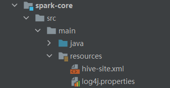

# IDEA开发SparkSQL

**添加依赖**

```xml
<dependency>
	<groupId>org.apache.spark</groupId>
	<artifactId>spark-sql_2.12</artifactId>
	<version>3.0.0</version>
</dependency>
```

**代码实现**

```scala
package com.stanlong.spark.sql

import org.apache.spark.SparkConf
import org.apache.spark.sql.SparkSession

object Spark01_SparkSql_Basic {

    def main(args: Array[String]): Unit = {
        // 创建SparkSQl的运行环境
        val sparkSQLConf = new SparkConf().setMaster("local[*]").setAppName("sparkSQL")
        val spark = SparkSession.builder().config(sparkSQLConf).getOrCreate()
        // 在使用DataFrame时，如果涉及到转换操作，需要引入转换规则
        import spark.implicits._

        // 执行逻辑代码
        // dataFrame
        // val dataFrame = spark.read.json("datas/user.json")
        // dataFrame.show()

        // dataFrame => SQL
        // dataFrame.createOrReplaceTempView("user")
        // spark.sql("select * from user").show()
        // spark.sql("select username from user").show()
        // spark.sql("select avg(age) as avg_age from user").show()

        // dataFrame => DSL
        // dataFrame.select("age", "username").show()
        // dataFrame.select($"age" + 1).show()
        // dataFrame.select('username, 'age + 1).show()

        // DataSet
        // val seq = Seq(1,2,3,4)
        // val ds = seq.toDS()
        // ds.show()

        // RDD <=> DataFrame
        var rdd = spark.sparkContext.makeRDD(List((1, "zhangsan", 21), (2, "lisi", 22), (3, "wangwu", 23)))
        val df = rdd.toDF("id", "name", "age")
        val rowRdd = df.rdd

        // DataFrame <=> DataSet
        val ds = df.as[User]
        val df1 = ds.toDF()

        // RDD <=> DataSet
        val ds1 = rdd.map {
            case (id, name, age) => {
                User(id, name, age)
            }
        }.toDS()

        val rdd1 = ds1.rdd


        // 关闭环境
        spark.close()
    }

    case class User(
        id:Int,
        name:String,
        age:Int
    )
}
```

# 用户自定义函数

用户可以通过 spark.udf 功能添加自定义函数，实现自定义功能。

## UDF

```scala
package com.stanlong.spark.sql

import org.apache.spark.SparkConf
import org.apache.spark.sql.SparkSession
/**
 * 自定义函数基础
 */
object Spark01_SparkSql_Basic {

    def main(args: Array[String]): Unit = {
        // 创建SparkSQl的运行环境
        val sparkSQLConf = new SparkConf().setMaster("local[*]").setAppName("sparkSQL")
        val spark = SparkSession.builder().config(sparkSQLConf).getOrCreate()
        // 在使用DataFrame时，如果涉及到转换操作，需要引入转换规则
        import spark.implicits._

        val df = spark.read.json("datas/user.json")
        df.createOrReplaceTempView("user")

        // 用户自定义函数
        spark.udf.register("prefixName", (name:String) =>{
            "Name: " + name
        })

        spark.sql("select age, prefixName(username) from user").show()

        // 关闭环境
        spark.close()
    }
}
```

## UDAF

强类型的Dataset 和弱类型的 DataFrame 都提供了相关的聚合函数， 如 count()，countDistinct()，avg()，max()，min()。除此之外，用户可以设定自己的自定义聚合函数。通过继承 UserDefinedAggregateFunction 来实现用户自定义弱类型聚合函数。从Spark3.0 版本后，UserDefinedAggregateFunction 已经不推荐使用了（用顺序做计算，容易出错）。可以统一采用强类型聚合函数Aggregator（通过属性来操作， 和顺序无关）。 

```scala
package com.stanlong.spark.sql

import org.apache.spark.SparkConf
import org.apache.spark.sql.{Encoder, Encoders, SparkSession, functions}
import org.apache.spark.sql.expressions.Aggregator

object Spark01_SparkSql_Basic {

    def main(args: Array[String]): Unit = {
        // 创建SparkSQl的运行环境
        val sparkSQLConf = new SparkConf().setMaster("local[*]").setAppName("sparkSQL")
        val spark = SparkSession.builder().config(sparkSQLConf).getOrCreate()
        // 在使用DataFrame时，如果涉及到转换操作，需要引入转换规则
        import spark.implicits._

        val df = spark.read.json("datas/user.json")
        df.createOrReplaceTempView("user")

        // 用户自定义UDAF函数
        spark.udf.register("ageAvg", functions.udaf(new MyAvgUDAF()))

        spark.sql("select ageAvg(age) from user").show()
        // 关闭环境
        spark.close()
    }


    /**
     * 自定义聚合函数类: 计算年龄的平均值
     * 1. 继承 org.apache.spark.sql.expressions.Aggregator 定义泛型
     *  IN: 输入的数据类型
     *  BUF: 缓冲取的数据类型
     *  OUT: 输出的数据类型
     *
     * 2 .重写方法
     */
    case class Buff(var total:Long, var count:Long)
    class MyAvgUDAF extends  Aggregator[Long, Buff, Long] {
        // 初始化
        override def zero: Buff = {
            Buff(0L, 0L)
        }

        // 根据输入的数据更新缓冲取的数据
        override def reduce(buff: Buff, in: Long): Buff = {
            buff.total = buff.total + in
            buff.count = buff.count + 1
            buff
        }

        // 合并缓冲区
        override def merge(buff1: Buff, buff2: Buff): Buff = {
            buff1.total = buff1.total + buff2.total
            buff1.count = buff1.count + buff2.count
            buff1
        }

        // 计算结果
        override def finish(buff: Buff): Long = {
            buff.total / buff.count
        }

        // 缓冲区的编码操作
        override def bufferEncoder: Encoder[Buff] = Encoders.product

        // 输出的编码操作
        override def outputEncoder: Encoder[Long] = Encoders.scalaLong
    }
}
```

# 数据的加载和保存

## 通用的加载和保存方式

SparkSQL 提供了通用的保存数据和数据加载的方式。这里的通用指的是使用相同的API，根据不同的参数读取和保存不同格式的数据，SparkSQL 默认读取和保存的文件格式为 parquet

### 加载数据

spark.read.load 是加载数据的通用方法， 如果读取不同格式的数据，可以对不同的数据格式进行设定。

```powershell
# 默认读取的是 parquet 文件
scala> val df = spark.read.load("../examples/src/main/resources/users.parquet")
df: org.apache.spark.sql.DataFrame = [name: string, favorite_color: string ... 1 more field]

scala> df.show
+------+--------------+----------------+
|  name|favorite_color|favorite_numbers|
+------+--------------+----------------+
|Alyssa|          null|  [3, 9, 15, 20]|
|   Ben|           red|              []|
+------+--------------+----------------+
```

### 保存数据

```powershell
scala> df.write.save("output") # 默认保存的也是 parquet 文件
```


### 格式转换

```
scala>df.write.format("…")[.option("…")].save("…")
```

- format("…")：指定保存的数据类型，包括"csv"、"jdbc"、"json"、"orc"、"parquet"和 "textFile"。

- save ("…")：在"csv"、"orc"、"parquet"和"textFile"格式下需要传入保存数据的路径。
- option("…")：在"jdbc"格式下需要传入 JDBC 相应参数，url、user、password 和 dbtable

保存操作可以使用 SaveMode, 用来指明如何处理数据，使用 mode()方法来设置。有一点很重要: 这些 SaveMode 都是没有加锁的, 也不是原子操作。

SaveMode 是一个枚举类，其中的常量包括：

| Scala/Java                      | Any Language     | Meaning                    |
| ------------------------------- | ---------------- | -------------------------- |
| SaveMode.ErrorIfExists(default) | "error"(default) | 如果文件已经存在则抛出异常 |
| SaveMode.Append                 | "append"         | 如果文件已经存在则追加     |
| SaveMode.Overwrite              | "overwrite"      | 如果文件已经存在则覆盖     |
| SaveMode.Ignore                 | "ignore"         | 如果文件已经存在则忽略     |

```powershell
# 加载
scala> val df = spark.read.format("json").load("input/user.json") # format 格式转换
df: org.apache.spark.sql.DataFrame = [age: bigint, username: string]

scala> df.show
+---+--------+
|age|username|
+---+--------+
| 20|zhangsan|
| 21|    lisi|
| 22|  wangyu|
+---+--------+

# 保存
scala> df.write.format("json").save("output1") # 保存为son格式
scala> df.write.format("json").mode("overwrite").save("output1") # 保存为son格式,并覆盖已有的文件
```

## CSV

Spark SQL 可以配置 CSV 文件的列表信息，读取CSV 文件,CSV 文件的第一行设置为数据列

```powershell
scala> spark.read.format("csv").option("sep", ";").option("inferSchema","true").option("header", "true").load("../examples/src/main/resources/people.csv").show
+-----+---+---------+
| name|age|      job|
+-----+---+---------+
|Jorge| 30|Developer|
|  Bob| 32|Developer|
+-----+---+---------+
```

## MySQL

Spark SQL 可以通过 JDBC 从关系型数据库中读取数据的方式创建DataFrame，通过对DataFrame 一系列的计算后，还可以将数据再写回关系型数据库中。如果使用 spark-shell 操作，可在启动shell 时指定相关的数据库驱动路径或者将相关的数据库驱动放到 spark 的类路径下。

```
bin/spark-shell --jars mysql-connector-java-5.1.27-bin.jar
```

我们这里只演示在Idea 中通过 JDBC 对 Mysql 进行操作

- 导入依赖

  ```xml
  <dependency>
  	<groupId>mysql</groupId>
  	<artifactId>mysql-connector-java</artifactId>
  	<version>5.1.37</version>
  </dependency>
  ```

- spark代码

  ```scala
  package com.stanlong.spark.sql
  
  import org.apache.spark.SparkConf
  import org.apache.spark.sql.{SaveMode, SparkSession}
  
  object Spark02_SparkSql_JDBC {
  
      def main(args: Array[String]): Unit = {
          // 创建SparkSQl的运行环境
          val sparkSQLConf = new SparkConf().setMaster("local[*]").setAppName("sparkSQL")
          val spark = SparkSession.builder().config(sparkSQLConf).getOrCreate()
          // 在使用DataFrame时，如果涉及到转换操作，需要引入转换规则
          import spark.implicits._
  
          // 读取mysql数据
          val df = spark.read.format("jdbc")
            .option("url", "jdbc:mysql://127.0.0.1:3306/mysql")
            .option("driver", "com.mysql.jdbc.Driver")
            .option("user", "root")
            .option("password", "root")
            .option("dbtable", "user")
            .load()
  
          df.show()
  
          // 保存数据到mysql
          df.write.format("jdbc")
            .option("url", "jdbc:mysql://127.0.0.1:3306/mysql")
            .option("driver", "com.mysql.jdbc.Driver")
            .option("user", "root")
            .option("password", "root")
            .option("dbtable", "scoot") // 把df中的内容保存到一张新表，表名 scoot
            .mode(SaveMode.Append)
            .save()
  
  
          // 关闭环境
          spark.close()
      }
  
  }
  ```

## Hive

Apache Hive 是 Hadoop 上的 SQL 引擎，Spark SQL 编译时可以包含 Hive  支持，也可以不包含。包含 Hive 支持的 Spark SQL 可以支持 Hive 表访问、UDF (用户自定义函数)以及 Hive 查询语言(HiveQL/HQL)等。需要强调的一点是，如果要在 Spark SQL 中包含Hive 的库，并不需要事先安装 Hive。一般来说，最好还是在编译 Spark SQL 时引入 Hive 支持，这样就可以使用这些特性了。如果你下载的是二进制版本的 Spark，它应该已经在编译时添加了 Hive 支持。

若要把 Spark SQL 连接到一个部署好的 Hive  上，你必须把 hive-site.xml 复制到

Spark 的配置文件目录中($SPARK_HOME/conf)。即使没有部署好 Hive，Spark SQL 也可以运行。 需要注意的是，如果你没有部署好 Hive，Spark SQL 会在当前的工作目录中创建出自己的 Hive 元数据仓库，叫作 metastore_db。此外，如果你尝试使用 HiveQL 中的CREATE TABLE (并非 CREATE EXTERNAL TABLE)语句来创建表，这些表会被放在你默认的文件系统中的 /user/hive/warehouse 目录中(如果你的 classpath 中有配好的
hdfs-site.xml，默认的文件系统就是 HDFS，否则就是本地文件系统)。

spark-shell 默认是Hive 支持的；代码中是默认不支持的，需要手动指定（加一个参数即可）。

### 内嵌的HIVE 

如果使用 Spark 内嵌的 Hive, 则什么都不用做, 直接使用即可.

Hive 的元数据存储在 derby 中, 默认仓库地址:$SPARK_HOME/spark-warehouse

```shell
scala> spark.sql("show tables").show
+--------+---------+-----------+
|database|tableName|isTemporary|
+--------+---------+-----------+
+--------+---------+-----------+

scala> spark.sql("create table aa(id int)")

scala> spark.sql("show tables").show
+--------+---------+-----------+
|database|tableName|isTemporary|
+--------+---------+-----------+
| default|	aa|	false|
+--------+---------+-----------+
```

向表加载本地数据

```shell
scala> spark.sql("load data local inpath 'input/ids.txt' into table aa")

scala> spark.sql("select * from aa").show
+---+
| id|
+---+
| 1|
| 2|
| 3|
| 4|
+---+
```

在实际使用中, 几乎没有任何人会使用内置的 Hive

### 外部的HIVE

如果想连接外部已经部署好的Hive，需要通过以下几个步骤：

- Spark 要接管 Hive 需要把hive-site.xml 拷贝到conf/目录下
- 把 Mysql 的驱动 copy 到 jars/目录下
- 如果访问不到 hdfs，则需要把 core-site.xml 和 hdfs-site.xml 拷贝到 conf/目录下
- 重启 spark-shell
- 可能出现的报错见 09错误日志记录.md

```shell
scala> spark.sql("show databases").show
21/08/29 18:34:35 WARN HiveConf: HiveConf of name hive.metastore.local does not exist
21/08/29 18:34:35 WARN HiveClientImpl: Detected HiveConf hive.execution.engine is 'tez' and will be reset to 'mr' to disable useless hive logic
21/08/29 18:34:42 WARN HiveConf: HiveConf of name hive.metastore.local does not exist
21/08/29 18:34:42 WARN HiveConf: HiveConf of name hive.stats.jdbc.timeout does not exist
21/08/29 18:34:42 WARN HiveConf: HiveConf of name hive.stats.retries.wait does not exist
21/08/29 18:34:46 WARN HiveConf: HiveConf of name hive.metastore.local does not exist
21/08/29 18:34:49 ERROR ObjectStore: Version information found in metastore differs 1.2.0 from expected schema version 2.3.0. Schema verififcation is disabled hive.metastore.schema.verification
21/08/29 18:34:49 WARN ObjectStore: setMetaStoreSchemaVersion called but recording version is disabled: version = 2.3.0, comment = Set by MetaStore root@192.168.235.11
+---------+
|namespace|
+---------+
|  default|
+---------+
```

### 运行Spark SQL CLI

Spark SQL CLI 可以很方便的在本地运行Hive 元数据服务以及从命令行执行查询任务。在Spark 目录下执行如下命令启动 Spark SQL CLI，直接执行 SQL 语句，类似一Hive 窗口

```shell
[root@node01 bin]# ./spark-sql 
spark-sql (default)> 
```

### 运行 Spark beeline

Spark Thrift Server 是Spark 社区基于HiveServer2 实现的一个Thrift 服务。旨在无缝兼容HiveServer2。因为 Spark Thrift Server 的接口和协议都和HiveServer2 完全一致，因此我们部署好 Spark Thrift Server 后，可以直接使用hive 的 beeline 访问Spark Thrift Server 执行相关语句。Spark Thrift Server 的目的也只是取代HiveServer2，因此它依旧可以和 Hive Metastore 进行交互，获取到hive 的元数据。
如果想连接Thrift Server，需要通过以下几个步骤：

- Spark 要接管 Hive 需要把hive-site.xml 拷贝到conf/目录下
- 把 Mysql 的驱动 copy 到 jars/目录下
- 如果访问不到 hdfs，则需要把 core-site.xml 和 hdfs-site.xml 拷贝到 conf/目录下
- 启动Thrift Server

```shell
[root@node01 sbin]# pwd
/opt/stanlong/spark-local/sbin
[root@node01 sbin]# ./start-thriftserver.sh

[root@node01 bin]# pwd
/opt/stanlong/spark-local/bin
[root@node01 bin]# beeline -u "jdbc:hive2://node01:10000"  -n root -p root
```

### 代码操作hive

1. 导入依赖

   ```xml
   <!-- spark操作外部hive用到的包 -->
   <dependency>
       <groupId>org.apache.spark</groupId>
       <artifactId>spark-hive_2.12</artifactId>
       <version>3.0.0</version>
   </dependency>
   
   <dependency>
       <groupId>org.apache.hive</groupId>
       <artifactId>hive-exec</artifactId>
       <version>1.2.1</version>
   </dependency>
   ```

2. 将hive-site.xml 文件拷贝到项目的 resources 目录中

   

3. 代码实现

   ```scala
   package com.stanlong.spark.sql
   
   import org.apache.spark.SparkConf
   import org.apache.spark.sql.SparkSession
   
   object Spark03_SparkSql_Hive {
   
       def main(args: Array[String]): Unit = {
           // 创建SparkSQl的运行环境
           val sparkSQLConf = new SparkConf().setMaster("local[*]").setAppName("sparkSQL")
           val spark = SparkSession.builder().enableHiveSupport().config(sparkSQLConf).getOrCreate() // enableHiveSupport() 启用hive支持
           // 在使用DataFrame时，如果涉及到转换操作，需要引入转换规则
           import spark.implicits._
   
           // 使用SparkSQl 连接外置的hive
           // 1.拷贝hive-site到resource目录下
           // 2.启动hive支持
           // 3.导入依赖包
           System.setProperty("HADOOP_USER_NAME", "root") // 防止访问数据库时报权限错误
           spark.sql("show tables").show()
           
           // 关闭环境
           spark.close()
       }
   }
   ```

   


  