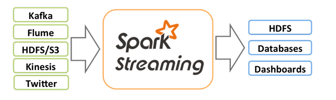
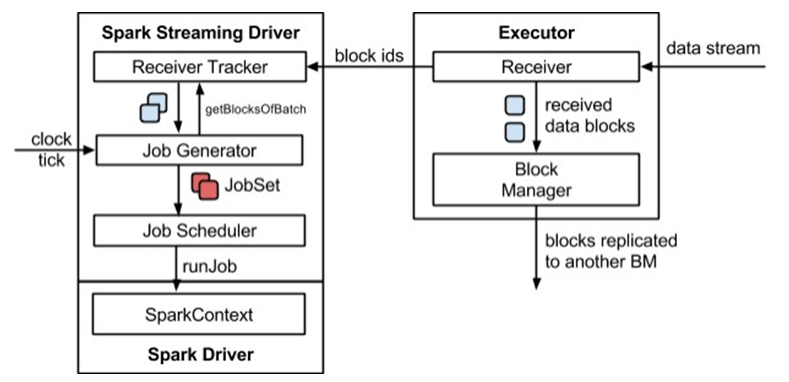
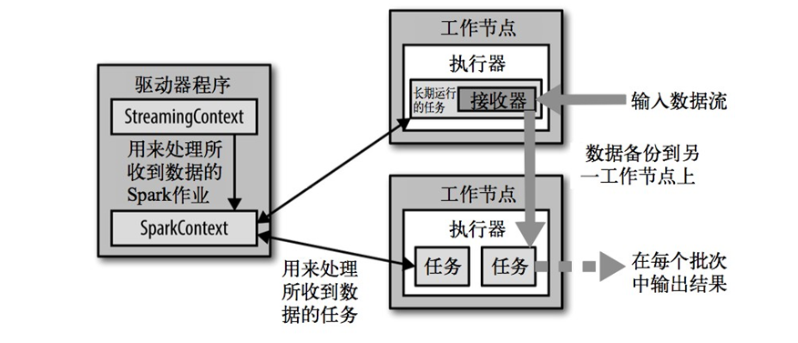
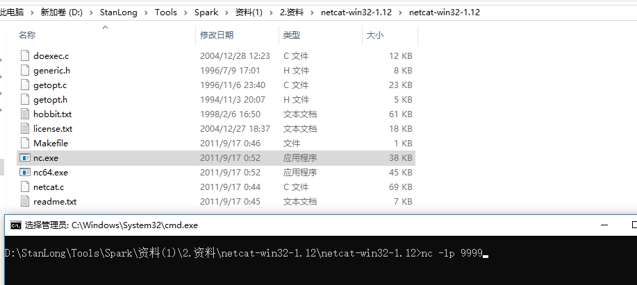
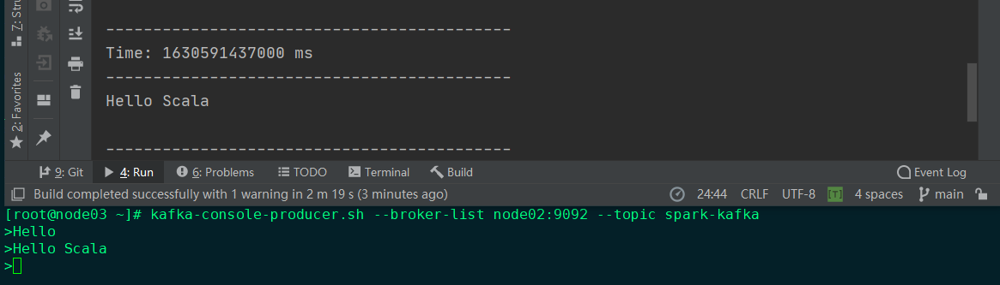
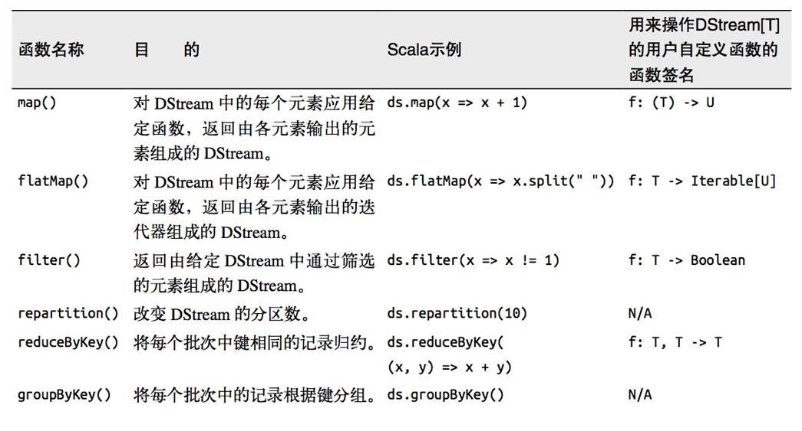
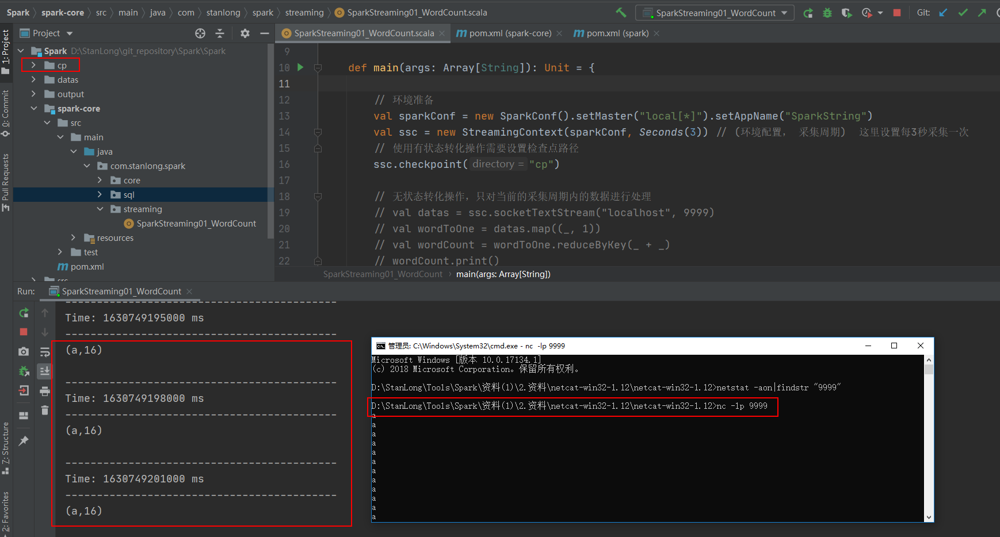

# SparkStreaming

## 概述

SparkStreaming 准实时（以秒或者分钟为单位）， 微批次(时间)的数据处理框架。

Spark Streaming 用于流式数据的处理。Spark Streaming 支持的数据输入源很多，例如：Kafka、 Flume、Twitter、ZeroMQ 和简单的 TCP 套接字等等。数据输入后可以用 Spark 的高度抽象原语如：map、reduce、join、window 等进行运算。而结果也能保存在很多地方，如 HDFS，数据库等。



和 Spark 基于 RDD 的概念很相似，Spark Streaming 使用离散化流(discretized stream)作为抽象表示，叫作DStream。DStream 是随时间推移而收到的数据的序列。在内部，每个时间区间收到的数据都作为 RDD 存在，而 DStream 是由这些RDD 所组成的序列(因此得名“离散化”)。所以简单来将，DStream 就是对 RDD 在实时数据处理场景的一种封装。

## 特点

- 易用
- 容错
- 易整合到Sparkt体系

## 架构图

- 整体架构图

  

- SparkStreaming架构图

  

## 背压机制

Spark 1.5 以前版本，用户如果要限制 Receiver 的数据接收速率，可以通过设置静态配制参

数“spark.streaming.receiver.maxRate”的值来实现，此举虽然可以通过限制接收速率，来适配当前的处理能力，

防止内存溢出，但也会引入其它问题。比如：producer 数据生产高于 maxRate，当前集群处理能力也高于 

maxRate，这就会造成资源利用率下降等问题。为了更好的协调数据接收速率与资源处理能力，1.5 版本开始 

Spark Streaming 可以动态控制数据接收速率来适配集群数据处理能力。背压机制（即 Spark Streaming 

Backpressure）: 根据JobScheduler 反馈作业的执行信息来动态调整Receiver 数据接收率。通过属性“spark.streaming.backpressure.enabled”来控制是否启用 backpressure 机制，默认值 false，即不启用。

# Dstream 入门

## 需求

使用 netcat 工具向 9999 端口不断的发送数据，通过 SparkStreaming 读取端口数据并统计不同单词出现的次数

## 实现

添加依赖

```xml
<dependency>
    <groupId>org.apache.spark</groupId>
    <artifactId>spark-streaming_2.12</artifactId>
    <version>3.0.0</version>
</dependency>
```

代码

```scala
package com.stanlong.spark.streaming

import org.apache.spark.SparkConf
import org.apache.spark.streaming.{Seconds, StreamingContext}

object SparkStreaming01_WordCount {

    def main(args: Array[String]): Unit = {

        // 创建环境对象
        val sparkConf = new SparkConf().setMaster("local[*]").setAppName("SparkString")
        val ssc = new StreamingContext(sparkConf, Seconds(3)) // (环境配置， 采集周期)  这里设置每3秒采集一次

        // 逻辑处理
        // 获取端口数据
        val lines = ssc.socketTextStream("127.0.0.1", 9999) // 连接本地9999端口
        val words = lines.flatMap(_.split(" "))
        val wordToOne = words.map((_, 1))
        val wordCount = wordToOne.reduceByKey(_ + _)
        wordCount.print()

        // 由于SparkStreaming采集器是长期执行的任务，所以不能直接关闭
        // main方法执行完毕后，应用程序也会自动结束，所以不能让main方法执行完毕
        // 1. 启动采集器
        ssc.start()
        // 2. 等待采集器的关闭
        ssc.awaitTermination()
    }

}
```

## 测试方法

先启动 netcat， 再启动程序。程序启动后通过cmd界面发送数据



# DStream创建

## RDD 队列

测试过程中，可以通过使用 ssc.queueStream(queueOfRDDs)来创建 DStream，每一个推送到这个队列中的RDD，都会作为一个DStream 处理。

### 需求

循环创建几个 RDD，将RDD 放入队列。通过 SparkStream 创建 Dstream，计算 WordCount

```scala
package com.stanlong.spark.streaming

import org.apache.spark.SparkConf
import org.apache.spark.rdd.RDD
import org.apache.spark.streaming.{Seconds, StreamingContext}

import scala.collection.mutable

object SparkStreaming01_WordCount {

    def main(args: Array[String]): Unit = {

        // 创建环境对象
        val sparkConf = new SparkConf().setMaster("local[*]").setAppName("SparkString")
        val ssc = new StreamingContext(sparkConf, Seconds(3)) // (环境配置， 采集周期)  这里设置每3秒采集一次

        // 创建RDD队列
        val rddQueue = new mutable.Queue[RDD[Int]]()

        // 创建QueueInputStream
        val inputStream = ssc.queueStream(rddQueue, false)

        val mappedStream = inputStream.map((_, 1))
        val reduceStream = mappedStream.reduceByKey(_ + _)

        // 打印结果
        reduceStream.print()

        // 1. 启动采集器
        ssc.start()

        // 循环创建并向RDD队列中加入RDD
        for(i <- 1 to 5){
            rddQueue += ssc.sparkContext.makeRDD(1 to 300, 10)
            Thread.sleep(2000)
        }

        // 2. 等待采集器的关闭
        ssc.awaitTermination()
    }
}
```

## 自定义数据源

需要继承Receiver，并实现 onStart、onStop 方法来自定义数据源采集

```scala
package com.stanlong.spark.streaming

import org.apache.spark.SparkConf
import org.apache.spark.rdd.RDD
import org.apache.spark.storage.StorageLevel
import org.apache.spark.streaming.receiver.Receiver
import org.apache.spark.streaming.{Seconds, StreamingContext}

import scala.collection.mutable
import scala.util.Random

object SparkStreaming01_WordCount {

    def main(args: Array[String]): Unit = {

        // 创建环境对象
        val sparkConf = new SparkConf().setMaster("local[*]").setAppName("SparkString")
        val ssc = new StreamingContext(sparkConf, Seconds(3)) // (环境配置， 采集周期)  这里设置每3秒采集一次

        val messageDS = ssc.receiverStream(new MyReceiver)
        messageDS.print()


        // 1. 启动采集器
        ssc.start()
        // 2. 等待采集器的关闭
        ssc.awaitTermination()
    }

    /**
     * 自定义数据采集器
     * 1. 继承 Receiver 定义泛型
     * 2. 重写方法
     */
    class MyReceiver extends Receiver[String](StorageLevel.MEMORY_ONLY){

        private var flag = true

        override def onStart(): Unit = {
            new Thread(new Runnable {
                override def run(): Unit = {
                    while (flag){
                        val message = "采集的数据为: " + new Random().nextInt(10).toString
                        store(message)
                        Thread.sleep(500)
                    }
                }
            }).start()
        }

        override def onStop(): Unit = {
            flag = false
        }
    }

}
```

## Kafka 数据源

**Kafka 0-10 Direct模式**：是由计算的Executor 来主动消费Kafka 的数据，速度由自身控制

### 需求

通过 SparkStreaming 从Kafka 读取数据，并将读取过来的数据做简单计算，最终打印到控制台

### 实现

导入依赖

```xml
<dependency>
    <groupId>org.apache.spark</groupId>
    <artifactId>spark-streaming-kafka-0-10_2.12</artifactId>
    <version>3.0.0</version>
</dependency>
<dependency>
    <groupId>com.fasterxml.jackson.core</groupId>
    <artifactId>jackson-core</artifactId>
    <version>2.10.1</version
</dependency>
```

代码实现

```scala
package com.stanlong.spark.streaming

import org.apache.kafka.clients.consumer.ConsumerConfig
import org.apache.spark.streaming.kafka010.{ConsumerStrategies, KafkaUtils, LocationStrategies}
import org.apache.spark.SparkConf
import org.apache.spark.streaming.{Seconds, StreamingContext}

object SparkStreaming01_WordCount {

    def main(args: Array[String]): Unit = {

        // 创建环境对象
        val sparkConf = new SparkConf().setMaster("local[*]").setAppName("SparkString")
        val ssc = new StreamingContext(sparkConf, Seconds(3)) // (环境配置， 采集周期)  这里设置每3秒采集一次


        //3.定义 Kafka 参数
        val kafkaPara: Map[String, Object] = Map[String, Object](
            ConsumerConfig.BOOTSTRAP_SERVERS_CONFIG -> "node02:9092,node03:9092,node04:9092",
            ConsumerConfig.GROUP_ID_CONFIG -> "spark-kafka",
            "key.deserializer" ->  "org.apache.kafka.common.serialization.StringDeserializer",
            "value.deserializer" -> "org.apache.kafka.common.serialization.StringDeserializer"
        )


        val kafkaDataDS = KafkaUtils.createDirectStream[String, String]( // k,v都是String类型
            ssc,
            LocationStrategies.PreferConsistent,
            ConsumerStrategies.Subscribe[String, String](Set("spark-kafka"), kafkaPara)
        ) // spark-kafka 为 topic名称

        kafkaDataDS.map(_.value()).print()


        // 1. 启动采集器
        ssc.start()
        // 2. 等待采集器的关闭
        ssc.awaitTermination()
    }
}
```

### 验证

kafka的相关操作参考  Hadoop/17Kafka



# DStream转换

DStream 上的操作与 RDD 的类似，分为Transformations（转换）和Output Operations（输出）两种，此外转换操作中还有一些比较特殊的原语，如：updateStateByKey()、transform()以及各种Window 相关的原语。

## Transform

Transform 允许 DStream 上执行任意的RDD-to-RDD 函数。即使这些函数并没有在DStream 的 API 中暴露出，通过该函数可以方便的扩展 Spark API。该函数每一批次调度一次。其实也就是对 DStream 中的 RDD 应用转换

```scala
package com.stanlong.spark.streaming

import org.apache.kafka.clients.consumer.ConsumerConfig
import org.apache.spark.streaming.kafka010.{ConsumerStrategies, KafkaUtils, LocationStrategies}
import org.apache.spark.SparkConf
import org.apache.spark.streaming.{Seconds, StreamingContext}

object SparkStreaming01_WordCount {

    def main(args: Array[String]): Unit = {

        // 环境准备
        val sparkConf = new SparkConf().setMaster("local[*]").setAppName("SparkString")
        val ssc = new StreamingContext(sparkConf, Seconds(3)) // (环境配置， 采集周期)  这里设置每3秒采集一次

        val lines = ssc.socketTextStream("localhost", 9999)

        // transform方法可以将底层RDD获取到后进行操作
        // 应用场景：1.补充DStream功能， 2. 需要代码周期性执行
        val newDS = lines.transform(
            rdd => {
                rdd.map(
                    str => {
                        str
                    }
                )
            }
        )

        val newDS1 = lines.map(
            data => {
                data
            }
        )

        // 1. 启动采集器
        ssc.start()
        // 2. 等待采集器的关闭
        ssc.awaitTermination()
    }
}
```

## 无状态转化操作

无状态转化操作就是把简单的RDD 转化操作应用到每个批次上，也就是转化DStream 中的每一个RDD。部分无状态转化操作列在了下表中。注意，针对键值对的DStream 转化操作(比如reduceByKey())要添加 import StreamingContext._ 才能在 Scala 中使用。



## 有状态转化操作

### UpdateStateByKey

UpdateStateByKey 原语用于记录历史记录，有时，我们需要在 DStream 中跨批次维护状态(例如流计算中累加wordcount)。针对这种情况，updateStateByKey()为我们提供了对一个状态变量的访问，用于键值对形式的 DStream。给定一个由(键，事件)对构成的 DStream，并传递一个指定如何根据新的事件更新每个键对应状态的函数，它可以构建出一个新的 DStream，其内部数据为(键，状态) 对。

updateStateByKey() 的结果会是一个新的DStream，其内部的RDD 序列是由每个时间区间对应的(键，状态)对组成的。

updateStateByKey 操作使得我们可以在用新信息进行更新时保持任意的状态。为使用这个功能，需要做下面两步：

1. 定义状态，状态可以是一个任意的数据类型。
2. 定义状态更新函数，用此函数阐明如何使用之前的状态和来自输入流的新值对状态进行更新。

使用 updateStateByKey 需要对检查点目录进行配置，会使用检查点来保存状态。

更新版的wordcount

#### 代码

```scala
package com.stanlong.spark.streaming

import org.apache.kafka.clients.consumer.ConsumerConfig
import org.apache.spark.streaming.kafka010.{ConsumerStrategies, KafkaUtils, LocationStrategies}
import org.apache.spark.SparkConf
import org.apache.spark.streaming.{Seconds, StreamingContext}

object SparkStreaming01_WordCount {

    def main(args: Array[String]): Unit = {

        // 环境准备
        val sparkConf = new SparkConf().setMaster("local[*]").setAppName("SparkString")
        val ssc = new StreamingContext(sparkConf, Seconds(3)) // (环境配置， 采集周期)  这里设置每3秒采集一次
        // 使用有状态转化操作需要设置检查点路径
        ssc.checkpoint("cp")

        // 无状态转化操作，只对当前的采集周期内的数据进行处理
        // val datas = ssc.socketTextStream("localhost", 9999)
        // val wordToOne = datas.map((_, 1))
        // val wordCount = wordToOne.reduceByKey(_ + _)
        // wordCount.print()

        // 有状态转化操作
        val datas = ssc.socketTextStream("localhost", 9999)
        val wordToOne = datas.map((_, 1))
        // updateStateByKey 根据key对数据的状态进行更新
        // (seq, opt) // 参数一：相同可以的value数据，参数二：缓冲区中相同key的value数据
        val state = wordToOne.updateStateByKey(
            (seq: Seq[Int], buff: Option[Int]) => {
                val newCount = buff.getOrElse(0) + seq.sum
                Option(newCount)
            }
        )

        state.print()

        // 1. 启动采集器
        ssc.start()
        // 2. 等待采集器的关闭
        ssc.awaitTermination()
    }
}
```

#### 测试



## WindowOperations

Window Operations 可以设置窗口的大小和滑动窗口的间隔来动态的获取当前Steaming 的允许状态。所有基于窗口的操作都需要两个参数，分别为窗口时长以及滑动步长。

- 窗口时长：计算内容的时间范围；
- 滑动步长：隔多久触发一次计算。

注意：这两者都必须为采集周期大小的整数倍。

WordCount 第三版：3 秒一个批次，窗口 6 秒，滑步 6 秒。

```scala
package com.stanlong.spark.streaming

import org.apache.kafka.clients.consumer.ConsumerConfig
import org.apache.spark.streaming.kafka010.{ConsumerStrategies, KafkaUtils, LocationStrategies}
import org.apache.spark.SparkConf
import org.apache.spark.streaming.{Seconds, StreamingContext}

object SparkStreaming01_WordCount {

    def main(args: Array[String]): Unit = {

        // 环境准备
        val sparkConf = new SparkConf().setMaster("local[*]").setAppName("SparkString")
        val ssc = new StreamingContext(sparkConf, Seconds(3)) // (环境配置， 采集周期)  这里设置每3秒采集一次

        val lines = ssc.socketTextStream("localhost", 9999)
        val wordToOne = lines.map((_, 1))

        // 窗口的范围应该是采集周期的整数倍
        // 窗口可以滑动，但是默认情况下，一个采集周期进行滑动，这样的化可能会出现重复的计算
        // 为了避免这种情况，可以改变滑动的步长
        val windowDS = wordToOne.window(Seconds(6), Seconds(6)) // (窗口时长, 滑动步长)
        val wordToCount = windowDS.reduceByKey(_ + _)
        wordToCount.print()

        // 1. 启动采集器
        ssc.start()
        // 2. 等待采集器的关闭
        ssc.awaitTermination()
    }
}
```

关于Window 的操作还有如下方法：

（1）window(windowLength, slideInterval): 基于对源DStream 窗化的批次进行计算返回一个新的Dstream；

（2）countByWindow(windowLength, slideInterval): 返回一个滑动窗口计数流中的元素个数；

（3）reduceByWindow(func, windowLength, slideInterval): 通过使用自定义函数整合滑动区间流元素来创建一个新的单元素流；

（4）reduceByKeyAndWindow(func, windowLength, slideInterval, [numTasks]): 当在一个(K,V) 对的DStream 上调用此函数，会返回一个新(K,V)对的 DStream，此处通过对滑动窗口中批次数据使用 reduce 函数来整合每个 key 的 value 值。

（5）reduceByKeyAndWindow(func, invFunc, windowLength, slideInterval, [numTasks]): 这个函数是上述函数的变化版本，每个窗口的 reduce 值都是通过用前一个窗的 reduce 值来递增计算。通过 reduce 进入到滑动窗口数据并”反向 reduce”离开窗口的旧数据来实现这个操作。一个例子是随着窗口滑动对keys 的“加”“减”计数。通过前边介绍可以想到，这个函数只适用于”可逆的 reduce 函数”，也就是这些 reduce 函数有相应的”反 reduce”函数(以参数 invFunc 形式传入)。如前述函数，reduce 任务的数量通过可选参数来配置。

# DStream 输出

输出操作指定了对流数据经转化操作得到的数据所要执行的操作(例如把结果推入外部数据库或输出到屏幕上)。与RDD 中的惰性求值类似，如果一个 DStream 及其派生出的DStream 都没有被执行输出操作，那么这些DStream 就都不会被求值。如果 StreamingContext 中没有设定输出操作，整个context 就都不会启动。

输出操作如下： 

- print()：在运行流程序的驱动结点上打印DStream 中每一批次数据的最开始 10 个元素。这用于开发和调试。在 Python API 中，同样的操作叫 print()。

- saveAsTextFiles(prefix, [suffix])：以 text 文件形式存储这个 DStream 的内容。每一批次的存储文件名基于参数中的 prefix 和 suffix。”prefix-Time_IN_MS[.suffix]”。

- saveAsObjectFiles(prefix, [suffix])：以 Java 对象序列化的方式将 Stream 中的数据保存为SequenceFiles . 每一批次的存储文件名基于参数中的为"prefix-TIME_IN_MS[.suffix]". Python 中目前不可用。

- saveAsHadoopFiles(prefix, [suffix])：将 Stream 中的数据保存为 Hadoop files. 每一批次的存储文件名基于参数中的为"prefix-TIME_IN_MS[.suffix]"。Python API 中目前不可用。

- foreachRDD(func)：这是最通用的输出操作，即将函数 func 用于产生于 stream 的每一个RDD。其中参数传入的函数 func 应该实现将每一个RDD 中数据推送到外部系统，如将RDD 存入文件或者通过网络将其写入数据库。

通用的输出操作foreachRDD()，它用来对DStream 中的 RDD 运行任意计算。这和 transform() 有些类似，都可以让我们访问任意RDD。在 foreachRDD()中，可以重用我们在 Spark 中实现的所有行动操作。比如，常见的用例之一是把数据写到诸如 MySQL 的外部数据库中。

注意：

1)     连接不能写在 driver 层面（序列化）

2)     如果写在 foreach 则每个 RDD 中的每一条数据都创建，得不偿失；

3)     增加 foreachPartition，在分区创建（获取）。

# 优雅关闭

流式任务需要 7*24 小时执行，但是有时涉及到升级代码需要主动停止程序，但是分布式程序，没办法做到一个个进程去杀死，所有配置优雅的关闭就显得至关重要了。

使用外部文件系统来控制内部程序关闭

```scala
package com.stanlong.spark.streaming

import org.apache.spark.SparkConf
import org.apache.spark.streaming.{Seconds, StreamingContext, StreamingContextState}

object SparkStreaming01_WordCount {

    def main(args: Array[String]): Unit = {

        // 环境准备
        val sparkConf = new SparkConf().setMaster("local[*]").setAppName("SparkString")
        val ssc = new StreamingContext(sparkConf, Seconds(3)) // (环境配置， 采集周期)  这里设置每3秒采集一次

        val lines = ssc.socketTextStream("localhost", 9999)
        val wordToOne = lines.map((_, 1))

        // 窗口的范围应该是采集周期的整数倍
        // 窗口可以滑动，但是默认情况下，一个采集周期进行滑动，这样的化可能会出现重复的计算
        // 为了避免这种情况，可以改变滑动的步长
        val windowDS = wordToOne.window(Seconds(6), Seconds(6)) // (窗口时长, 滑动步长)
        val wordToCount = windowDS.reduceByKey(_ + _)
        wordToCount.print()

        // 1. 启动采集器
        ssc.start()

        // 如果想要关闭采集器，需要创建新的线程
        // 而且需要在第三方的程序中增加关闭状态，如mysql，redis， hdfs等
        new Thread(
            new Runnable {1
                override def run(): Unit ={
                    // 计算节点不再接收新的数据，而是将现有的数据处理完毕，然后关闭
                    // ssc.stop(true, true)

                    // 模拟
                    Thread.sleep(5000)
                    val state = ssc.getState()
                    if(state == StreamingContextState.ACTIVE) {
                        ssc.stop(true, true)
                    }

                }
            }
        ).start()

        // 2. 等待采集器的关闭
        ssc.awaitTermination()

    }
}
```

## 重启后数据的恢复

```scala
package com.stanlong.spark.streaming

import org.apache.spark.SparkConf
import org.apache.spark.streaming.{Seconds, StreamingContext, StreamingContextState}

object SparkStreaming01_WordCount {

    def main(args: Array[String]): Unit = {

        // 设置数据从检查点恢复
        val ssc = StreamingContext.getActiveOrCreate("cp", () => {
            // 环境准备
            val sparkConf = new SparkConf().setMaster("local[*]").setAppName("SparkString")
            val ssc = new StreamingContext(sparkConf, Seconds(3)) // (环境配置， 采集周期)  这里设置每3秒采集一次

            val lines = ssc.socketTextStream("localhost", 9999)
            val wordToOne = lines.map((_, 1))

            // 窗口的范围应该是采集周期的整数倍
            // 窗口可以滑动，但是默认情况下，一个采集周期进行滑动，这样的化可能会出现重复的计算
            // 为了避免这种情况，可以改变滑动的步长
            val windowDS = wordToOne.window(Seconds(6), Seconds(6)) // (窗口时长, 滑动步长)
            val wordToCount = windowDS.reduceByKey(_ + _)
            wordToCount.print()
            ssc
        })

        ssc.checkpoint("cp")

        // 1. 启动采集器
        ssc.start()
        
        // 2. 等待采集器的关闭
        ssc.awaitTermination()

    }
}
```

