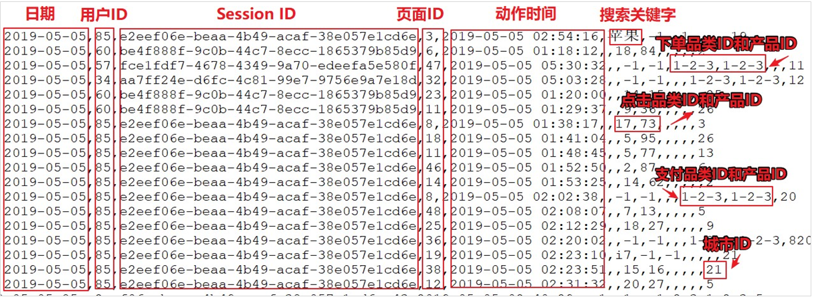
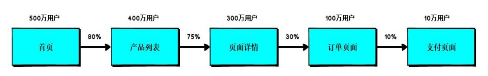

# **Spark** 案例实操

## 数据准备



上面的数据图是从数据文件中截取的一部分内容，表示为电商网站的用户行为数据，主要包含用户的 4 种行为：搜索，点击，下单，支付。数据规则如下：

- 数据文件中每行数据采用下划线分隔数据
- 每一行数据表示用户的一次行为，这个行为只能是 4 种行为的一种
- 如果搜索关键字为 null,表示数据不是搜索数据
- 如果点击的品类 ID 和产品 ID 为-1，表示数据不是点击数据
- 针对于下单行为，一次可以下单多个商品，所以品类 ID 和产品 ID 可以是多个，id 之间采用逗号分隔，如果本次不是下单行为，则数据采用 null 表示
- 支付行为和下单行为类似 

详细字段说明：

| 编号 | 字段名称           | 字段类型 | 字段含义                     |
| ---- | ------------------ | -------- | ---------------------------- |
| 1    | date               | String   | 用户点击行为的日期           |
| 2    | user_id            | Long     | 用户的 ID                    |
| 3    | session_id         | String   | Session 的 ID                |
| 4    | page_id            | Long     | 某个页面的 ID                |
| 5    | action_time        | String   | 动作的时间点                 |
| 6    | search_keyword     | String   | 用户搜索的关键词             |
| 7    | click_category_id  | Long     | 某一个商品品类的 ID          |
| 8    | click_product_id   | Long     | 某一个商品的 ID              |
| 9    | order_category_ids | String   | 一次订单中所有品类的 ID 集合 |
| 10   | order_product_ids  | String   | 一次订单中所有商品的 ID 集合 |
| 11   | pay_category_ids   | String   | 一次支付中所有品类的 ID 集合 |
| 12   | pay_product_ids    | String   | 一次支付中所有商品的 ID 集合 |
| 13   | city_id            | Long     | 城市 id                      |

## 需求 1：Top10 热门品类

### 方式一

```scala
package com.stanlong.spark.core.req

import org.apache.spark.{SparkConf, SparkContext}

/**
 * Top10热门品类
 */
object Spark01_Req_HotCategoryTop10 {

    def main(args: Array[String]): Unit = {
        val sparkConf = new SparkConf().setMaster("local[*]").setAppName("HotCategoryTop10")
        val sc = new SparkContext(sparkConf)

        // 读取原始日志数据
        val actionRdd = sc.textFile("datas/user_visit_action.txt")
        // 2019-07-17_95_26070e87-1ad7-49a3-8fb3-cc741facaddf_37_2019-07-17 00:00:02_手机_-1_-1_null_null_null_null_3
        // 2019-07-17_63_837f7970-3f77-4337-812c-c1e790ca05b7_39_2019-07-17 00:05:24_null_-1_-1_13,17,14,11_1,88,94_null_null_14

        // 统计品类的点击数量
        // datas(6) 商品品类的 ID
        // 如果点击的品类 ID 和产品 ID 为-1，表示数据不是点击数据
        val clickActionRdd = actionRdd.filter(
            action => {
                val datas = action.split("_")
                datas(6) != "-1" 
            }
        )

        val clickCountRdd = clickActionRdd.map(
            action => {
                val datas = action.split("_")
                (datas(6), 1)
            }
        ).reduceByKey(_+_)

        // 统计品类的下单数量
        // datas(8) 订单中所有品类的 ID 集合
        // 如果不是下单行为，则数据采用 null 表示
        val orderActionRdd = actionRdd.filter(
            action => {
                var datas = action.split("_")
                datas(8) != "null"
            }
        )

        // 下单品类 ID 之间采用逗号分隔， 需要对数据做扁平化操作
        val orderCountRdd = orderActionRdd.flatMap(
            action => {
                val datas = action.split("_")
                val cid = datas(8)
                val cids = cid.split(",") 
                cids.map(id => (id, 1))
            }
        ).reduceByKey(_+_)

        // 统计品类的支付数量
        // 支付行为和下单行为类似
        val payActionRdd = actionRdd.filter(
            action => {
                var datas = action.split("_")
                datas(10) != "null"
            }
        )

        val payCountRdd = payActionRdd.flatMap(
            action => {
                val datas = action.split("_")
                val cid = datas(10)
                val cids = cid.split(",")
                cids.map(id => (id, 1))
            }
        ).reduceByKey(_+_)
        
        // 将 品类的点击数量，品类的下单数量，品类的支付数量组合
        val cogroupRdd = clickCountRdd.cogroup(orderCountRdd, payCountRdd)
        
        // 将品类进行排序，并取前十
        // 先按点击量排序，再按下单量排序，最后按支付数量排序        
        val analysisRdd = cogroupRdd.mapValues {
            case (clickIter, orderIter, payIter) => {
                var clickCnt = 0
                val iter1 = clickIter.iterator
                if (iter1.hasNext) {
                    clickCnt = iter1.next()
                }

                var orderCnt = 0
                val iter2 = orderIter.iterator
                if (iter2.hasNext) {
                    orderCnt = iter2.next()

                }

                var payCnt = 0
                val iter3 = payIter.iterator
                if (iter3.hasNext) {
                    payCnt = iter3.next()
                }
                
                (clickCnt, orderCnt, payCnt)
            }
        }

        val resultRdd = analysisRdd.sortBy(_._2, false).take(10)

        // 将结果打印到控制台
        resultRdd.foreach(println)

        sc.stop()
    }
}

// 问题 
// 1. actionRdd 重复使用
// 2. cogroup 有可能存在 shuffle， 性能较低
```

### 方式二

```scala
package com.stanlong.spark.core.req

import org.apache.spark.{SparkConf, SparkContext}

/**
 * Top10热门品类
 */
object Spark01_Req_HotCategoryTop10 {

    def main(args: Array[String]): Unit = {
        val sparkConf = new SparkConf().setMaster("local[*]").setAppName("HotCategoryTop10")
        val sc = new SparkContext(sparkConf)

        // 读取原始日志数据
        val actionRdd = sc.textFile("datas/user_visit_action.txt")

        // 持久化， 解决 actionRdd 重复使用
        actionRdd.cache() 
        
        // 统计品类的点击数量
        val clickActionRdd = actionRdd.filter(
            action => {
                val datas = action.split("_")
                datas(6) != "-1"
            }
        )

        val clickCountRdd = clickActionRdd.map(
            action => {
                val datas = action.split("_")
                (datas(6), 1)
            }
        ).reduceByKey(_+_)

        // 统计品类的下单数量
        val orderActionRdd = actionRdd.filter(
            action => {
                var datas = action.split("_")
                datas(8) != "null"
            }
        )

        val orderCountRdd = orderActionRdd.flatMap(
            action => {
                val datas = action.split("_")
                val cid = datas(8)
                val cids = cid.split(",")
                cids.map(id => (id, 1))
            }
        ).reduceByKey(_+_)

        // 统计品类的支付数量
        val payActionRdd = actionRdd.filter(
            action => {
                var datas = action.split("_")
                datas(10) != "null"
            }
        )

        val payCountRdd = payActionRdd.flatMap(
            action => {
                val datas = action.split("_")
                val cid = datas(10)
                val cids = cid.split(",")
                cids.map(id => (id, 1))
            }
        ).reduceByKey(_+_)


        // 将品类进行排序，并取前十
        // 先按点击量排序，再按下单量排序，最后按支付数量排序
        // 方式一使用 cogroup ,的数据格式是 (品类ID ,(点击数量，下单数量，支付数量))
        // 这里做一步转化，不使用 cogroup
        // 数据格式为
        // (品类ID， 点击数量) => (品类ID,(点击数量, 0, 0))
        // (品类ID， 下单数量) => (品类ID,(0, 下单数量, 0))
        // (品类ID， 支付数量) => (品类ID,(0, 0, 支付数量))
        // 相同的key两两结合，最后得到  (品类ID ,(点击数量，下单数量，支付数量))
        val rdd1 = clickCountRdd.map {
            case (cid, cnt) => {
                (cid, (cnt, 0, 0))
            }
        }

        val rdd2 = orderCountRdd.map {
            case (cid, cnt) => {
                (cid, (0, cnt, 0))
            }
        }

        val rdd3 = payCountRdd.map {
            case (cid, cnt) => {
                (cid, (0, 0, cnt))
            }
        }

        // 将三个数据源合并在一起，统一进行聚合计算
        val sourceRdd = rdd1.union(rdd2).union(rdd3)
        val analysisRdd = sourceRdd.reduceByKey(
            (t1, t2) => {
                (t1._1 + t2._1, t1._2 + t2._2, t1._3 + t2._3)
            }
        )

        val resultRdd = analysisRdd.sortBy(_._2, false).take(10)

        // 将结果打印到控制台
        resultRdd.foreach(println)

        sc.stop()
    }
}
// 方式二的问题： 存在大量的 reduceByKey（shuffle操作）
// reduceByKey是聚合算子， Spark提供优化，本身有缓存操作
```

### 方式三

```scala
package com.stanlong.spark.core.req

import org.apache.spark.{SparkConf, SparkContext}

/**
 * Top10热门品类
 */
object Spark01_Req_HotCategoryTop10 {

    def main(args: Array[String]): Unit = {
        val sparkConf = new SparkConf().setMaster("local[*]").setAppName("HotCategoryTop10")
        val sc = new SparkContext(sparkConf)

        // 读取原始日志数据
        val actionRdd = sc.textFile("datas/user_visit_action.txt")
        
        // 将数据转换结构
        // 点击的场合:(品类ID,(1,0,0))
        // 下单的场合:(品类ID,(0,1,0))
        // 支付的场合:(品类ID,(0,0,1))
        val flatRdd = actionRdd.flatMap(
            action => {
                val datas = action.split("_")
                if (datas(6) != "-1") {
                    // 点击的场合
                    List((datas(6), (1, 0, 0)))
                } else if (datas(8) != "null") {
                    // 下单的场合
                    val ids = datas(8).split(",")
                    ids.map(id => (id, (0, 1, 0)))
                } else if (datas(10) != "null") {
                    // 支付的场合
                    val ids = datas(10).split(",")
                    ids.map(id => (id, (0, 0, 1)))
                } else {
                    Nil
                }
            }
        )


        // 将相同品类ID的数据进行分组聚合
        //  (品类ID ,(点击数量，下单数量，支付数量))
        val analysisRdd = flatRdd.reduceByKey(
            (t1, t2) => {
                (t1._1 + t2._1, t1._2 + t2._2, t1._3 + t2._3)
            }
        )

        val resultRdd = analysisRdd.sortBy(_._2, false).take(10)

        // 将结果打印到控制台
        resultRdd.foreach(println)

        sc.stop()
    }
}
// 还是有shuffle
```

### 方式四

```scala
package com.stanlong.spark.core.req

import org.apache.spark.util.AccumulatorV2
import org.apache.spark.{SparkConf, SparkContext}

import scala.collection.mutable

/**
 * Top10热门品类
 */
object Spark01_Req_HotCategoryTop10 {

    def main(args: Array[String]): Unit = {
        val sparkConf = new SparkConf().setMaster("local[*]").setAppName("HotCategoryTop10")
        val sc = new SparkContext(sparkConf)

        // 读取原始日志数据
        val actionRdd = sc.textFile("datas/user_visit_action.txt")

        // 声明累加器
        val acc = new HotCategoryAccumulator
        sc.register(acc, "hotCategory")

        actionRdd.foreach(
            action => {
                val datas = action.split("_")
                if (datas(6) != "-1") {
                    // 点击的场合
                    acc.add((datas(6), "click"))
                } else if (datas(8) != "null") {
                    // 下单的场合
                    val ids = datas(8).split(",")
                    ids.foreach(
                        id => {
                            acc.add((id, "order"))
                        }
                    )
                } else if (datas(10) != "null") {
                    // 支付的场合
                    val ids = datas(10).split(",")
                    ids.foreach(
                        id => {
                            acc.add((id, "pay"))
                        }
                    )
                } else {
                    Nil
                }
            }
        )


        // 将相同品类ID的数据进行分组聚合
        //  (品类ID ,(点击数量，下单数量，支付数量))
        val accVal = acc.value
        val categories = accVal.map((_._2))
        val sort = categories.toList.sortWith(
            (left, right) => {
                if (left.clickCnt > right.clickCnt) {
                    true
                } else if (left.clickCnt == right.clickCnt) {
                    if (left.orderCnt > right.orderCnt) {
                        true
                    } else if (left.orderCnt == right.orderCnt) {
                        left.payCnt > right.payCnt
                    } else {
                        false
                    }
                } else {
                    false
                }
            }
        )

        // 将结果打印到控制台
        sort.take(10).foreach(println)

        sc.stop()
    }

    case class HotCategory(cid:String, var clickCnt:Int, var orderCnt:Int, var payCnt:Int)

    /**
     * 自定义累加器
     * 1. 继承 AccumulatorV2
     *      IN:(品类ID， 行为类型)
     *      OUT:mutable.Map[String, HotCategory]
     * 2. 重写方法
     */
    class HotCategoryAccumulator extends AccumulatorV2[(String, String), mutable.Map[String, HotCategory]]{

        private val hcMap = mutable.Map[String, HotCategory]()

        override def isZero: Boolean = {
            hcMap.isEmpty
        }

        override def copy(): AccumulatorV2[(String, String), mutable.Map[String, HotCategory]] = {
            new HotCategoryAccumulator()
        }

        override def reset(): Unit = {
            hcMap.clear()
        }

        override def add(v: (String, String)): Unit = {
            val cid = v._1
            val actionType = v._2
            val category = hcMap.getOrElse(cid, HotCategory(cid, 0, 0, 0))
            if(actionType == "click"){
                category.clickCnt += 1
            }else if(actionType == "order"){
                category.orderCnt += 1
            }else if(actionType == "pay"){
                category.payCnt += 1
            }
            hcMap.update(cid, category)
        }

        override def merge(other: AccumulatorV2[(String, String), mutable.Map[String, HotCategory]]): Unit = {
            val map1 = this.hcMap
            val map2 = other.value
            map2.foreach{
                case(cid, hc) => {
                    val category = map1.getOrElse(cid, HotCategory(cid, 0, 0, 0))
                    category.clickCnt += hc.clickCnt
                    category.orderCnt += hc.orderCnt
                    category.payCnt += hc.payCnt
                    map1.update(cid, category)
                }
            }
        }

        override def value: mutable.Map[String, HotCategory] = hcMap
    }
}
```

## 需求 2：Top10 热门品类中每个品类的Top10活跃Session统计

说明: 在需求一的基础上，增加每个品类用户session的点击统计

```scala
package com.stanlong.spark.core.req

import org.apache.spark.rdd.RDD
import org.apache.spark.util.AccumulatorV2
import org.apache.spark.{SparkConf, SparkContext}

import scala.collection.mutable

/**
 * Top10热门品类
 */
object Spark02_Req_HotCategorySessionTop10 {

    def main(args: Array[String]): Unit = {
        val sparkConf = new SparkConf().setMaster("local[*]").setAppName("HotCategoryTop10")
        val sc = new SparkContext(sparkConf)

        val actionRdd = sc.textFile("datas/user_visit_action.txt")
        actionRdd.cache()


        val top10Ids = top10Category(actionRdd)

        // 过滤原始数据， 保留点击和前10品类的ID
        val filterActionRdd = actionRdd.filter(
            action => {
                val datas = action.split("_")
                if (datas(6) != -1) {
                    top10Ids.contains(datas(6))
                } else {
                    false
                }
            }
        )


        // 根据品类ID和sessionID进行点击量的统计
        val reduceRdd = filterActionRdd.map(
            action => {
                val datas = action.split("_")
                ((datas(6), datas(2)), 1)
            }
        ).reduceByKey(_ + _)


        // 将统计的结果进行结构的转换
        // ((品类ID， sessionID), sum) =》(品类ID， (sessionID, sum))
        val mapRdd = reduceRdd.map {
            case ((cid, sid), sum) => {
                (cid, (sid, sum))
            }
        }

        // 相同的品类进行分组
        val groupRdd = mapRdd.groupByKey()

        // 分组后的数据进行点击量的排序，取前10名
        val resultRdd = groupRdd.mapValues(
            iter => {
                iter.toList.sortBy(_._2)(Ordering.Int.reverse).take(10)
            }
        )

        resultRdd.collect().foreach(println)


        sc.stop()
    }

    def top10Category(actionRdd: RDD[String]): Array[(String)] ={

        val flatRdd = actionRdd.flatMap(
            action => {
                val datas = action.split("_")
                if (datas(6) != "-1") {
                    // 点击的场合
                    List((datas(6), (1, 0, 0)))
                } else if (datas(8) != "null") {
                    // 下单的场合
                    val ids = datas(8).split(",")
                    ids.map(id => (id, (0, 1, 0)))
                } else if (datas(10) != "null") {
                    // 支付的场合
                    val ids = datas(10).split(",")
                    ids.map(id => (id, (0, 0, 1)))
                } else {
                    Nil
                }
            }
        )

        val analysisRdd = flatRdd.reduceByKey(
            (t1, t2) => {
                (t1._1 + t2._1, t1._2 + t2._2, t1._3 + t2._3)
            }
        )

        analysisRdd.sortBy(_._2, false).take(10).map(_._1)
    }
}
```

## 需求 3：页面跳转率统计

**需求说明**

1） 页面单跳转化率

什么是页面单跳转换率，比如一个用户在一次 Session 过程中访问的页面路径 3,5,7,9,10,21，那么页面 3 跳到页面 5 叫一次单跳，7-9 也叫一次单跳， 那么单跳转化率就是要统计页面点击的概率。比如：计算 3-5 的单跳转化率，先获取符合条件的 Session 对于页面 3 的访问次数（PV） 为 A，然后获取符合条件的 Session 中访问了页面 3 又紧接着访问了页面 5 的次数为 B，那么 B/A 就是 3-5 的页面单跳转化率。



2） 统计页面单跳转化率意义 

- 产品经理和运营总监，可以根据这个指标，去尝试分析，整个网站，产品，各个页面的表现怎么样，是不是需要去优化产品的布局；吸引用户最终可以进入最后的支付页面。
- 数据分析师，可以此数据做更深一步的计算和分析。
- 企业管理层，可以看到整个公司的网站，各个页面的之间的跳转的表现如何，可以适当调整公司的经营战略或策略

```scala
package com.stanlong.spark.core.req

import org.apache.spark.{SparkConf, SparkContext}

/**
 * 页面单跳转换率统计
 */
object Spark06_Req3_PageflowAnalysis {

    def main(args: Array[String]): Unit = {
        val sparkConf = new SparkConf().setMaster("local[*]").setAppName("HotCategoryTop10")
        val sc = new SparkContext(sparkConf)

        val actionRdd = sc.textFile("datas/user_visit_action.txt")

        val actionDataRdd = actionRdd.map(
            action => {
                val datas = action.split("_")
                UserVisitAction(
                    datas(0),
                    datas(1).toLong,
                    datas(2),
                    datas(3).toLong,
                    datas(4),
                    datas(5),
                    datas(6).toLong,
                    datas(7).toLong,
                    datas(8),
                    datas(9),
                    datas(10),
                    datas(11),
                    datas(12).toLong
                )
            }
        )

        actionDataRdd.cache()


        // 对指定的页面连续跳转进行统计
        val ids = List(1,2,3,4,5,6,7)

        val okflowIds = ids.zip(ids.tail)

        // 计算分母
        val pageIdToCountMap = actionDataRdd.filter(
            action => {
                ids.init.contains(action.page_id) // ids.init 不统计列表的最后一个
            }
        ).map(
            action => {
                (action.page_id, 1L)
            }
        ).reduceByKey(_+_).collect().toMap

        // 计算分子
        // 根据Session进行分组
        val sessionRdd = actionDataRdd.groupBy(_.session_id)
        // 分组后根据访问时间排序（升序）
        val mvRdd = sessionRdd.mapValues(
            iter => {
                val sortList = iter.toList.sortBy(_.action_time)

                // 原始 [1,2,3,4]
                // 想要得到[1-2, 2-3, 3-4]
                // [1,2,3,4]
                // [2,3,4]
                // 使用zip
                val flowIds = sortList.map(_.page_id)
                val pageFlowIds = flowIds.zip(flowIds.tail)

                // 将不合法的跳转页面进行过滤
                pageFlowIds.filter(
                    t => {
                        okflowIds.contains(t)
                    }
                ).map(
                    t => {
                        (t, 1)
                    }
                )

            }
        )

        val flatRdd = mvRdd.map(_._2).flatMap(list => list)
        val dataRdd = flatRdd.reduceByKey(_ + _)

        // 计算单跳转换率
        dataRdd.foreach{
            case ((pageId1, pageId2), sum) => {
                val lon = pageIdToCountMap.getOrElse(pageId1, 0L)
                println(s"页面${pageId1}跳转到页面${pageId2}的单跳转换率为: " + (sum.toDouble / lon))
            }
        }

        sc.stop()
    }

    //用户访问动作表
    case class UserVisitAction(
        date: String,//用户点击行为的日期
        user_id: Long,// 用 户 的 ID
        session_id: String,//Session 的 ID
        page_id: Long,// 某 个 页 面 的 ID
        action_time: String,//动作的时间点
        search_keyword: String,//用户搜索的关键词
        click_category_id: Long,// 某 一 个 商 品 品 类 的 ID
        click_product_id: Long,// 某 一 个 商 品 的 ID
        order_category_ids: String,//一次订单中所有品类的 ID 集合
        order_product_ids: String,//一次订单中所有商品的 ID 集合
        pay_category_ids: String,//一次支付中所有品类的 ID 集合
        pay_product_ids: String,//一次支付中所有商品的 ID 集合
        city_id: Long //城市 id
    )
}
```

