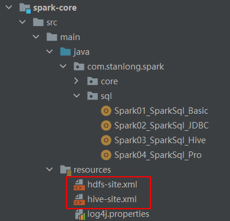

# SparkSql项目实战

## 环境准备

复制 hive-site.xml 和 hdfs-site.xml 到 resource



## 数据准备

首先在 Hive 中创建表,，并导入数据。一共有 3 张表： 1 张用户行为表，1 张城市表，1 张产品表

```sql
CREATE TABLE `user_visit_action`(
`date` string,
`user_id` bigint,
`session_id` string,
`page_id` bigint,
`action_time` string,
`search_keyword` string,
`click_category_id` bigint,
`click_product_id` bigint,
`order_category_ids` string,
`order_product_ids` string,
`pay_category_ids` string,
`pay_product_ids` string,
`city_id` bigint)
row format delimited fields terminated by '\t';
load data local inpath '/root/spark-sql/user_visit_action.txt' into table user_visit_action;

CREATE TABLE `product_info`(
`product_id` bigint,
`product_name` string,
`extend_info` string)
row format delimited fields terminated by '\t';
load data local inpath '/root/spark-sql/product_info.txt' into table product_info;

CREATE TABLE `city_info`(
`city_id` bigint,
`city_name` string,
`area` string)
row format delimited fields terminated by '\t';
load data local inpath '/root/spark-sql/city_info.txt' into table city_info;
```

## 需求

### 个区域热门商品Top3

#### 需求简介

这里的热门商品是从点击量的维度来看的，计算各个区域前三大热门商品，并备注上每个商品在主要城市中的分布比例，超过两个城市用其他显示。

例如：

| **地区** | **商品名称** | **点击次数** | **城市备注**                        |
| -------- | ------------ | ------------ | ----------------------------------- |
| **华北** | 商品 A       | 100000       | 北京 21.2%，天津  13.2%，其他 65.6% |
| **华北** | 商品 P       | 80200        | 北京 63.0%，太原  10%，其他 27.0%   |
| **华北** | 商品 M       | 40000        | 北京 63.0%，太原  10%，其他 27.0%   |
| **东北** | 商品 J       | 92000        | 大连 28%，辽宁  17.0%，其他 55.0%   |

#### 需求分析

- 查询出来所有的点击记录，并与 city_info 表连接，得到每个城市所在的地区，与Product_info 表连接得到产品名称
- 按照地区和商品 id 分组，统计出每个商品在每个地区的总点击次数
- 每个地区内按照点击次数降序排列
- 只取前三名
- 城市备注需要自定义 UDAF 函数

#### 功能实现

- 连接三张表的数据，获取完整的数据（只有点击）
- 将数据根据地区，商品名称分组
- 统计商品点击次数总和,取Top3
- 实现自定义聚合函数显示备注

#### 代码

```scala
package com.stanlong.spark.sql

import org.apache.spark.sql.expressions.Aggregator
import org.apache.spark.{SparkConf}
import org.apache.spark.sql.{Encoder, Encoders, SparkSession, functions}

import scala.collection.mutable
import scala.collection.mutable.ListBuffer


object Spark04_SparkSql_Pro {

    def main(args: Array[String]): Unit = {
        // 创建SparkSQl的运行环境
        val sparkSQLConf = new SparkConf().setMaster("local[*]").setAppName("sparkSQL")
        val spark = SparkSession.builder().enableHiveSupport().config(sparkSQLConf).getOrCreate() // enableHiveSupport() 启用hive支持
        // 在使用DataFrame时，如果涉及到转换操作，需要引入转换规则
        import spark.implicits._

        // spark 建表并导入数据，这里我直接在hive上把数据准备好了，不用这种方式
        // spark.sql("use spark") // 使用spark数据库

        // 数据准备， 这一步在beeline里操作，这里只记录Spark的写法
        // spark.sql(
        //     """
        //       |CREATE TABLE `user_visit_action`(
        //       |`date` string,
        //       |`user_id` bigint,
        //       |`session_id` string,
        //       |`page_id` bigint,
        //       |`action_time` string,
        //       |`search_keyword` string,
        //       |`click_category_id` bigint,
        //       |`click_product_id` bigint,
        //       |`order_category_ids` string,
        //       |`order_product_ids` string,
        //       |`pay_category_ids` string,
        //       |`pay_product_ids` string,
        //       |`city_id` bigint)
        //       |row format delimited fields terminated by '\t'
        //       |""".stripMargin)

        // spark.sql(
        //     """
        //       |load data local inpath 'datas/spark-sql/user_visit_action.txt' into table user_visit_action
        //      |""".stripMargin)

        // 查询基本数据
        spark.sql(
            """
              | select
              |    a.*,
              |    p.product_name,
              |    c.area,
              |    c.city_name
              | from user_visit_action a
              | inner join product_info p
              |    on a.click_product_id = p.product_id
              | inner join city_info c
              |    on a.city_id = c.city_id
              | where a.click_product_id != -1
              |""".stripMargin).createOrReplaceTempView("t1")

        // 根据商品和区域数据进行聚合
        spark.udf.register("cityRemark", functions.udaf(new CityRemarkUDAf()))
        spark.sql(
            """
              | select
              |     t1.area,
              |     t1.product_name,
              |     count(1) as click_count,
              |     cityRemark(city_name) as city_remark
              | from t1
              | group by t1.area, t1.product_name
              |
              |""".stripMargin).createOrReplaceTempView("t2")

        // 区域内对点击数量进行排序
        spark.sql(
            """
              | select
              |     t2.area,
              |     t2.product_name,
              |     t2.click_count,
              |     t2.city_remark,
              |     rank() over(partition by area order by click_count desc) as rank
              | from t2
              |""".stripMargin).createOrReplaceTempView("t3")

        // 取排序的前三
        spark.sql(
            """
              | select
              |    *
              | from t3
              | where rank <= 3
              |""".stripMargin).show(false)

        spark.close()
    }


    case class Buffer(var total:Long, var cityMap:mutable.Map[String, Long])

    // 自定义聚合函数，实现城市备注功能
    // 1. 继承 Aggregator 定义泛型
    //     IN: 城市名称
    //     BUF: 【总点击数量， 数据结构为[(city, cnt),(city, cnt)]】
    //     OUT: 备注信息
    // 2. 重写方法
    class CityRemarkUDAf extends Aggregator[String, Buffer, String]{
        // 缓冲区初始化
        override def zero: Buffer = {
            Buffer(0, mutable.Map[String, Long]())
        }

        // 更新缓冲取数据
        override def reduce(buffer: Buffer, city: String): Buffer = {
            buffer.total += 1
            var newCount = buffer.cityMap.getOrElse(city, 0L) + 1
            buffer.cityMap.update(city, newCount)
            buffer
        }

        // 合并缓冲区数据
        override def merge(buffer1: Buffer, buffer2: Buffer): Buffer = {
            buffer1.total += buffer2.total
            val map1 = buffer1.cityMap
            val map2 = buffer2.cityMap

            // 两个Map的合并
            // 方式一
            buffer1.cityMap = map1.foldLeft(map2){
                case (map, (city, cnt)) => {
                    val newCount = map.getOrElse(city, 0L) + cnt
                    map.update(city, newCount)
                    map
                }
            }

            // 方式二
            // map2.foreach{
            //     case (city, cnt) => {
            //         val newCount = map1.getOrElse(city, 0L) + cnt
            //         map1.update(city, newCount)
            //     }
            // }
            // buffer1.cityMap = map1
            buffer1
        }

        // 将统计的结果生成字符串信息
        override def finish(buffer: Buffer): String = {
            val remarkList = ListBuffer[String]()
            val totalcnt = buffer.total
            val cityMap = buffer.cityMap
            val cityCntList = cityMap.toList.sortWith(
                (left, right) => {
                    left._2 > right._2
                }
            ).take(2)

            val hasMore = cityMap.size > 2
            var rsum = 0L
            cityCntList.foreach{
                case(city, cnt) => {
                    val r = cnt * 100 / totalcnt
                    remarkList.append(s"${city} ${r}%")
                    rsum += r
                }
            }

            if(hasMore){
                remarkList.append(s"其他 ${100 - rsum}")
            }

            remarkList.mkString(",")
        }

        override def bufferEncoder: Encoder[Buffer] = Encoders.product

        override def outputEncoder: Encoder[String] = Encoders.STRING
    }
}
```

