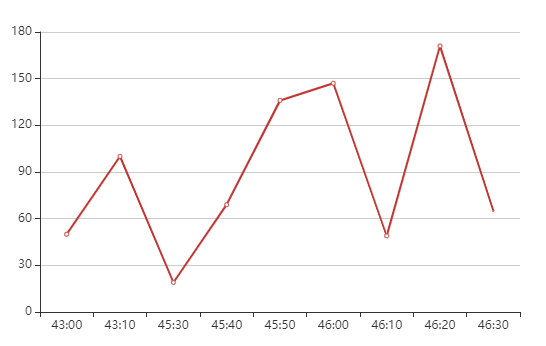

# SparkStreaming案例

## 环境准备

导入依赖

```xml
<dependencies>
    <dependency>
        <groupId>org.apache.spark</groupId>
        <artifactId>spark-core_2.12</artifactId>
        <version>3.0.0</version>
    </dependency>
    <dependency>
        <groupId>org.apache.spark</groupId>
        <artifactId>spark-streaming_2.12</artifactId>
        <version>3.0.0</version>
    </dependency>
    <dependency>
        <groupId>org.apache.spark</groupId>
        <artifactId>spark-streaming-kafka-0-10_2.12</artifactId>
        <version>3.0.0</version>
    </dependency>
    <!-- https://mvnrepository.com/artifact/com.alibaba/druid -->
    <dependency>
        <groupId>com.alibaba</groupId>
        <artifactId>druid</artifactId>
        <version>1.1.10</version>
    </dependency>
    <dependency>
        <groupId>mysql</groupId>
        <artifactId>mysql-connector-java</artifactId>
        <version>5.1.27</version>
    </dependency>
    <dependency>
        <groupId>com.fasterxml.jackson.core</groupId>
        <artifactId>jackson-core</artifactId>
        <version>2.10.1</version>
    </dependency>
</dependencies>
```

启动Kafka， kafka的相关操作见 Hadoop\17Kafka

Kafka环境测试

消费者

```scala
package com.stanlong.spark.streaming

import org.apache.kafka.clients.consumer.ConsumerConfig
import org.apache.spark.streaming.kafka010.{ConsumerStrategies, KafkaUtils, LocationStrategies}
import org.apache.spark.SparkConf
import org.apache.spark.streaming.{Seconds, StreamingContext}

object SparkStreaming01_WordCount {

    def main(args: Array[String]): Unit = {

        // 创建环境对象
        val sparkConf = new SparkConf().setMaster("local[*]").setAppName("SparkString")
        val ssc = new StreamingContext(sparkConf, Seconds(3)) // (环境配置， 采集周期)  这里设置每3秒采集一次


        //3.定义 Kafka 参数
        val kafkaPara: Map[String, Object] = Map[String, Object](
            ConsumerConfig.BOOTSTRAP_SERVERS_CONFIG -> "node02:9092,node03:9092,node04:9092",
            ConsumerConfig.GROUP_ID_CONFIG -> "spark-kafka",
            "key.deserializer" ->  "org.apache.kafka.common.serialization.StringDeserializer",
            "value.deserializer" -> "org.apache.kafka.common.serialization.StringDeserializer"
        )


        val kafkaDataDS = KafkaUtils.createDirectStream[String, String]( // k,v都是String类型
            ssc,
            LocationStrategies.PreferConsistent,
            ConsumerStrategies.Subscribe[String, String](Set("spark-kafka"), kafkaPara)
        ) // spark-kafka 为 topic名称

        kafkaDataDS.map(_.value()).print()


        // 1. 启动采集器
        ssc.start()
        // 2. 等待采集器的关闭
        ssc.awaitTermination()
    }
}
```

生产者

```scala
package com.stanlong.spark.streaming

import java.util.Properties

import org.apache.kafka.clients.producer.{KafkaProducer, ProducerConfig, ProducerRecord}

import scala.collection.mutable.ListBuffer
import scala.util.Random

object SparkStreaming02_MockData {

    def main(args: Array[String]): Unit = {

        // 生成模拟数据
        // 格式: timestamp area city userid adid
        // 含义: 时间戳 省份 城市 用户 广告

        // 数据流程
        // 模拟数据 =》 Kafka =》 SparkStreaming =》 统计分析

        // 创建配置对象
        val prop = new Properties()
        // 添加配置
        prop.put(ProducerConfig.BOOTSTRAP_SERVERS_CONFIG, "node02:9092,node03:9092,node04:9092")
        prop.put(ProducerConfig.KEY_SERIALIZER_CLASS_CONFIG, "org.apache.kafka.common.serialization.StringSerializer")
        prop.put(ProducerConfig.VALUE_SERIALIZER_CLASS_CONFIG, "org.apache.kafka.common.serialization.StringSerializer")

        // 根据配置创建 Kafka 生产者
        val producer = new KafkaProducer[String, String](prop)

        while(true){
            mockData().foreach(
                data => {
                    // 向Kafka中生成数据
                    val record = new ProducerRecord[String, String]("spark-kafka", data)
                    producer.send(record)


                }
            )
            Thread.sleep(2000)

        }

    }

    def mockData(): ListBuffer[String] ={
        val list = ListBuffer[String]()
        val areaList = ListBuffer[String]("华东", "华北" , "华南")
        val cityList = ListBuffer[String]("北京","上海","深圳")
        for (i <- 1 to 30){
            val area = areaList(new Random().nextInt(3))
            val city = cityList(new Random().nextInt(3))
            var userid = new Random().nextInt(6) + 1 //编号从1开始
            var adid = new Random().nextInt(6) + 1
            list.append(s"${System.currentTimeMillis()} ${area} ${city} ${userid} ${adid}")
        }
        list
    }
}
```

先启动消费者，在启动生产者。能正常生产和消费数据，则kafka环境搭建成功。

## 需求一: 广告黑名单

实现实时的动态黑名单机制：将每天对某个广告点击超过 100 次的用户拉黑。注：黑名单保存到MySQL 中。

### 思路分析

1） 读取Kafka 数据之后，并对 MySQL 中存储的黑名单数据做校验；

2） 校验通过则对给用户点击广告次数累加一并存入MySQL；

3） 在存入MySQL 之后对数据做校验，如果单日超过 100 次则将该用户加入黑名单。

### MySQL 建表

```mysql
-- 存放黑名单用户的表
CREATE TABLE black_list (userid CHAR(1) PRIMARY KEY);	

-- 存放单日各用户点击每个广告的次数
CREATE TABLE user_ad_count ( 
    dt varchar(255),
    userid CHAR (1),
    adid CHAR (1), count BIGINT,
    PRIMARY KEY (dt, userid, adid)
);
```

### 代码实现

模拟广告点击数据

```scala
package com.stanlong.spark.streaming

import java.util.Properties

import org.apache.kafka.clients.producer.{KafkaProducer, ProducerConfig, ProducerRecord}

import scala.collection.mutable.ListBuffer
import scala.util.Random

object SparkStreaming02_MockData {

    def main(args: Array[String]): Unit = {

        // 生成模拟数据
        // 格式: timestamp area city userid adid
        // 含义: 时间戳 省份 城市 用户 广告

        // 数据流程
        // 模拟数据 =》 Kafka =》 SparkStreaming =》 统计分析

        // 创建配置对象
        val prop = new Properties()
        // 添加配置
        prop.put(ProducerConfig.BOOTSTRAP_SERVERS_CONFIG, "node02:9092,node03:9092,node04:9092")
        prop.put(ProducerConfig.KEY_SERIALIZER_CLASS_CONFIG, "org.apache.kafka.common.serialization.StringSerializer")
        prop.put(ProducerConfig.VALUE_SERIALIZER_CLASS_CONFIG, "org.apache.kafka.common.serialization.StringSerializer")

        // 根据配置创建 Kafka 生产者
        val producer = new KafkaProducer[String, String](prop)


        while(true){
            mockData().foreach(
                data => {
                    // 向Kafka中生成数据
                    val record = new ProducerRecord[String, String]("spark-kafka", data)
                    producer.send(record)


                }
            )
            Thread.sleep(2000)

        }
    }

    def mockData(): ListBuffer[String] ={
        val list = ListBuffer[String]()
        val areaList = ListBuffer[String]("华东", "华北" , "华南")
        val cityList = ListBuffer[String]("北京","上海","深圳")
        for (i <- 1 to 30){
            val area = areaList(new Random().nextInt(3))
            val city = cityList(new Random().nextInt(3))
            var userid = new Random().nextInt(6) + 1 //编号从1开始
            var adid = new Random().nextInt(6) + 1
            list.append(s"${System.currentTimeMillis()} ${area} ${city} ${userid} ${adid}")
        }
        list
    }
}
```

黑名单判断

```scala
package com.stanlong.spark.streaming

import java.text.SimpleDateFormat
import java.util.Date

import com.stanlong.spark.util.JdbcUtil
import org.apache.kafka.clients.consumer.ConsumerConfig
import org.apache.spark.SparkConf
import org.apache.spark.streaming.{Seconds, StreamingContext}
import org.apache.spark.streaming.kafka010.{ConsumerStrategies, KafkaUtils, LocationStrategies}

import scala.collection.mutable.ListBuffer


object SparkStreaming03_Req1_BlackList {

    def main(args: Array[String]): Unit = {

        // 创建环境对象
        val sparkConf = new SparkConf().setMaster("local[*]").setAppName("SparkString")
        val ssc = new StreamingContext(sparkConf, Seconds(3)) // (环境配置， 采集周期)  这里设置每3秒采集一次


        //3.定义 Kafka 参数
        val kafkaPara: Map[String, Object] = Map[String, Object](
            ConsumerConfig.BOOTSTRAP_SERVERS_CONFIG -> "node02:9092,node03:9092,node04:9092",
            ConsumerConfig.GROUP_ID_CONFIG -> "spark-kafka",
            "key.deserializer" ->  "org.apache.kafka.common.serialization.StringDeserializer",
            "value.deserializer" -> "org.apache.kafka.common.serialization.StringDeserializer"
        )


        val kafkaDataDS = KafkaUtils.createDirectStream[String, String]( // k,v都是String类型
            ssc,
            LocationStrategies.PreferConsistent,
            ConsumerStrategies.Subscribe[String, String](Set("spark-kafka"), kafkaPara) // spark-kafka 为 topic名称
        )

        val adClickData = kafkaDataDS.map(
            kafkaData => {
                val data = kafkaData.value()
                val datas = data.split(" ")
                AdClickData(datas(0), datas(1), datas(2), datas(3), datas(4))
            }
        )


        val ds = adClickData.transform(
            rdd => {
                // 周期性查询mysql获取黑名单数据
                val blackList = ListBuffer[String]()
                val conn = JdbcUtil.getConnection
                val pstmt = conn.prepareStatement("select userid from black_list")
                val rs = pstmt.executeQuery()
                while (rs.next()) {
                    blackList.append(rs.getString(1))

                }
                rs.close()
                pstmt.close()
                conn.close()


                // 判断点击用户是否在黑名单中
                val filterRdd = rdd.filter(
                    data => {
                        !blackList.contains(data.userid) // 过滤掉黑名单中的用户
                    }
                )

                // 如果不在黑名单，则开始统计 （每个采集周期）
                filterRdd.map(
                    data => {
                        val sdf = new SimpleDateFormat("yyyy-MM-dd")
                        val day = sdf.format(new Date(data.ts.toLong))
                        val user = data.userid
                        val ad = data.adid
                        ((day, user, ad), 1)
                    }
                ).reduceByKey(_+_)
            }
        )

        // 业务逻辑处理
        ds.foreachRDD(

            rdd => {

                // foreachPartition 可以一个分区创建一个连接对象，这样可以大幅度减少连接对象的数量，提升效率
                // rdd.foreachPartition(
                //     iter => {
                //         val conn = JdbcUtil.getConnection
                //         iter.foreach{
                //             case((day, user, ad),count) =>{
                //
                //             }
                //         }
                //         conn.close()
                //     }
                // )

                rdd.foreach{ // 每循环一次会创建一个连接对象，性能不高
                    case((day, user, ad), count) =>{
                        println(s"${day} ${user} ${ad} ${count}")
                        // 如果统计数量超过了点击阈值，则将用户拉入黑名单
                        if(count>=30){
                            val conn = JdbcUtil.getConnection
                            val sql =
                                """
                                  |insert into black_list (userid) values(?)
                                  |on DUPLICATE KEY
                                  |UPDATE userid=?
                                  |""".stripMargin
                            JdbcUtil.executeUpdate(conn, sql, Array(user, user))
                            conn.close()

                        }else{
                            // 如果没有超过阈值，那么需要将当天的广告点击数量进行更新
                            val conn = JdbcUtil.getConnection
                            val sql = """
                                        |select * from user_ad_count where dt= ? and userid = ? and adid = ?
                                        |""".stripMargin
                            val flag = JdbcUtil.isExist(conn, sql, Array(day, user, ad))

                            // 查询统计
                            if(flag){
                                // 查询统计表数据，如果存在则更新，判断更新后的点击数量是否超过阈值
                                val sql = """
                                            |update user_ad_count set count= count + ?
                                            |where dt=? and userid=? and adid=?
                                            |""".stripMargin
                                JdbcUtil.executeUpdate(conn, sql, Array(count, day, user, ad))

                                // 如果超过，将用户拉入黑名单

                                val sql2 = """
                                             |select * from user_ad_count where dt=? and userid=? and adid=? and count>30
                                             |""".stripMargin
                                val flag2 = JdbcUtil.isExist(conn, sql2, Array(day, user, ad))
                                if(flag2){
                                    val sql3 = """
                                                 |insert into black_list (userid) values(?)
                                                 |on DUPLICATE KEY
                                                 |UPDATE userid=?
                                                 |""".stripMargin
                                    JdbcUtil.executeUpdate(conn, sql3, Array(user, user))
                                }
                            }else{
                                // 不存在则新增
                                val sql4 = """
                                         |insert into user_ad_count(dt, userid, adid, count) values(?,?,?,?)
                                         |""".stripMargin
                                JdbcUtil.executeUpdate(conn, sql4, Array(day, user, ad, count))
                            }
                            conn.close()
                        }
                    }
                }
            }
        )

        // 1. 启动采集器
        ssc.start()
        // 2. 等待采集器的关闭
        ssc.awaitTermination()
    }

    // 广告点击数据样例类
    case class AdClickData(ts:String, area:String, city:String, userid:String, adid:String)
}
```

JDBC工具类

```scala
package com.stanlong.spark.util

import java.sql.{Connection, PreparedStatement}
import java.util.Properties

import javax.sql.DataSource
import com.alibaba.druid.pool.DruidDataSourceFactory

object JdbcUtil {
    //初始化连接池
    var dataSource: DataSource = init()

    //初始化连接池方法
    def init(): DataSource = {
        val properties = new Properties()
        properties.setProperty("driverClassName", "com.mysql.jdbc.Driver")
        properties.setProperty("url", "jdbc:mysql://node01:3306/gmall?useUnicode=true&characterEncoding=UTF-8")
        properties.setProperty("username", "root")
        properties.setProperty("password", "root")
        properties.setProperty("maxActive", "50")
        DruidDataSourceFactory.createDataSource(properties)
    }

    //获取 MySQL 连接
    def getConnection: Connection = {
        dataSource.getConnection
    }

    //执行 SQL 语句,单条数据插入
    def executeUpdate(connection: Connection, sql: String, params: Array[Any]): Int = {
        var rtn = 0
        var pstmt: PreparedStatement = null
        try {
            connection.setAutoCommit(false)
            pstmt = connection.prepareStatement(sql)

            if (params != null && params.length > 0) {
                for (i <- params.indices) {
                    pstmt.setObject(i + 1, params(i))
                }
            }
            rtn = pstmt.executeUpdate()
            connection.commit()
            pstmt.close()
        } catch {
            case e: Exception => e.printStackTrace()
        }
        rtn
    }

    //判断一条数据是否存在
    def isExist(connection: Connection, sql: String, params: Array[Any]): Boolean =  {
        var flag: Boolean = false
        var pstmt: PreparedStatement = null
        try {
            pstmt = connection.prepareStatement(sql)
            for (i <- params.indices) {
                pstmt.setObject(i + 1, params(i))
            }
            flag = pstmt.executeQuery().next()
            pstmt.close()
        } catch {
            case e: Exception => e.printStackTrace()
        }
        flag
    }

    def main(args: Array[String]): Unit = {

    }
}
```

## 需求二：广告点击量实时统计

描述：实时统计每天各地区各城市各广告的点击总流量，并将其存入MySQL

### 思路分析

- 单个批次内对数据进行按照天维度的聚合统计;
- 结合 MySQL 数据跟当前批次数据更新原有的数据

### MySQL 建表

```mysql
CREATE TABLE area_city_ad_count (
    dt VARCHAR(255),
    area VARCHAR(255), 
    city VARCHAR(255), 
    adid VARCHAR(255),
    count BIGINT,
    PRIMARY KEY (dt,area,city,adid)
);
```

### 代码实现

```scala
package com.stanlong.spark.streaming

import java.text.SimpleDateFormat
import java.util.Date

import com.stanlong.spark.util.JdbcUtil
import org.apache.kafka.clients.consumer.ConsumerConfig
import org.apache.spark.SparkConf
import org.apache.spark.streaming.kafka010.{ConsumerStrategies, KafkaUtils, LocationStrategies}
import org.apache.spark.streaming.{Seconds, StreamingContext}

import scala.collection.mutable.ListBuffer


object SparkStreaming04_Req2_AdCount {

    def main(args: Array[String]): Unit = {

        // 创建环境对象
        val sparkConf = new SparkConf().setMaster("local[*]").setAppName("SparkString")
        val ssc = new StreamingContext(sparkConf, Seconds(3)) // (环境配置， 采集周期)  这里设置每3秒采集一次


        //3.定义 Kafka 参数
        val kafkaPara: Map[String, Object] = Map[String, Object](
            ConsumerConfig.BOOTSTRAP_SERVERS_CONFIG -> "node02:9092,node03:9092,node04:9092",
            ConsumerConfig.GROUP_ID_CONFIG -> "spark-kafka",
            "key.deserializer" ->  "org.apache.kafka.common.serialization.StringDeserializer",
            "value.deserializer" -> "org.apache.kafka.common.serialization.StringDeserializer"
        )


        val kafkaDataDS = KafkaUtils.createDirectStream[String, String]( // k,v都是String类型
            ssc,
            LocationStrategies.PreferConsistent,
            ConsumerStrategies.Subscribe[String, String](Set("spark-kafka"), kafkaPara) // spark-kafka 为 topic名称
        )

        val adClickData = kafkaDataDS.map(
            kafkaData => {
                val data = kafkaData.value()
                val datas = data.split(" ")
                AdClickData(datas(0), datas(1), datas(2), datas(3), datas(4))
            }
        )

        val reduceDS = adClickData.map(
            data => {
                val sdf = new SimpleDateFormat("yyyy-MM-dd")
                val day = sdf.format(new Date(data.ts.toLong))
                val area = data.area
                val city = data.city
                val ad = data.adid
                ((day, area, city, ad), 1)
            }
        ).reduceByKey(_ + _)

        reduceDS.foreachRDD(
            rdd => {
                rdd.foreachPartition(
                    iter => {
                        val conn = JdbcUtil.getConnection
                        val sql =
                            """
                              |insert into area_city_ad_count (dt,area,city,adid,count)
                              |values(?,?,?,?,?)
                              |on DUPLICATE KEY
                              |UPDATE count = count + ?
                              |""".stripMargin
                        iter.foreach{
                            case ((day, area, city, ad), sum) => {
                                println(s"${day} ${area} ${city} ${ad} ${sum}")
                                JdbcUtil.executeUpdate(conn, sql, Array(day, area, city, ad, sum, sum))
                            }

                        }
                        conn.close()
                    }
                )
            }
        )

        // 1. 启动采集器
        ssc.start()
        // 2. 等待采集器的关闭
        ssc.awaitTermination()
    }

    // 广告点击数据样例类
    case class AdClickData(ts:String, area:String, city:String, userid:String, adid:String)
}
```

## 需求三：最近一小时广告点击量

### 思路分析 

- 开窗确定时间范围；
- 在窗口内将数据转换数据结构为((adid,hm),count);
- 按照广告 id 进行分组处理，组内按照时分排序

### 代码

```scala
package com.stanlong.spark.streaming

import java.io.{File, FileWriter, PrintWriter}
import java.text.SimpleDateFormat
import java.util.Date

import com.stanlong.spark.util.JdbcUtil
import org.apache.kafka.clients.consumer.ConsumerConfig
import org.apache.spark.SparkConf
import org.apache.spark.streaming.kafka010.{ConsumerStrategies, KafkaUtils, LocationStrategies}
import org.apache.spark.streaming.{Seconds, StreamingContext}

import scala.collection.mutable.ListBuffer


object SparkStreaming05_Req3_AdClick {

    def main(args: Array[String]): Unit = {

        // 创建环境对象
        val sparkConf = new SparkConf().setMaster("local[*]").setAppName("SparkString")
        val ssc = new StreamingContext(sparkConf, Seconds(5)) // (环境配置， 采集周期)  这里设置每5秒采集一次


        //3.定义 Kafka 参数
        val kafkaPara: Map[String, Object] = Map[String, Object](
            ConsumerConfig.BOOTSTRAP_SERVERS_CONFIG -> "node02:9092,node03:9092,node04:9092",
            ConsumerConfig.GROUP_ID_CONFIG -> "spark-kafka",
            "key.deserializer" ->  "org.apache.kafka.common.serialization.StringDeserializer",
            "value.deserializer" -> "org.apache.kafka.common.serialization.StringDeserializer"
        )


        val kafkaDataDS = KafkaUtils.createDirectStream[String, String]( // k,v都是String类型
            ssc,
            LocationStrategies.PreferConsistent,
            ConsumerStrategies.Subscribe[String, String](Set("spark-kafka"), kafkaPara) // spark-kafka 为 topic名称
        )

        val adClickData = kafkaDataDS.map(
            kafkaData => {
                val data = kafkaData.value()
                val datas = data.split(" ")
                AdClickData(datas(0), datas(1), datas(2), datas(3), datas(4))
            }
        )

        // 最近一分钟，每10秒计算一次
        val reduceDS = adClickData.map(
            data => {
                val ts = data.ts.toLong
                val newts = ts / 10000 * 10000
                (newts, 1)
            }
        ).reduceByKeyAndWindow((x:Int, y:Int) => {x+y}, Seconds(60), Seconds(10))
        // 打印数据到控制台
        // reduceDS.print()


        // 效果展示
        reduceDS.foreachRDD(
            rdd => {
                val list = ListBuffer[String]()
                val datas = rdd.sortByKey(true).collect()
                datas.foreach{
                    case(time, cnt) => {
                        val timeString = new SimpleDateFormat("mm:ss").format(new Date(time.toLong))
                        // 按文件 adclick.json 的格式生成json串
                        list.append(s"""{ "xtime":"${timeString}", "yval":"${cnt}" }""")
                    }
                }

                // 将生成的数据输出到文件，供页面动态展示
                val out = new PrintWriter(new FileWriter(new File("D:\\StanLong\\git_repository\\Spark\\Spark\\datas\\adclick\\adclick.json")))
                println("[" + list.mkString(",") + "]")
                out.println("[" + list.mkString(",") + "]")
                out.flush()
                out.close()
            }
        )

        // 1. 启动采集器
        ssc.start()
        // 2. 等待采集器的关闭
        ssc.awaitTermination()
    }

    // 广告点击数据样例类
    case class AdClickData(ts:String, area:String, city:String, userid:String, adid:String)
}
```

### 验证

动态验证页面在目录 Spark\datas\adclick。

先启动 SparkStreaming05_Req3_AdClick.scala， 再启动 SparkStreaming02_MockData.scala。再点击adClickCharts.html 最终展示效果如图



