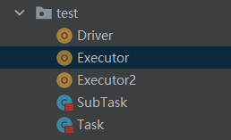

# 模拟分布式计算

目录结构



**Driver**

```scala
package com.stanlong.spark.core.test

import java.io.ObjectOutputStream
import java.net.Socket

object Driver {

    def main(args: Array[String]): Unit = {
        val client1 = new Socket("localhost", 9999)
        val client2 = new Socket("localhost", 8888)

        val task = new Task

        val out1 = client1.getOutputStream
        val objOut1 = new ObjectOutputStream(out1)

        val subTask1 = new SubTask()
        subTask1.logic = task.logic
        subTask1.datas = task.datas.take(2)

        objOut1.writeObject(subTask1)

        objOut1.flush()
        objOut1.close()
        client1.close()

        val out2 = client2.getOutputStream
        val objOut2 = new ObjectOutputStream(out2)

        val subTask2 = new SubTask()
        subTask2.logic = task.logic
        subTask2.datas = task.datas.takeRight(2)

        objOut2.writeObject(subTask2)

        objOut2.flush()
        objOut2.close()
        client2.close()

        println("客户端程序发送完毕")
    }
}

```

**Executor**

```scala
package com.stanlong.spark.core.test

import java.io.ObjectInputStream
import java.net.ServerSocket

object Executor {
    def main(args: Array[String]): Unit = {
        val server = new ServerSocket(9999)
        println("9999服务器启动，等待接收数据")

        val client = server.accept()
        val in = client.getInputStream
        val objIn = new ObjectInputStream(in)
        val subTask = objIn.readObject().asInstanceOf[SubTask]
        val ints = subTask.compute()
        println("9999节点计算结果为: " + ints)
        objIn.close()
        client.close()
        server.close()
    }
}
```

**Executor2**

```scala
package com.stanlong.spark.core.test

import java.io.ObjectInputStream
import java.net.ServerSocket

object Executor2 {
    def main(args: Array[String]): Unit = {
        val server = new ServerSocket(8888)
        println("8888服务器启动，等待接收数据")

        val client = server.accept()
        val in = client.getInputStream
        val objIn = new ObjectInputStream(in)
        val subTask = objIn.readObject().asInstanceOf[SubTask]
        val ints = subTask.compute()
        println("8888节点计算结果为: " + ints)
        objIn.close()
        client.close()
        server.close()
    }
}
```

**Task**

```scala
package com.stanlong.spark.core.test

class Task extends Serializable {

    val datas = List(1,2,3,4)

    val logic:(Int)=>Int = _ * 2

    def compute(): List[Int] ={
        datas.map(logic)
    }

}
```

**SubTask**

```scala
package com.stanlong.spark.core.test

class SubTask extends Serializable {
    var datas : List[Int]= _

    var logic:(Int) => Int = _

    def compute(): Unit ={
        datas.map(logic)
    }
}
```


